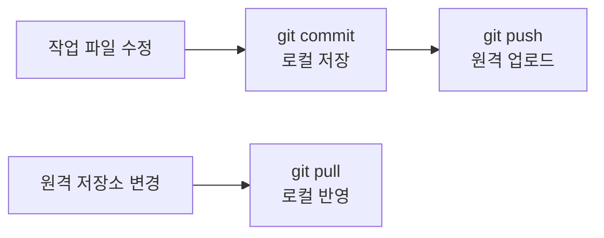
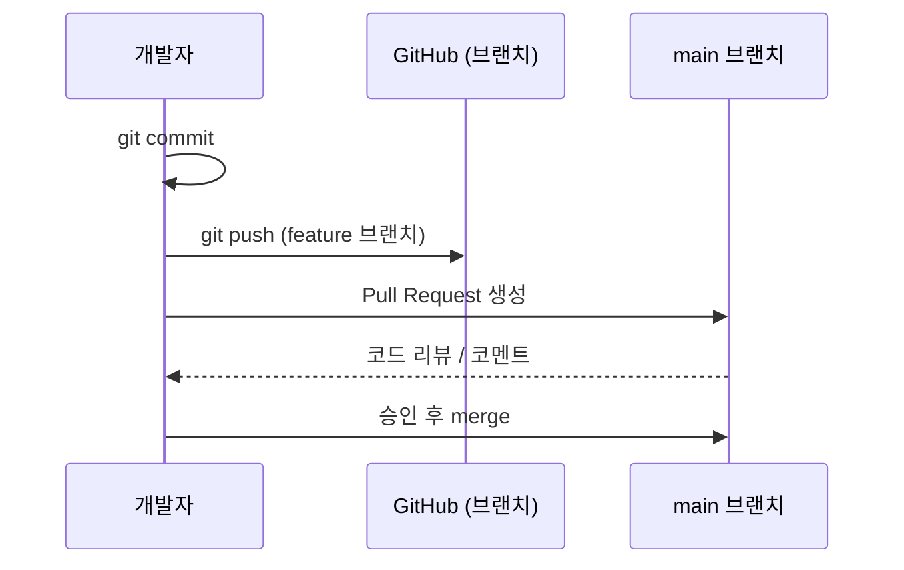

## 들어가며 (Situation)

Git을 쓰면서 `commit`, `push`, `pull`은 어느 정도 익숙해졌지만, `PR(Pull Request)`이 정확히 무슨 역할을 하는지는 헷갈렸다. 각 명령/기능이 어떤 시점에, 어떤 목적으로 쓰이는지 스스로 정리해보기로 했다.

## 문제 상황 (Task)

- 커밋, 푸시, 풀은 각각 "무엇을, 어디서 어디로" 옮기는 동작인지 명확히 구분되지 않았다.
- PR이 push와 어떻게 다른지, 왜 필요한지 이해가 부족했다.

## 해결 과정 (Action)

### 커밋 / 푸시 / 풀의 흐름

| 동작 | 역할 | 범위 |
|------|------|------|
| `commit` | 변경사항을 로컬 저장소에 스냅샷으로 저장 | 로컬 → 로컬 |
| `push` | 로컬 커밋을 원격 저장소(GitHub 등)에 업로드 | 로컬 → 원격 |
| `pull` | 원격 저장소의 변경사항을 로컬로 가져와 병합 | 원격 → 로컬 |

즉 commit은 "저장", push는 "올리기", pull은 "받아오기"로 이해하면 된다.

### PR(Pull Request)은 무엇이 다른가

처음엔 push만 하면 원격에 반영되니 PR이 왜 필요한지 감이 안 왔다. 정리해보니, PR은 **push 이후의 절차**였다.

- push는 "내 변경사항을 원격 저장소의 특정 브랜치에 올리는 행위" 자체다.
- PR은 "그 브랜치의 변경사항을 다른 브랜치(보통 main)에 merge해도 되는지 검토해달라"는 요청이다.

즉 커밋을 곧바로 main에 반영하지 않고, 별도 브랜치에서 작업한 뒤 PR을 통해 리뷰와 논의를 거쳐 병합하는 절차다.

이 흐름을 통해 commit → push는 "변경사항을 저장하고 옮기는 것"이고, PR은 "옮긴 변경사항을 정식으로 합치기 전 거치는 리뷰 절차"라는 점이 명확해졌다.

## 결과 (Result)

- commit / push / pull이 각각 로컬-원격 사이에서 어느 방향으로 움직이는지 헷갈리지 않게 됐다.
- PR을 "push의 다른 이름"이 아니라 "merge 전에 거치는 리뷰 단계"로 구분해서 이해하게 됐다.

## 더 학습하면 좋은 개념

- **브랜치 전략 (Git Flow, GitHub Flow)** — PR을 언제, 어떤 브랜치 단위로 만드는지는 팀의 브랜치 전략에 따라 달라진다. PR을 제대로 활용하려면 브랜치 운영 방식을 함께 이해해야 한다.
- **merge conflict 해결** — 여러 사람이 같은 파일을 수정하면 pull이나 PR merge 시 충돌이 발생한다. 충돌 상황과 해결 방법을 익혀두면 협업 시 당황하지 않는다.
- **rebase vs merge** — pull이나 PR 병합 시 히스토리를 어떻게 관리할지 결정하는 두 가지 전략으로, 커밋 이력 관리 방식에 큰 차이를 만든다.
- **코드 리뷰 문화** — PR의 핵심 가치는 리뷰다. 좋은 리뷰 코멘트를 남기고 받는 법을 익히면 PR을 더 효과적으로 활용할 수 있다.

## 참고 자료
- [Git 공식 문서 - git-commit](https://git-scm.com/docs/git-commit)
- [Git 공식 문서 - git-push](https://git-scm.com/docs/git-push)
- [Git 공식 문서 - git-pull](https://git-scm.com/docs/git-pull)
- [GitHub Docs - About pull requests](https://docs.github.com/en/pull-requests/collaborating-with-pull-requests/proposing-changes-to-your-work-with-pull-requests/about-pull-requests)
