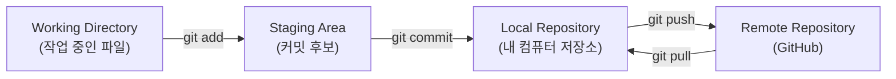
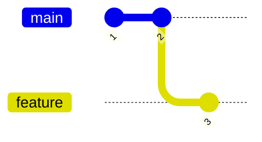
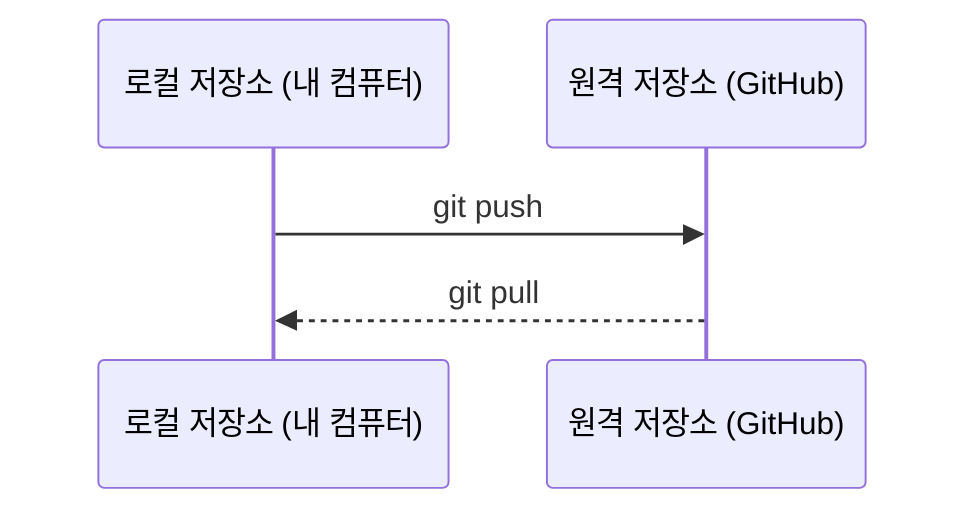
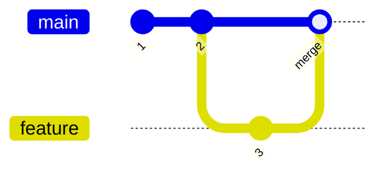
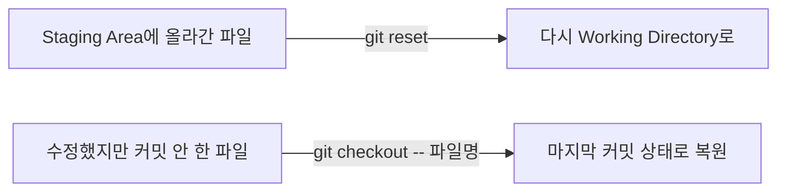

## 들어가며

이번 주에는 Git으로 **저장소를 만들고, 변경 내용을 기록하고, 브랜치로 작업을 나눴다가, 다시 합치고, 필요하면 되돌리는 법**까지 배웠다. 오늘은 이 흐름을 하나씩 정리해본다.

## 1. Git이 관리하는 세 가지 공간

Git은 파일을 세 단계로 나눠서 관리한다. 아직 저장하지 않은 **작업 중인 파일**, 커밋할 준비가 된 **스테이징 영역**, 그리고 실제로 기록이 저장되는 **로컬 저장소(Local Repository)**다.

## 2. 저장소 만들기

프로젝트 폴더를 Git으로 관리하고 싶을 때 가장 먼저 하는 일이다.

| 명령어 | 언제 쓰나 |
|---|---|
| `git init` | 폴더를 Git 저장소로 만들고 싶을 때 (Local Repository가 생김) |

## 3. 스테이징

수정한 파일 중에서 **이번 커밋에 포함할 것만** 골라 담는 단계다.

| 명령어 | 언제 쓰나 |
|---|---|
| `git add` | 작업 중인 파일을 커밋 후보(Staging Area)로 올리고 싶을 때 |

## 4. 커밋

스테이징한 내용을 하나의 기록으로 Local Repository에 남기는 단계다.

| 명령어 | 언제 쓰나 |
|---|---|
| `git commit` | 스테이징한 변경 사항을 하나의 저장 지점으로 남기고 싶을 때 |

## 5. 브랜치

브랜치를 쓰면 원래 작업(main)을 건드리지 않고 다른 줄기에서 새로운 작업을 할 수 있다.

| 명령어 | 언제 쓰나 |
|---|---|
| `git branch` | 새로운 브랜치를 만들거나, 브랜치 목록을 보고 싶을 때 |
| `git checkout` | 다른 브랜치로 이동(갈아타기)하고 싶을 때 |

## 6. push / pull

Local Repository와 GitHub(원격 저장소) 사이에 기록을 주고받는 단계다.

| 명령어 | 언제 쓰나 |
|---|---|
| `git push` | 내 Local Repository의 커밋 기록을 GitHub에 올리고 싶을 때 |
| `git pull` | GitHub에 있는 최신 기록을 내 컴퓨터로 받아오고 싶을 때 |

## 7. merge

나눠졌던 브랜치를 다시 하나로 합치는 단계다.

| 명령어 | 언제 쓰나 |
|---|---|
| `git merge` | feature 브랜치에서 한 작업을 main 브랜치에 합치고 싶을 때 |

## 8. 되돌리기

실수했을 때 이전 상태로 되돌리는 방법이다.

| 명령어 | 언제 쓰나 |
|---|---|
| `git reset` | 스테이징을 취소하거나, 커밋 자체를 되돌리고 싶을 때 |
| `git checkout -- <파일명>` | 아직 커밋하지 않은 파일 수정을 마지막 커밋 상태로 되돌리고 싶을 때 |

## 정리표

| 개념 | 명령어 | 언제 쓰나 |
|---|---|---|
| 저장소 만들기 | `git init` | 새 프로젝트를 Git으로 관리하기 시작할 때 |
| 스테이징 | `git add` | 변경한 파일을 커밋 후보로 올릴 때 |
| Local Repository | (git commit의 결과) | 커밋한 기록이 실제로 저장되는 곳 |
| 커밋 | `git commit` | 스테이징한 내용을 하나의 기록으로 저장할 때 |
| 브랜치 | `git branch` / `git checkout` | 작업 줄기를 나누거나 다른 브랜치로 이동할 때 |
| push | `git push` | 로컬 저장소의 기록을 GitHub에 올릴 때 |
| pull | `git pull` | GitHub의 최신 기록을 내 로컬로 받아올 때 |
| merge | `git merge` | 나눠진 브랜치를 다시 하나로 합칠 때 |
| 되돌리기 | `git reset` / `git checkout -- <파일명>` | 잘못된 스테이징, 커밋, 파일 수정을 되돌릴 때 |
