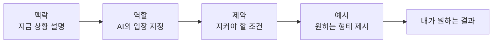

## 들어가며 (Situation)

오늘은 Claude Code를 VSCode에 연동해서 실제로 블로그 글 초안을 여러 개 뽑아보는 실습을 했다. 이 과정에서 AI에게 같은 부탁을 하더라도 **질문을 어떻게 쓰느냐**에 따라 결과물의 범위와 형식이 완전히 달라진다는 걸 계속 확인하게 됐다.

## 문제 상황 (Task)

내가 원하는 건 명확했다. "이번 주에 배운 것만, 표와 mermaid 차트를 적극 활용해서" 같은 조건을 정확히 지키는 글을 받는 것. 그런데 이걸 그냥 "Git 정리해줘" 식으로 뭉뚱그려 물어보면, AI가 어디까지 범위를 잡아야 할지 스스로 판단해야 해서 내가 원하지 않은 내용(예: 이번 주에 안 배운 명령어)까지 섞여 들어올 위험이 있었다. **질문 자체를 어떻게 구조화해야 매번 원하는 결과를 받을 수 있는가**가 오늘의 과제였다.

## 해결 과정 (Action)

### 4가지 요소로 질문을 쪼개기

무작정 하고 싶은 말을 다 적기보다, 질문을 4개 요소로 나눠서 쓰는 방법을 배웠다.

| 요소 | 의미 | 안 쓰면 생기는 문제 |
|------|------|------|
| 맥락 (Context) | 지금 상황이 어떤지 설명한다 | AI가 내 배경지식 수준을 몰라 눈높이가 안 맞는 답을 준다 |
| 역할 (Role) | AI가 어떤 입장에서 답해야 하는지 정한다 | 설명 방식(전문가용 vs 초보자용)이 매번 달라진다 |
| 제약 (Constraints) | 꼭 지켜야 할 조건을 정한다 | 범위를 벗어난 내용(이번 주에 안 배운 것 등)까지 섞여 나온다 |
| 예시 (Example) | 원하는 결과물의 형태를 미리 보여준다 | 표/다이어그램 없이 줄글로만 답이 나올 수 있다 |

### 실제로 써본 프롬프트

오늘 블로그 글을 요청할 때 실제로 이 구조를 그대로 사용했다.

> [맥락] 나는 프로그래밍을 독학으로 조금 해보았다. 저번 주에 Git과 Github를 처음 배워보았으며, 내 블로그를 만들어서 인터넷에 배포를 한 상태이다.
>
> [역할] 프로그래밍을 처음 접하는 학생에게 설명하는 선생님으로서 답변해줘.
>
> [제약] 이번 주에 배운 것만 다뤄줘 (저장소 만들기, 스테이징, 커밋, 브랜치, push, pull, merge, 되돌리기). 표와 mermaid 차트를 적극 활용해줘.
>
> [예시] `|명령어|언제쓰나|` 형태의 표

### STAR로 오늘 겪은 일을 정리해보기

블로그를 STAR(Situation-Task-Action-Result) 구조로 써본 적이 아직 없어서, 오늘 겪은 일 자체를 STAR로 한번 정리해봤다. 이렇게 각 단계를 한 줄씩 채워보면 다음 글을 쓸 때도 같은 방식으로 적용할 수 있다.

| 단계 | 오늘 있었던 일 |
|------|------|
| S (Situation) | Claude Code를 VSCode에 연동해 블로그 글 초안을 여러 번 요청하는 실습을 했다 |
| T (Task) | 매번 원하는 범위와 형식대로 답을 받으려면 질문을 어떻게 써야 하는지 알아야 했다 |
| A (Action) | 질문을 맥락/역할/제약/예시 4가지로 나눠 쓰는 방법을 적용해봤다 |
| R (Result) | 아래 "결과" 참고 |

## 결과 (Result)

4요소를 갖춰 요청한 3건(Git 명령어 정리, Claude Code 모드 정리, 프롬프트 엔지니어링 정리) 모두, **재요청 없이 한 번의 프롬프트로** 지정한 범위(예: 9개 개념) 안의 내용만 담긴 글이 나왔다. 특히 제약에 "위 목록에 없는 명령어는 작성하지 말아줘"를 넣은 두 건에서는 실제로 `git status`, `git log`처럼 흔히 딸려 나올 법한 명령어가 결과물에 전혀 섞여 들어오지 않았다.

## 더 학습하면 좋은 개념

- **Few-shot 프롬프팅** — 예시를 1개가 아니라 여러 개 보여주면 형식이 더 안정적으로 유지된다. 오늘은 표 형식 예시 1개만 줬는데, 더 복잡한 형식을 원할 때는 예시를 여러 개 두는 방법을 익혀둘 필요가 있다.
- **Chain-of-Thought(단계별 사고 유도)** — 지금은 결과물의 "형태"를 통제하는 법을 배웠다면, 복잡한 문제를 풀 때는 AI가 중간 추론 과정을 거치도록 유도하는 방법도 있다.
- **시스템 프롬프트 vs 사용자 프롬프트** — Claude Code처럼 도구를 쓰는 환경에서는 매번 쓰는 사용자 프롬프트 말고, 도구 사용 규칙을 미리 고정해두는 시스템 프롬프트(이 블로그의 `CLAUDE.md`가 그 역할)라는 개념이 따로 있다.
- **반복적 프롬프트 개선(Iterative Prompting)** — 한 번에 완벽한 프롬프트를 쓰기보다, 결과를 보고 제약이나 예시를 조금씩 수정해가는 방법.

## 참고 자료

- [Anthropic 공식 문서 - Prompt engineering overview](https://docs.claude.com/en/docs/build-with-claude/prompt-engineering/overview)
- [Claude Code 공식 문서 - IDE 연동](https://docs.claude.com/en/docs/claude-code/ide-integrations)
