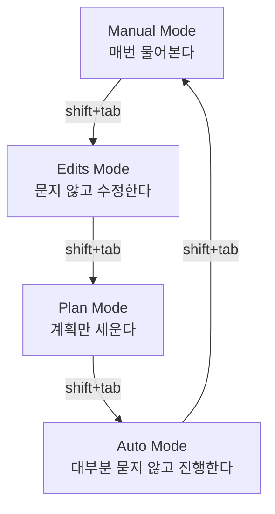
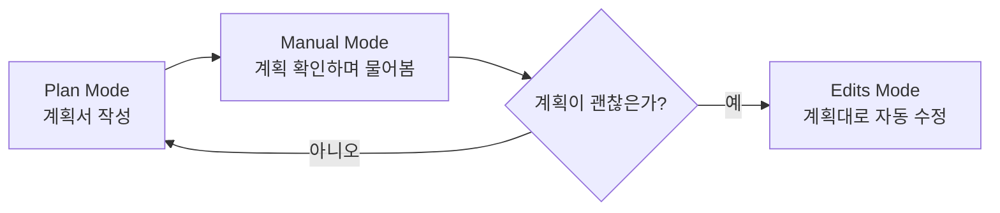

## 들어가며

오늘은 **프롬프트 엔지니어링**을 배우고, **Claude Code를 VSCode에 연동**해서 실제로 써보는 활동을 했다. 그중에서 오늘 익힌 조작법과 모드 개념만 정리해본다.

## 1. 클로드 터미널 조작법

Claude Code 터미널에서는 키보드로 모드를 바꾸거나 입력을 넘길 수 있다.

| 키 | 하는 일 |
|---|---|
| `shift+tab` | 모드를 전환한다 |
| `alt+enter` | 다음 줄(화면)로 넘어간다 |

## 2. 모드별 정리

`shift+tab`으로 전환할 수 있는 모드는 아래 4가지다.

| 모드 | 설명 |
|---|---|
| Manual Mode | AI가 무언가를 하기 전에 **매번 물어본다** (폴더를 워크스페이스로 지정할 때, 권한이 필요할 때 등) |
| Edits Mode (accept edit on) | 묻지 않고 **알아서 파일을 수정**한다 |
| Plan Mode | **계획만 세우고** 파일은 고치지 않는다 |
| Auto Mode | 대부분 묻지 않고 **알아서 진행**한다 |

## 3. Manual Mode와 Plan Mode를 적극 활용하기

Edits Mode는 AI가 묻지 않고 파일을 고치기 때문에 그대로 쓰면 "무뇌 상태"가 되기 쉽다. 그래서 **Plan Mode로 먼저 계획을 세우고, Manual Mode로 그 계획을 확인**한 뒤에 Edits Mode를 쓰는 순서를 지켜야 한다.

## 4. 커밋으로 백업해두기

Edits Mode나 Auto Mode처럼 AI가 알아서 파일을 고치는 모드를 쓸 때는, **AI가 수정하기 전과 후에 커밋**을 남겨두면 나중에 비교하거나 되돌릴 수 있다.

## 정리표

| 항목 | 내용 |
|---|---|
| `shift+tab` | 모드 전환 |
| `alt+enter` | 다음 줄(화면)로 넘어가기 |
| Manual Mode | 매번 물어본다 |
| Edits Mode | 묻지 않고 수정한다 |
| Plan Mode | 계획만 세운다 |
| Auto Mode | 대부분 묻지 않고 진행한다 |
| 커밋 습관 | AI 수정 전/후로 커밋을 남겨 백업해두기 |
