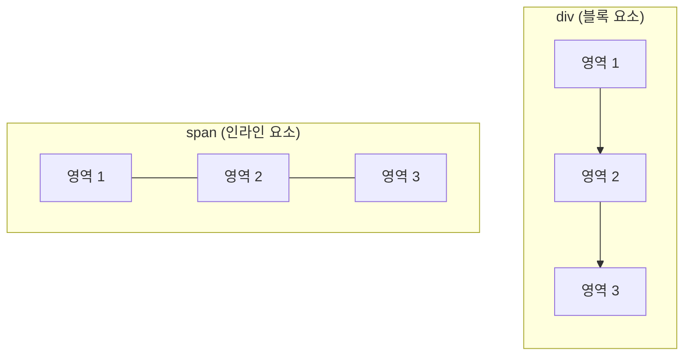
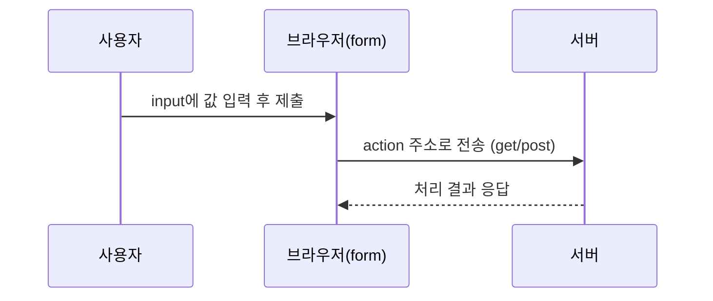

## 들어가며

오늘은 HTML의 기본 태그들을 텍스트, 목록, 표, 영역, 이미지, 미디어, 하이퍼링크, 폼까지 8가지 주제로 나눠서 실습했다. 태그 하나하나를 따로 외우기보다, 실습 파일을 직접 만들어보면서 "이 태그는 어떤 상황에 쓰는가"를 기준으로 정리해본다.

## 1. 글자(텍스트) 관련 태그

제목은 `h1`~`h6`로 크기 순서가 정해져 있고, 문단은 `p`와 `pre` 두 가지 방식이 있다.

| 태그 | 역할 |
|---|---|
| `h1`~`h6` | 제목 (숫자가 커질수록 글씨가 작아짐) |
| `br` | 줄바꿈 |
| `hr` | 수평선(구분선) |
| `p` | 문단 구분. 공백은 한 칸만 적용되고 줄바꿈은 무시됨 |
| `pre` | 작성한 그대로(띄어쓰기, 줄바꿈 포함) 화면에 표현 |
| `strong` / `b` | 굵게 |
| `em` / `i` | 기울임 |
| `mark` | 형광펜 효과 |
| `u` | 밑줄 |
| `small` | 작은 글씨 |
| `sub` / `sup` | 아래첨자 / 윗첨자 |
| `s` | 취소선 |

`p`와 `pre`의 차이가 헷갈렸는데, **공백·줄바꿈을 그대로 살리고 싶으면 `pre`**라고 기억하니 정리가 됐다.

## 2. 목록 관련 태그

목록은 순서가 필요 없는 `ul`과 순서가 있는 `ol`로 나뉜다.

| 태그 | 역할 |
|---|---|
| `ul` | 순서 없는 목록 (unordered list) |
| `ol` | 순서 있는 목록 (ordered list) |
| `li` | 목록 항목 |

`ol`은 `type` 속성으로 번호 표시 방식을 바꿀 수 있다.

| type 값 | 표시 방식 | 예시 |
|---|---|---|
| (기본) | 숫자 | 1, 2, 3 |
| `a` | 소문자 알파벳 | a, b, c |
| `A` | 대문자 알파벳 | A, B, C |
| `I` | 로마 숫자 | I, II, III |

## 3. 표 관련 태그

표는 `table`, `tr`, `th`, `td` 네 태그로 만든다.

| 태그 | 역할 |
|---|---|
| `table` | 표 전체 영역 |
| `tr` | 표의 행(row) |
| `th` | 표의 제목 셀 (보통 굵게 표시됨) |
| `td` | 표의 데이터 셀 |

여기에 셀을 합치는 속성이 추가된다.

| 속성 | 역할 |
|---|---|
| `colspan` | 열(가로)을 합침 |
| `rowspan` | 행(세로)을 합침 |

이력서 양식처럼 칸이 불규칙하게 합쳐지는 표를 만들 때 `colspan`, `rowspan`을 함께 써야 해서 처음엔 어떤 셀이 몇 칸을 차지하는지 헷갈렸다. **표 문제를 반복해서 풀어보면서**, "이 칸이 몇 행/몇 열을 차지하는지 먼저 그림으로 그려보고 코드로 옮긴다"는 감을 잡을 수 있었다. 반복 연습이 가장 확실한 해결책이었다.

## 4. 영역 관련 태그

`div`와 `span`은 둘 다 영역을 묶어주는 태그지만 줄바꿈 여부가 다르다.

| 태그 | 성격 | 특징 |
|---|---|---|
| `div` | 블록 요소 | 항상 다음 줄로 넘어가서 영역이 잡힘 |
| `span` | 인라인 요소 | 줄바꿈 없이 옆으로 붙어서 배치됨 |

공통 스타일을 묶어서 적용하고 싶은 여러 요소를 감쌀 때 `div`를, 문장 중 일부 단어에만 스타일을 주고 싶을 때 `span`을 쓰면 된다는 기준이 잡혔다.

## 5. 이미지 관련 태그

이미지는 `img` 태그 하나로 삽입하며, 닫는 태그가 없다.

| 속성 | 역할 |
|---|---|
| `src` | 불러올 이미지 파일 경로 |
| `alt` | 이미지를 못 불러올 때 대신 보여줄 텍스트 (대체 텍스트) |
| `width` / `height` | 이미지 크기 지정 |

`width`, `height` 값을 `px`(고정 크기)로 주면 화면 크기가 변해도 그대로지만, `%`(가변 크기)로 주면 화면 크기에 따라 이미지도 함께 커지고 작아진다.

## 6. 미디어 관련 태그

오디오와 비디오는 각각 `audio`, `video` 태그로 삽입한다.

| 태그 | 역할 |
|---|---|
| `audio` | 오디오(음악, 소리) 삽입 |
| `video` | 비디오(영상) 삽입 |
| `src` | 재생할 파일 경로 |
| `controls` | 재생/정지 등 컨트롤러 표시 |
| `loop` | 반복 재생 |

## 7. 하이퍼링크 관련 태그

`a` 태그(anchor)의 `href` 속성으로 다른 페이지, 외부 사이트, 심지어 같은 페이지 안의 특정 위치로도 이동할 수 있다.

| 사용 방식 | 예시 |
|---|---|
| 다른 HTML 파일로 이동 | `<a href="02_목록관련태그.html">` |
| 외부 사이트로 이동 | `<a href="https://...">` |
| 새 탭에서 열기 | `target="_blank"` |
| 같은 탭에서 열기 | `target="_self"` (기본값) |
| 이미지에 링크 걸기 | `<a>` 안에 ``를 넣음 |
| 같은 페이지 내부 이동 | `href="#id값"` + 이동할 태그에 `id` 속성 |

특히 마지막 방식(페이지 내부 앵커)은 목차처럼 클릭하면 같은 페이지 안의 특정 위치로 점프하는 기능이라, 긴 문서의 목차를 만들 때 유용하다는 걸 알게 됐다.

## 8. 폼 관련 태그

`form`은 사용자가 입력한 값을 서버로 전달하는 태그다.

| 속성 | 역할 |
|---|---|
| `action` | 입력값을 전송받을 서버 주소 |
| `method` | 전송 방식 (`get` / `post`) |

`get`은 URL에 데이터가 그대로 보이고, `post`는 URL에 데이터가 드러나지 않는다는 차이가 있다.

`form` 안에서는 `input`의 `type` 속성에 따라 입력 방식이 완전히 달라진다.

| type 값 | 용도 |
|---|---|
| `text` | 한 줄 텍스트 입력 |
| `password` | 입력값을 가려서 표시 |
| `search` | 검색어 입력 |
| `email` | 이메일 입력 |
| `number` | 숫자 입력 (`min`, `max`, `step`으로 범위·간격 지정) |
| `range` | 슬라이더로 값 선택 |
| `date` / `month` / `week` / `time` / `datetime-local` | 날짜·시간 입력 |
| `radio` | 여러 선택지 중 하나만 선택 (같은 `name`으로 그룹화) |
| `checkbox` | 여러 선택지 중 복수 선택 |
| `color` | 색상 선택 |
| `file` | 파일 선택 (`multiple`로 여러 개 선택 가능) |
| `hidden` | 화면에 보이지 않지만 서버로는 전달되는 값 |

이 외에도 여러 줄 텍스트를 입력하는 `textarea`, 드롭다운 목록을 만드는 `select` + `option`(`multiple` 속성을 주면 복수 선택 가능), 버튼 역할을 하는 `button`(기본 타입이 `submit`)까지 폼에서 자주 쓰이는 요소들을 함께 확인했다.

## 마무리

오늘 배운 8가지 태그 중에서는 **표(table) 관련 태그**가 가장 어려웠다. `colspan`, `rowspan`으로 셀을 합치는 게 머릿속에서 바로 그려지지 않았기 때문이다. 하지만 표 문제를 여러 번 반복해서 풀다 보니 점점 감이 잡혔고, "먼저 완성된 표 모양을 그려보고 셀이 몇 행/몇 열을 차지하는지 계산한 뒤 코드로 옮긴다"는 나만의 접근법을 찾을 수 있었다. 이론만 보고 넘어가기보다 직접 여러 번 만들어보는 게 가장 빠른 학습 방법이라는 걸 다시 확인한 하루였다.
