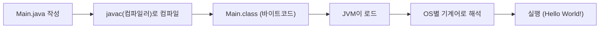

## 들어가며

오늘부터 `03_JAVA` 로 자바를 시작했다. 자바 코드가 실제로 어떻게 실행되는지(JDK/JVM), 패키지 구조를 왜 이렇게 짜는지, 그리고 변수·자료형·형변환·연산자까지 기초를 실습했다. 특히 면접 문제로 나온 `&&`/`||` 순서 최적화가 인상 깊어서 따로 정리해둔다.

## 1. JDK와 JVM — 코드가 실행되기까지

자바는 코드를 작성하자마자 바로 실행되는 게 아니라, 아래 과정을 거친다.



| 구성 요소 | 역할 |
|---|---|
| JDK | 자바 개발에 필요한 도구 모음(컴파일러 `javac` 포함). 개발 전 반드시 설치 |
| javac | `.java` 소스 코드를 `.class` 바이트코드로 번역(컴파일) |
| JVM | `.class` 파일을 로드해서, 각 OS가 이해할 수 있는 기계어로 해석·실행하는 가상 공간 |

모든 자바 프로그램은 클래스 안에서 동작하고, 실행은 항상 `main()` 메서드에서 시작한다.

```java
package com.wanted.a_basic;

public class Main {
    public static void main(String[] args) {
        System.out.println("Hello World!");
    }
}
```

프로그래밍은 **위→아래, 왼쪽→오른쪽** 순서로 진행되고, 여는 괄호는 반드시 닫아야 한다는 것도 오늘 다시 확인한 기본 규칙이다.

## 2. 패키지 구조 — 3-step

패키지는 폴더처럼 코드를 구분하는 역할을 한다. `회사(도메인).서비스명.기능` 식의 3단계로 짜는 걸 실습했다.

| 예시 | 의미 |
|---|---|
| `com.wanted.a_basic` | 오늘 실습에서 사용한 패키지 |
| `com.naver.sports` | 네이버가 스포츠 서비스를 만든다면 이런 구조 |

클래스 이름의 첫 글자는 항상 대문자로 쓴다(`Main`, `Application`).

## 3. 변수와 자료형

변수는 "변하는 수"이면서 동시에 **값을 저장하는 공간**이라는 개념이 추가된다. 형식은 아래와 같다.

```
(자료형) (변수명) (대입 연산자) 리터럴(값);
     공간         =           값
```

컴퓨터 자원은 한정적이기 때문에, 자료형마다 담을 수 있는 크기(byte 수)와 범위가 다르다.

| 분류 | 자료형 | 크기 | 비고 |
|---|---|---|---|
| 정수 | `byte` | 1 byte | 범위 -128 ~ 127 (`2^7`) |
| 정수 | `short` | 2 byte | |
| 정수 | `int` | 4 byte | 기본 정수형 |
| 정수 | `long` | 8 byte | |
| 실수 | `float` | 4 byte | 정수보다 `.` 이하까지 저장해야 해서 정수형보다 표현 폭이 더 필요하다 |
| 실수 | `double` | 8 byte | |
| 문자 | `char` | - | 문자 1개 |
| 문자열 | `String` | - | |
| 논리 | `boolean` | - | `true` / `false` |

```java
byte b = 10;      // 1 byte
int i = 10;       // 4 byte
double d = 3.14;  // 8 byte
String str = "안녕하세요!";
```

1 byte는 8 bit이고, `2^0 ~ 2^7`까지 쓰다가 한 byte가 늘어나면 `2^8`로 이어 붙는 방식이라 `byte`의 범위가 -128~127이 된다는 것도 함께 배웠다.

변수 선언과 초기화는 따로 할 수도, 동시에 할 수도 있다.

```java
int num;      // 선언: num이라는 int 공간을 만든다
num = 30;     // 초기화: 값을 넣는다
int num2 = 10; // 선언과 동시에 초기화
```

같은 영역(`{}`) 안에서는 동일한 변수명을 쓸 수 없다.

## 4. 형변환 (Type Conversion)

형변환은 데이터 타입을 다른 타입으로 바꾸는 과정이며, 두 가지 방식이 있다.

| 구분 | 방향 | 데이터 손실 | 컴파일러 동작 |
|---|---|---|---|
| 암시적(묵시적) 형변환 | 작은 타입 → 큰 타입 (예: `int` → `double`) | 없음 | 자동으로 변환 |
| 명시적 형변환 | 큰 타입 → 작은 타입 (예: `double` → `int`) | 있을 수 있음 | 자동 변환 금지, `(타입)`으로 직접 명시해야 함 |

```java
double dnum = 99.99;
int inum = (int) dnum;   // 명시적 형변환 → 99 (소수점 손실)

int num2 = 100;
double dnum2 = num2;     // 암시적 형변환 → 100.0
```

큰 공간(double)의 값을 작은 공간(int)으로 옮기면 값이 상실될 수 있기 때문에, 컴파일러가 이를 감지해서 에러를 표시하고 **명시적으로 형변환하도록 강제**한다는 점이 핵심이었다.

## 5. 연산자 — 산술 / 비교 / 논리 / 증감

```java
int a = 10;
int b = 3;

System.out.println("덧셈 : " + a + b);       // 103 (문자열 + 숫자라 이어붙기)
System.out.println("덧셈 : " + (a + b));     // 13  (괄호로 먼저 연산)
System.out.println("나눗셈 : " + (a / b));   // 3
System.out.println("나머지 : " + (a % b));   // 1
```

문자열과 `+` 연산을 같이 쓸 때는 피연산자가 문자열로 변환되어 이어붙기가 된다는 점을 실수로 겪고 나서야 체감했다.

### 5.1 전위 연산 vs 후위 연산

| 구분 | 의미 | 예시 |
|---|---|---|
| 전위 연산 (`++age`) | 연산을 먼저 하고 값을 사용 | 대입/출력 **전에** 증가 |
| 후위 연산 (`age++`) | 값을 먼저 사용하고 연산 | 대입/출력 **후에** 증가 |

```java
int age = 20;
System.out.println(++age); // 21 (먼저 증가 후 출력)
System.out.println(age++); // 21 (먼저 출력 후 증가)
System.out.println(age);   // 22
```

## 6. 면접 문제로 배운 최적화 — 짧게 끝나는 조건을 왼쪽에

회원가입 로직 예시로 `&&`/`||`의 **단축 평가(short-circuit evaluation)** 를 배웠다.

- 아이디 중복 검사: 1분 소요
- 비밀번호 8글자 미만 검사: 5초 소요

| 순서 | 비밀번호가 틀렸을 때 소요 시간 | 이유 |
|---|---|---|
| 아이디 중복 검사 `&&` 비밀번호 검사 | 1분 5초 | `&&`는 좌항이 참이어야 우항을 검사하는데, 좌항(1분)이 무조건 먼저 끝나야 함 |
| 비밀번호 검사 `&&` 아이디 중복 검사 | 5초 | 좌항(비밀번호)이 거짓이면 `&&`는 우항을 아예 보지 않고 바로 종료 |

`&&`는 좌항이 거짓이면, `||`는 좌항이 참이면 우항을 평가하지 않는다. 그래서 **더 빨리 판단할 수 있는(비용이 적은) 조건을 왼쪽에 두는 것**이 성능상 유리하다는 걸 숫자로 체감했다.

## 더 학습하면 좋은 개념

- **오토박싱/언박싱(Autoboxing/Unboxing)** — `int`↔`Integer`처럼 기본형과 래퍼 클래스를 자바가 자동 변환해주는 개념. 형변환을 더 깊이 이해하려면 기본형과 참조형의 차이를 함께 봐야 한다.
- **오버플로우(Overflow)** — `byte`의 범위(-128~127)를 넘는 값을 넣으면 어떻게 되는지. 오늘 배운 "금일 생각해보면 좋은 키워드"인 `byte bnum = 127;`과 바로 연결되는 주제다.
- **스코프(Scope)와 변수의 생명주기** — 같은 `{}` 안에서 변수명이 겹치면 안 되는 이유를 제대로 이해하려면 필요한 개념.
- **비트 연산자** — `2^7`, `2^8` 같은 바이트 크기 이야기가 나온 김에, `&`, `|`, `<<`, `>>` 같은 비트 단위 연산도 함께 익혀두면 자료형의 내부 표현을 이해하는 데 도움이 된다.

## 참고 자료

- [Oracle 공식 문서 - Primitive Data Types](https://docs.oracle.com/javase/tutorial/java/nutsandbolts/datatypes.html)
- [Oracle 공식 문서 - Operators](https://docs.oracle.com/javase/tutorial/java/nutsandbolts/operators.html)

## 마무리

오늘은 "변수는 값을 저장하는 공간"이라는 개념과, 형변환에서 왜 큰 타입→작은 타입만 명시적으로 해줘야 하는지가 가장 크게 와닿았다. 면접 문제로 배운 단축 평가 최적화는 단순 문법이 아니라 실무에서 바로 써먹을 수 있는 습관이라 따로 기억해두려 한다. 다음에는 `03_JAVA`의 조건문/반복문 실습을 이어서 정리할 예정이다.

## 번외: 헷갈렸던 개념 — 생각해볼 점과 예제 풀이

### 예제 1. byte 오버플로우 — 127 + 1은 왜 -128이 될까

다음 코드를 실행했더니 예상과 다른 값이 나와서, 원인을 직접 파고들어봤다.

```java
// 금일 생각해보면 좋은 키워드
byte bnum = 127;
bnum++;
System.out.println(bnum);

// 위 식을 실행했을 때 예상 값은 127 + 1 이기 때문에
// 128이 나와야 하지만 실제 값은 다르게 나온다.
// 위 내용이 왜 이렇게 되는지 생각해보고 설명해보자.
// 포함되어야 하는 내용 : byte, bit, overflow, underflow, type casting
```

실제로 돌려보니 `128`이 아니라 **`-128`** 이 출력됐다.

### 내가 처음 생각한 부분

- `byte`는 1 byte(8 bit)라서 `2^7 = 128`까지 세면, 표현 가능한 값은 -128~127까지라는 것까지는 이해했다.
- 그래서 "128을 담지 못한다"는 것 자체는 납득이 됐는데, 왜 하필 **음수**로 튀는지는 전혀 감이 안 왔다.

### 헷갈렸던 개념

가장 먼저 "맨 앞 비트는 부호만 표시하는 깃발이고, 나머지 7자리가 크기(magnitude)"라는 이론을 세웠다.

- `127`을 8bit 2진수로 쓰면 `01111111`이 된다. 여기에 1을 더하면 맨 끝 자리(1의 자리)부터 `1+1=10`이 되어 자리올림이 발생하고, 그 자리올림이 끝까지 이어져서 `10000000`이 된다.
- 내 이론대로면 `10000000`은 "맨 앞이 음수 표시 + 나머지 `0000000`(=0)이 크기"이므로 `-0`이 나와야 하는데, 실제는 `-128`이었다.
- 이 이론을 검증하려고 `byte all1 = -1;`을 코드로 확인했는데, 내 "부호+크기" 이론으로 계산하면 `11111111`은 "음수 + 나머지 `1111111`(=127)"이라 `-127`이 나와야 했다. 그런데 실제 결과는 `-1`이었다. 여기서 내 이론이 틀렸다는 걸 알았다.

### 실제 원리 — 2의 보수법 (Two's Complement)

자바를 포함한 대부분의 컴퓨터는 정수를 **2의 보수법(two's complement)** 으로 표현한다. 맨 앞 비트가 단순한 부호 깃발이 아니라, **다른 자리처럼 실제 값을 갖되 부호만 음수인 자리(`-128`)** 라는 게 핵심이다.

| 자리값 | -128 | 64 | 32 | 16 | 8 | 4 | 2 | 1 | 값 |
|---|---|---|---|---|---|---|---|---|---|
| `127` | 0 | 1 | 1 | 1 | 1 | 1 | 1 | 1 | 0 + 127 = **127** |
| `127 + 1` → `10000000` | 1 | 0 | 0 | 0 | 0 | 0 | 0 | 0 | -128 + 0 = **-128** |
| 검증용 `11111111` | 1 | 1 | 1 | 1 | 1 | 1 | 1 | 1 | -128 + 127 = **-1** |

세 번째 줄(`11111111 = -128 + 127 = -1`)이 실제 코드 실행 결과(`-1`)와 정확히 일치해서, "부호+크기"가 아니라 "맨 앞 자리도 값을 갖되 부호가 마이너스"라는 게 맞는 원리라는 걸 확인할 수 있었다.

이 문제에 포함되어야 했던 키워드를 정리하면:

| 키워드 | 이 문제와의 연결 |
|---|---|
| `byte` | 8 bit로 크기가 고정된 정수 자료형이라 표현 범위가 -128~127로 제한됨 |
| `bit` | 값을 0/1로 저장하는 최소 단위. 자리올림(carry)이 진행되는 단위이기도 함 |
| `overflow` | 표현 범위의 최댓값(127)을 넘어서면서 값이 최솟값(-128) 쪽으로 튀는 현상 |
| `underflow` | overflow의 반대. 최솟값(-128)에서 1을 더 빼면 반대로 최댓값(127)으로 넘어가는 현상 |
| `type casting` | 다른 자료형끼리 변환할 때도 결국 비트가 잘리거나 재해석되면서 값이 달라질 수 있다는 점에서 같은 원리를 공유함 |

더 알아볼 것: "2의 보수법(two's complement)"으로 검색해서, 음수를 뺄셈 없이 덧셈만으로 계산할 수 있게 해주는 이유까지 확인해보기

### 예제 2. 전위·후위 연산이 섞이면? — `x++ + ++x`

전위 연산과 후위 연산을 각각 따로 볼 때는 헷갈리지 않았는데, 둘을 한 식에 같이 섞으니 다시 헷갈렸다.

```java
int x = 5;
int result = x++ + ++x;
System.out.println(result); // ?
System.out.println(x);      // ?
```

**생각해볼 점**

- 처음에는 `x++`을 "5를 쓰고 그다음부터 6이 된다"로 이해했지만, `++x`를 계산할 때 무의식적으로 **원래 값 5**를 기준으로 다시 1을 더해서 `6`으로 계산했다. 그래서 `result = 5 + 6 = 11`, `x = 6`이라고 잘못 예상했다.
- 헷갈린 지점은 "`x++`이 끝난 직후, 변수 `x`가 실제로 바뀌는 시점이 언제인가"였다. 식 전체가 끝난 뒤에 한꺼번에 반영되는 게 아니라, **`x++`을 계산하는 바로 그 순간 변수 `x`가 즉시 갱신**된다.

**예제 풀이**

| 단계 | 코드 조각 | 식에서 쓰이는 값 | 그 직후 x |
|---|---|---|---|
| 1 | `x++` | `5` (기존 값을 그대로 사용) | `6`으로 즉시 갱신 |
| 2 | `++x` | `x`가 이미 `6`이므로, 1을 더한 `7`을 사용 | `7`로 갱신 |
| 3 | `result = 5 + 7` | `12` | `7` (그대로 유지) |

그래서 `result`는 `12`, 최종 `x`는 `7`이다.

**깨달은 점**: 사람은 방정식을 풀듯 식 전체를 한 번에 보고 계산하려는 습관이 있지만, 프로그래밍 언어는 **왼쪽에서 오른쪽으로, 한 조각씩 순서대로** 계산하면서 그때그때 변수 값을 바로 반영한다. 이 "왼쪽부터 순서대로, 즉시 반영"이라는 원칙 하나가 문자열 이어붙기(`"" + a + b`)와 전위·후위 연산 둘 다를 관통하는 규칙이라는 걸 오늘 알게 됐다.

### 예제 3. char는 문자일까, 숫자일까 — `'a' + 1`

```java
char a = 'a';
int num3 = a;
System.out.println(num3); // ?

char c = (char) ('a' + 1);
System.out.println(c);    // ?
```

**생각해볼 점**

- `char a = 'a';`가 `int` 변수에 형변환 없이 그대로 대입되는 것부터 이상했다. 문자인데 왜 숫자 자리에 들어갈까.
- `'a' + 1`을 보고 문자열 이어붙이기처럼 `"a1"`이 되는 줄 알았다. 앞서 배운 "`+` 연산에 문자열이 섞이면 이어붙이기가 된다"는 규칙과 헷갈렸기 때문이다.
- 헷갈린 지점을 파고들어보니, 자바는 작은따옴표(`'a'`, `char`)와 큰따옴표(`"a"`, `String`)를 완전히 다른 타입으로 엄격히 구분했다. `char`는 겉모습만 문자일 뿐, 실제로는 **아스키/유니코드 코드값을 담은 숫자 타입**이다. 그래서 "문자열이 섞이면 이어붙이기" 규칙은 `String`에만 적용되고, `char`에는 적용되지 않는다.

**예제 풀이**

| 코드 | 설명 | 결과 |
|---|---|---|
| `int num3 = a;` | `char`가 가진 아스키 코드값(`'a'` = `97`)이 그대로 `int`로 암시적 형변환된다 | `97` |
| `'a' + 1` | 피연산자에 `String`이 없으므로 이어붙이기가 아니라 **숫자 덧셈**이 수행된다 | `98` (int) |
| `(char) ('a' + 1)` | `98`이라는 숫자를 다시 문자로 해석(명시적 형변환) | `'b'` |

**깨달은 점**: `char`는 자바 내부적으로는 숫자(아스키/유니코드 코드값)로 저장되는 자료형이다. `+`가 "이어붙이기"로 바뀌는 건 오직 피연산자 중 하나가 `String`(큰따옴표)일 때뿐이며, `char`(작은따옴표)는 어디까지나 숫자로 취급되기 때문에 산술 연산이 그대로 적용된다.
