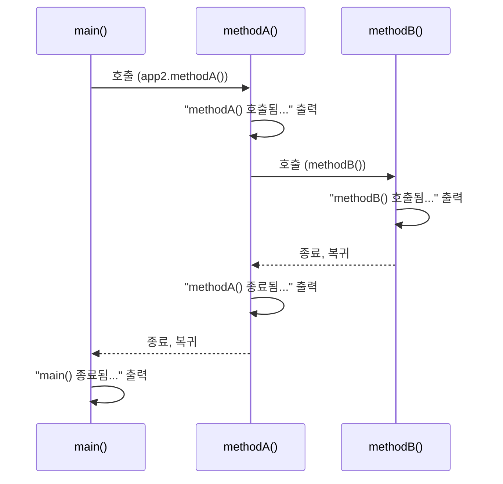

## 들어가며

어제 변수·자료형·연산자를 정리했고, 오늘은 `chap02_control-flow-and-method`로 조건문·반복문·메소드를 실습했다. 특히 메소드는 오늘 처음 등장한 개념이라, 바로 설명을 보기보다 질문을 먼저 던져보고 스스로 답을 생각해본 뒤 정리하는 방식으로 적어본다.

## a. 제어문 — 분기와 단축평가

### 중괄호, 생략해도 될까?

**질문.** if문 안에서 실행할 코드가 딱 한 줄뿐이라면, 감싸는 중괄호 `{}`를 꼭 써야 할까?

잠깐 생각해보고 다음을 보자.

```java
// package com.wanted.a_controlflow; — Application01.java
int score = 98;
if(score >= 90) {
    System.out.println("A 등급입니다!");
} else if(score >= 80){
    System.out.println("B등급입니다!");
} else if(score >= 70){
    System.out.println("C등급...?");
} else{
    System.out.println("재수강 확정!");
}
```

**정리.** 실행할 문장이 하나뿐이면 `{}`를 생략할 수 있다. 오늘 실습 코드는 안전하게 항상 중괄호를 썼지만, 문법상으로는 생략이 허용된다는 것만 기억해두면 된다. `else` 뒤도 마찬가지다.

다중 분기가 많아지면 `switch`문으로 바꿀 수도 있다.

```java
// Application04.java
switch (month) {
    case 1:
        System.out.println("1월~");
        break;
    default:  // 조건문에서 else 역할을 하는 것이 default
        System.out.println("그 외 월입니다.");
}
```

### 단축평가 — `&&`의 좌항엔 무엇을 둬야 유리할까?

**질문.** 회원가입 로직에서 아래 두 검사를 `&&`로 묶는다고 하자.

- A: 아이디 중복 여부 판단 (1분 걸림)
- B: 비밀번호 8글자 미만 여부 판단 (0.5초 걸림)

`if(A && B)`처럼 A를 왼쪽에 두는 것과 `if(B && A)`처럼 B를 왼쪽에 두는 것, 사용자가 비밀번호를 잘못 입력했을 때 어느 쪽이 더 빨리 실패를 알려줄까?

**생각해볼 점.** `&&`는 좌항이 `false`면 우항은 아예 검사하지 않는다(단축평가, short-circuit evaluation). 그렇다면 **B(비밀번호, 0.5초)를 좌항**에 두면 0.5초 만에 실패를 확정할 수 있고, A(아이디 중복, 1분)를 좌항에 두면 실패를 알기까지 1분이 걸린다.

즉, 원리를 일반화하면:

| 연산자 | 좌항 조건 결과 | 우항 검사 여부 | 좌항에 두면 유리한 조건 |
|---|---|---|---|
| `&&` (AND) | 좌항이 `false` | 검사 안 함 | 실패(`false`) 가능성이 높거나, 비용이 저렴한 조건 |
| `\|\|` (OR) | 좌항이 `true` | 검사 안 함 | 성공(`true`) 가능성이 높은 조건 |

실제로 조건 순서를 바꿔서 시간을 재보는 실습도 했다.

```java
// Application03.java
long startTime = System.nanoTime();
if(age <= 19) { discount = "학생 할인 가능"; } else { discount = "할인 불가"; } // 드문 조건이 좌항
long endTime = System.nanoTime();

long startTime2 = System.nanoTime();
if(age > 19) { discount = "학생 할인 가능"; } else { discount = "할인 불가"; }   // 자주 발생하는 조건이 좌항
long endTime2 = System.nanoTime();
```

`nanoTime()` 한두 번 측정만으로 절대적인 성능 차이를 단정하긴 어렵지만(JIT, 시스템 노이즈 등 변수가 많다), **"대규모 트래픽/반복 호출 상황에서는 저렴하고 실패 확률 높은 조건을 왼쪽에 둔다"**는 원리 자체가 핵심이다.

## b. 반복문 — for / while / do-while

**질문.** 아래 코드를 5번이 아니라 100번, 1000번 반복해야 한다면 `System.out.println(...)`을 그만큼 줄줄이 써야 할까?

```java
// b_loop/Application01.java — 주석 처리된 원래 코드
// System.out.println("성원님 1번했습니다~");
// System.out.println("성원님 2번했습니다~");
// System.out.println("성원님 3번했습니다~");
// ...
```

**정리.** 반복되는 패턴이라면 `for`문으로 바꿔서 "초기식 / 조건식 / 증감식" 세 가지로 반복 횟수를 제어할 수 있다.

```java
for (int i = 1; i <= 5; i++) {
    if(i % 2 != 0) {
        System.out.println("성원님 " + i + "번 했습니다~");
    } else {
        System.out.println("침묵함..");
    }
}
```

`while`과 `do-while`도 반복문이지만 성격이 조금 다르다.

| 반복문 | 조건 확인 시점 | 최소 실행 횟수 | 주로 쓰는 상황 |
|---|---|---|---|
| `for` | 반복 전 | 0회 가능 | 반복 횟수를 미리 알 때 |
| `while` | 반복 전 | 0회 가능 | 반복 횟수가 불확실하거나 조건에 따라 종료할 때 |
| `do-while` | **반복 후** | **최소 1회** | 일단 한 번은 실행해야 하는 로직일 때 |

**질문.** 그렇다면 "무조건 최소 한 번은 실행해야 하는" 로직에는 셋 중 무엇이 가장 적합할까? → `do-while`이다. `do { 실행코드 } while(조건식);` 형태로, 조건을 나중에 확인하기 때문이다.

## c. 메소드 — 코드 재사용과 호출 흐름

### 메소드가 없다면 어떤 문제가 생길까?

**질문.** 아래처럼 두 수를 더하는 코드를 계속 작성해야 한다면, 어떤 점이 불편할까?

```java
// c_method/Application01.java
int num1 = 1; int num2 = 2;
System.out.println("1번째 연산 결과 : " + (num1 + num2));

int num3 = 3; int num4 = 4;
System.out.println("2번째 연산 결과 : " + (num3 + num4));
// 더하고 싶을 때마다 변수 선언 2줄 + 연산/출력 1줄이 계속 반복된다
```

**정리.** 메소드는 **특정 작업을 수행하는 코드 블록**이다. 코드의 재사용성과 가독성을 높이고, 프로그램 구조를 체계적으로 만들며 유지보수를 쉽게 해준다.

```java
public int sumTwoNumber(int a, int b) {
    return a + b;
}
```

| 구성 요소 | 이 예시에서 |
|---|---|
| 접근 제어자 | `public` |
| 반환 타입 | `int` |
| 메소드명 | `sumTwoNumber` |
| 매개변수 타입/명 | `int a`, `int b` |

형식으로 일반화하면:

```
[접근제어자][반환 타입] 메소드명([매개변수 타입 매개변수 명]) {
    실행할 코드
    [return 반환값;]
}
```

**질문.** `app.sumTwoNumber(5, 6)`이라고 호출할 때, `(int a, int b)`와 `(5, 6)`은 각각 뭐라고 부를까?

**정리.** `(int a, int b)`처럼 메소드 정의부에 있는 것은 **매개변수(parameter)**, `sumTwoNumber(5, 6)`처럼 호출할 때 실제로 넘기는 값 `5, 6`은 **전달인자(argument)**라고 부른다.

```java
Application01 app = new Application01();      // Application01 내부에 접근할 준비
System.out.println(app.sumTwoNumber(5, 6));   // 전달인자 5, 6을 들고 메소드로 이동
```

여기서 소괄호 `()`는 "호출"을 의미한다. 클래스는 `new`로 객체를 만든 뒤, `참조변수.메소드명()` 형태로 그 내부에 접근한다.

### 메소드를 호출하면 코드가 어떻게 움직일까?

**질문.** 아래 코드를 실행하면 콘솔에 어떤 순서로 문장이 출력될까? 실행하기 전에 먼저 예측해보자.

```java
// c_method/Application02.java
public static void main(String[] args) {
    System.out.println("main() 시작됨...");

    Application02 app2 = new Application02();
    app2.methodA();

    System.out.println("main() 종료됨...");
}

public void methodA() {
    System.out.println("methodA() 호출됨...");
    methodB();
    System.out.println("methodA() 종료됨...");
}

public void methodB(){
    System.out.println("methodB() 호출됨...");
    // methodB()를 정의만 해두고 아무데서도 호출하지 않으면
    // 이 출력 구문은 절대 실행되지 않는다.
}
```

(생각해보기 — 예측한 순서를 적어보자)

**정리.** 실제 실행 순서는 다음과 같다.



콘솔 출력:

```
main() 시작됨...
methodA() 호출됨...
methodB() 호출됨...
methodA() 종료됨...
main() 종료됨...
```

핵심은 두 가지다.

1. **메소드는 호출해야만 실행된다.** `methodB()`를 만들어만 두고 아무도 호출하지 않으면 그 안의 코드는 절대 실행되지 않는다. (정의 ≠ 실행)
2. **호출하면 코드는 아래로 내려가지 않고 그 메소드로 이동한다.** 그리고 메소드 안의 작업이 끝나면, **호출했던 자리로 무조건 돌아온다.** `methodA()`가 끝나자마자 `main()`으로 돌아와서 "main() 종료됨..."이 출력되는 것도 이 때문이다.

`void`로 선언된 메소드는 호출은 되지만 반환값이 없다는 뜻이라 `return`이 필요 없다.

### CS 지식 — 스택(Stack)과 큐(Queue)

**질문.** `main()` → `methodA()` → `methodB()` 순서로 호출됐는데, 종료는 어떤 순서로 될까? 호출한 순서 그대로(`main → methodA → methodB`) 끝날까, 아니면 반대일까?

**정리.** 위 시퀀스 다이어그램에서 봤듯 **가장 나중에 호출된 `methodB()`가 가장 먼저 끝나고, 가장 먼저 호출된 `main()`이 가장 나중에 끝난다.** 이렇게 **나중에 들어온 것이 먼저 나가는 구조**를 **후입선출(LIFO, Last In First Out)**이라 부르고, 이걸 **스택(Stack)** 구조라고 한다. 바구니에 물건을 쌓았다가(push) 위에서부터 꺼내는(pop) 모습을 떠올리면 된다.

| 호출 순서 (쌓이는 순서) | 종료 순서 (빠지는 순서) |
|---|---|
| 1. `main()` | 3. `main()` |
| 2. `methodA()` | 2. `methodA()` |
| 3. `methodB()` | 1. `methodB()` |

메소드 호출은 항상 이 스택 구조를 따른다. `main()`에서 시작해서, 가장 마지막에 `main()`이 종료되며 프로그램이 끝난다.

**질문.** 그럼 반대로 **먼저 들어온 것이 먼저 나가는** 구조는 뭐라고 부르고, 실무에서는 어디에 쓰일까?

**정리.** 이를 **선입선출(FIFO, First In First Out)**이라 하고, 자료구조로는 **큐(Queue)**라고 부른다. 실무에서는 로그인 대기열, 공연/티켓 예매 대기열처럼 **먼저 요청한 사람이 먼저 처리되어야 하는 상황**에 쓰인다. 스택과 정반대로, 순서를 공정하게 지켜야 하는 곳에 큐가 어울린다.

## 더 학습하면 좋은 개념

- **재귀 호출(Recursion)과 Stack Overflow** — 메소드가 자기 자신을 계속 호출하면 콜 스택이 계속 쌓이는데, 오늘 배운 "스택은 계속 쌓이다가 끝난 것부터 빠진다"는 구조를 알아야 왜 재귀가 특정 조건에서 `StackOverflowError`를 내는지 이해할 수 있다.
- **메소드 오버로딩(Overloading)** — 같은 이름이지만 매개변수 타입/개수가 다른 메소드를 여러 개 정의하는 것. `sumTwoNumber(int, int)` 외에 `double`을 받는 버전도 만들 수 있는지 생각해보면 다음 학습으로 자연스럽게 이어진다.
- **접근 제어자(public/private/protected)** — 오늘은 `public`만 사용했지만, 캡슐화를 제대로 이해하려면 각 제어자가 여는 접근 범위의 차이를 알아야 한다.
- **`java.util.Queue` / `Deque` 구현체** — 오늘은 큐를 개념으로만 배웠는데, 실제 자바에서는 `LinkedList`, `ArrayDeque` 등으로 큐를 구현해서 쓴다. 개념과 실제 코드를 연결해보면 좋다.
- **for-each 문** — 오늘 배운 `for`문의 변형으로, 배열이나 컬렉션을 순회할 때 자주 쓰인다. 반복문 다음 단계로 자연스럽게 이어지는 문법이다.

## 참고 자료

- [Oracle 공식 문서 - The if-then-else Statement](https://docs.oracle.com/javase/tutorial/java/nutsandbolts/if.html)
- [Oracle 공식 문서 - The switch Statement](https://docs.oracle.com/javase/tutorial/java/nutsandbolts/switch.html)
- [Oracle 공식 문서 - The for, while, and do-while Statements](https://docs.oracle.com/javase/tutorial/java/nutsandbolts/for.html)
- [Oracle 공식 문서 - Defining Methods](https://docs.oracle.com/javase/tutorial/java/javaOO/methods.html)
- [Oracle 공식 문서 - java.util.Queue](https://docs.oracle.com/javase/8/docs/api/java/util/Queue.html)

## 마무리

오늘 가장 크게 와닿은 건 "메소드는 정의만 해서는 아무 일도 하지 않는다"는 것과, "호출하면 반드시 호출한 자리로 되돌아온다"는 두 가지였다. 특히 `main → methodA → methodB` 호출을 스택(후입선출) 구조로 연결해서 이해하니, 왜 가장 나중에 부른 메소드가 가장 먼저 끝나는지가 명확해졌다. 다음에는 오늘 열어둔 "메소드 오버로딩"과 재귀 호출을 이어서 정리해볼 예정이다.

## 번외: 질문으로 짚어본 회고

오늘은 정리만 하지 않고, 개념마다 스스로 답해보면서 진짜 이해했는지 확인해봤다. 그 과정에서 나온 답과 헷갈렸던 지점을 그대로 남겨둔다.

### 1. `if(A && B)` vs `if(B && A)` — 순서를 바꾸면 왜 더 빠를까

**질문**: 아이디 중복 검사(A, 1분)와 비밀번호 검사(B, 0.5초)를 `&&`로 묶을 때, 비밀번호를 잘못 입력한 사용자에게는 `A && B`와 `B && A` 중 어느 쪽이 더 빨리 실패를 알려줄까?

**내 답변**: `if(A && B)`로 쓰면 A(1분)가 통과되더라도 어차피 B에서 실패하기 때문에, 통과 여부와 상관없이 항상 1분 이상이 걸린다. 반면 `if(B && A)`는 좌항 B가 `false`인 순간 `&&`가 우항(A)을 검사하지 않으므로 0.5초 만에 실패를 알 수 있다. 지금처럼 **비밀번호가 틀린 상황**에서는 실패 확률이 높고 비용도 저렴한 B를 좌항에 두는 게 더 빠르다.

| 순서 | 비밀번호가 틀렸을 때 걸리는 시간 |
|---|---|
| `A && B` | 1분 + 0.5초 (A를 먼저 끝까지 기다려야 함) |
| `B && A` | 0.5초 (좌항에서 바로 실패, A는 검사 안 함) |

### 2. 단축평가에 매몰돼서 홀짝 조건문에 잘못 적용한 것

`b_loop`의 홀짝 판별 코드를 보고, 처음엔 이렇게 생각했다.

```java
if(i%2!=0){
    System.out.println("회원님 " + i + "번 했습니다~");
} else {
    System.out.println("침묵함..");
}
```

**처음 생각한 부분**: `i`가 1부터 시작하니까 홀수가 먼저 오고, 단축평가처럼 "먼저 나오는(자주 발생하는) 조건을 if에 두면" 시간을 아낄 수 있지 않을까 생각했다.

**헷갈렸던 지점**: 단축평가는 `&&`/`||`로 **조건이 두 개 이상 연결**돼 있을 때, 앞 조건 결과에 따라 뒤 조건의 평가를 건너뛸 수 있어서 생기는 이득이다. 그런데 이 코드는 `i%2!=0`이라는 **조건이 하나뿐**이라, 애초에 "건너뛸 두 번째 조건"이 없다. if를 홀수로 두든 짝수로 두든 조건은 매번 정확히 한 번 평가되므로, 단축평가 관점의 성능 이득 자체가 성립하지 않는 상황이었다.

오히려 이 상황에서 신경 써야 할 건 성능이 아니라 **가독성**이었다. `i%2!=0`(부정)보다 `i%2==1`(긍정)이 "홀수면 실행"이라는 의도를 더 직관적으로 드러낸다.

**깨달은 점**: 어제는 전위/후위 연산을 보면서 "코드는 왼쪽에서 오른쪽으로 순서대로 진행되고, 그 자리에서 바로 값이 반영된다"는 걸 배우고도 정작 오늘 조건문을 볼 때는 그 감각을 놓치고 단축평가라는 한 가지 원리에만 매몰되어 있었다. 오늘은 그래서 **하나의 최적화 원리에 과몰입하지 말고, 상황에 맞게 판단하면서 단순하고 읽기 좋은 코드에서 나오는 효율까지 함께 신경 쓰자**는 걸 배웠다.

### 3. 메소드 호출 순서 예측

`main() → methodA() → methodB()`로 호출되는 코드를 실행 전에 먼저 예측해봤다.

**내 답변**: main이 먼저 실행되며 시작 출력 → `app2.methodA()`로 인해 main을 빠져나가 methodA로 이동해 호출됨을 출력 → `methodB();`로 methodB로 이동해 호출됨을 출력 → methodB가 끝나면 다시 methodA로 돌아와 그다음 줄(종료됨)을 출력 → methodA가 끝나면 다시 main으로 돌아와 이어서 종료됨을 출력한다.

예측이 실제 실행 순서와 정확히 일치했다. 코드가 호출된 순서의 **역순으로** 종료된다는 것(스택, LIFO)을 이 예측 과정에서 직접 확인한 셈이다.

### 4. 스택(LIFO)과 큐(FIFO)

**질문**: 나중에 들어온 게 먼저 나가는 구조와, 먼저 들어온 게 먼저 나가는 구조는 각각 뭐라고 부르고 왜 그런 이름이 붙었을까?

**내 답변**: 나중에 들어온 게 먼저 나가는 건 **담기고 쌓이는 구조**라서 후입선출(**LIFO**)라고 부른다. 반대로 먼저 들어온 게 먼저 나가는 건 **통로 같은 구조**라서 들어온 순서대로 나가는 선입선출(**FIFO**), 즉 **큐(Queue)**다.

**질문**: 로그인이나 예매 대기열을 큐(FIFO)가 아니라 스택(LIFO)으로 처리하면 어떤 문제가 생길까?

**내 답변**: 먼저 들어온 사람이 제일 오래 기다리다가 나중에 처리되는 문제가 생긴다. 실제 상황으로 치면, 가게가 열리길 기다리며 문 앞에 제일 먼저 도착한 사람이 있는데 그 반대인 나중에 온 사람부터 물건(또는 순서, 값)을 받는다면 명백히 불공평한 상황이 된다.

큐가 "먼저 온 순서를 그대로 지켜주는" 구조라는 걸, 대기열이라는 실제 상황에 대입해보니 왜 스택이 아니라 큐를 써야 하는지가 확실히 이해됐다.
