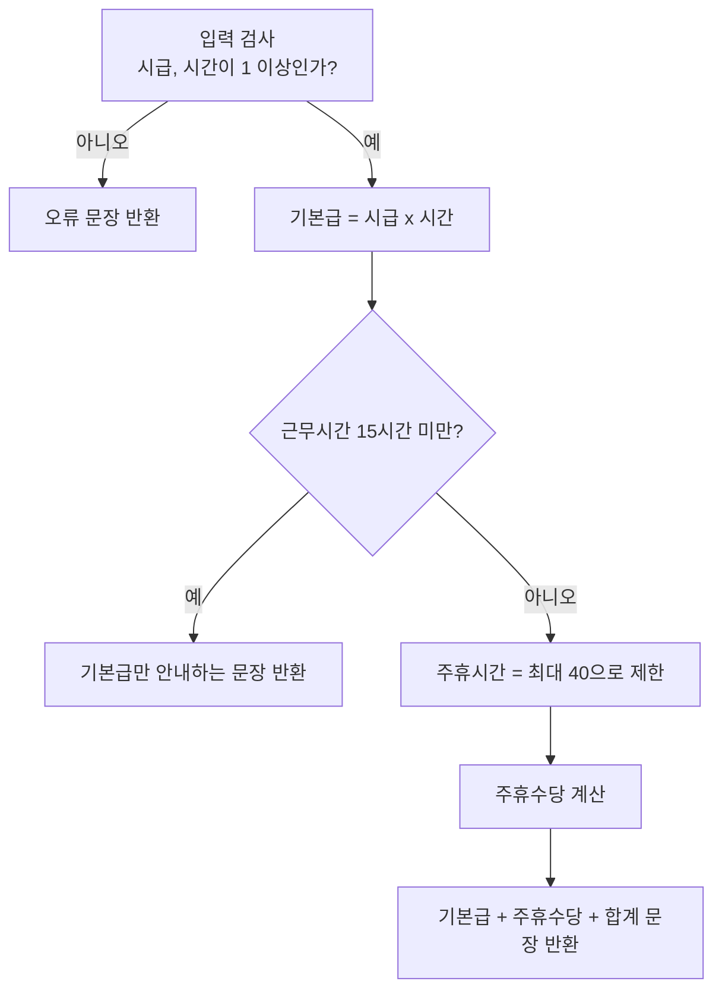
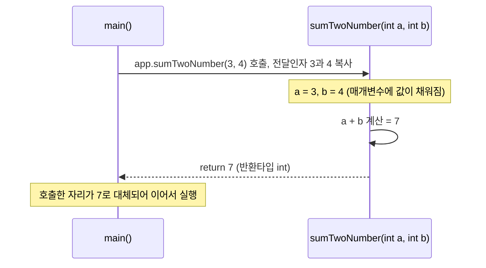
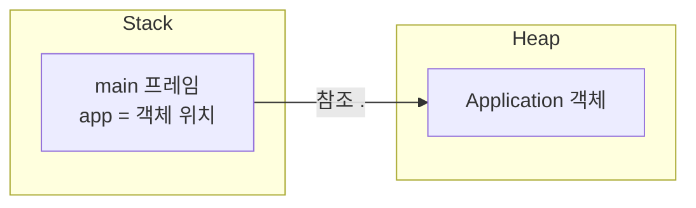

## 들어가며 (Situation)

어제(제어문·반복문·메소드 정리 글)는 `main()` → `methodA()` → `methodB()`가 스택처럼 쌓였다가 거꾸로 빠져나오는 호출 **흐름**을 봤다. 오늘은 그 메소드에 **값을 넘기고(전달인자, 매개변수), 값을 돌려받고(반환타입)**, 다른 클래스에 있는 메소드를 **어떻게 불러오는지(new)**를 배웠다.

복습하면 1일차는 리터럴·변수·연산자, 2일차는 조건문·반복문·메소드의 기초였고, 오늘은 그 메소드를 직접 설계해서 쓰는 날이었다. 강사님이 "캠퍼스 계산기"라는 실습을 주셨다. 메뉴가 있는 `Application`의 뼈대(do-while + switch)는 주어졌고, 나는 `1. 알바 급여` 메뉴를 만들어 넣는 역할을 맡았다.

## 문제 상황 (Task)

주어진 뼈대에는 메뉴 `0. 종료`만 있었다. 여기에 "시급과 주간 근무시간을 입력하면 급여 명세 문장을 돌려주는" 기능을 붙여야 했다. 제약과 조건은 다음과 같았다.

- 뼈대 `Application`의 `main` 안에 계산 로직을 전부 쓰면 메뉴가 늘수록 코드가 길어진다. (어제 배운 "반복·역할은 메소드로 묶는다"를 적용해야 한다.)
- 입력 검사 → 기본급 → 15시간 규칙 판단 → 주휴수당 → 결과 문장 순서로 동작해야 한다.
- 계산을 맡는 클래스와 결과 문장을 조립하는 클래스를 나눠, 클래스 사이에서 메소드를 호출해야 한다.

실습 요구사항은 팀 저장소의 [Issue #3 `[메뉴 1] 알바 급여`](https://github.com/Staff-Only-team/StaffOnly-campus-calculator/issues/3)에 정리했다. 강사님이 준 규칙을 내 말로 옮겨 적은 것이고, 만들어야 할 메소드 선언부도 여기에 글자 그대로 적었다.

| 클래스 | 메소드 선언부 (Issue에 적은 것) |
|---|---|
| `WageCalculator` | `public int getPay(int wage, int hours)`, `public int getHolidayPay(int wage, int hours)` |
| `WageService` | `public int getHolidayHours(int hours)`, `public String makePayslip(int wage, int hours)` |

규칙은 다음과 같다.

- 시급이나 근무시간이 0 이하이면 계산하지 않고 "1 이상이어야 한다"는 안내 문장을 돌려준다.
- 기본급 = 시급 × 근무시간
- 주 15시간 미만이면 기본급만, 15시간 이상이면 기본급 + 주휴수당이다. 주휴수당은 시급 × 주휴시간 ÷ 5이고, 주휴시간은 근무시간이 40을 넘으면 40으로 제한한다.

처음 그린 설계 메모는 이랬다. (`test.java`에 주석으로 남겨둔 것을 정리했다.)



## 해결 과정 (Action)

### 1. 개념 정리 — 오늘의 핵심 키워드 5개

먼저 메모로 정리한 `sumTwoNumber` 예제를 바르게 고쳐서 다시 적고, 키워드를 하나씩 짚었다. (메모의 `int num2 =2l`, `int a,, int b`는 오타라서 고쳤다.)

```java
// 호출하는 쪽 (main 영역)
Application app = new Application();   // 호출 준비: 객체를 만든다
int result = app.sumTwoNumber(3, 4);   // 소괄호를 만나는 순간 호출. 3, 4가 전달인자

// 호출당하는 쪽 (main 밖)
public int sumTwoNumber(int a, int b) { // int a, int b가 매개변수
    return a + b;                       // 반환타입 int → int 값을 돌려준다
}
```

| 키워드 | 이 예제에서 | 한 줄 정리 |
|---|---|---|
| 매개변수(parameter) | `int a`, `int b` | 메소드 선언부에 적는 변수 목록. 받을 값의 "자리"를 만든다 |
| 전달인자(argument) | `3`, `4` | 호출할 때 실제로 넘기는 값. 타입과 순서가 매개변수와 맞아야 한다 |
| 메소드 호출 | `app.sumTwoNumber(3, 4)` | `()`를 만나는 순간 실행 흐름이 메소드로 이동한다 |
| 반환타입 | `int` | `return`으로 돌려줄 값의 타입. 돌려줄 게 없으면 `void` |
| 다른 영역의 메소드 호출 | `new Application()` | 다른 클래스의 (static이 아닌) 메소드는 객체를 `new`로 만든 뒤 호출한다 |

메모에는 "매개변수는 공간만 설정하고 값은 넣지 않은 상태"라고 적었는데, 더 정확히는 이렇다. 공식 튜토리얼은 이를 다음과 같이 구분한다.

> *Parameters* refers to the list of variables in a method declaration. *Arguments* are the actual values that are passed in when the method is invoked. — [Oracle Java Tutorials, Passing Information to a Method](https://docs.oracle.com/javase/tutorial/java/javaOO/arguments.html)

즉 매개변수는 선언만 해둔 빈 변수이고, **호출되는 순간 전달인자 값이 그 자리에 복사되어 채워진다.** 자바에서 기본형 인자는 값이 복사되어 전달되기(pass by value) 때문에 메소드 안에서 `a`를 바꿔도 호출한 쪽의 변수는 바뀌지 않는다. 위 문서는 참조형도 "참조값이 복사되어 전달된다"고 설명한다.

### 2. 호출 시 값이 오가는 흐름



어제의 "호출하면 반드시 호출한 자리로 돌아온다"에 오늘은 **돌아올 때 값을 들고 올 수 있다**는 내용이 더해진 셈이다. `return`을 만나면 그 메소드는 즉시 끝나고, 호출 표현식 `app.sumTwoNumber(3, 4)` 전체가 반환값 `7`로 바뀐 것처럼 동작한다. 반환값이 없는 `void` 메소드는 `return`을 생략해도 된다.

### 3. "다른 영역의 메소드를 부르려면 Heap에 new" — 정확히는 무슨 뜻일까

메모에는 "다른 영역에 있는 메서드를 호출하기 위해서는 Heap 메모리에 할당해야 한다"고 적었다. 실습하면서 이 문장을 공식 문서 기준으로 다시 다듬었다.

- `main`은 `static` 메소드이고, `sumTwoNumber`는 `static`이 아닌 **인스턴스 메소드**다. 인스턴스 메소드는 특정 객체에 속하므로, 호출하려면 **먼저 객체가 있어야** 한다. 그 객체를 만드는 것이 `new` 연산자다.
- JVM 명세에 따르면 클래스 인스턴스와 배열은 **Heap**에 할당된다. 반면 메소드를 호출할 때마다 만들어지는 **프레임(지역변수, 매개변수 포함)**은 각 스레드의 **Stack**에 쌓인다. ([JVM 명세 2.5.2 Stack, 2.5.3 Heap](https://docs.oracle.com/javase/specs/jvms/se17/html/jvms-2.html))
- 그래서 `Application app = new Application();`에서는 객체(Application 인스턴스)가 Heap에 생기고, `app`이라는 참조변수가 `main`의 스택 프레임에 그 위치를 가리킨다.
- 메소드의 코드 자체를 Heap에 올리는 것은 아니다. Heap에 올라가는 것은 "객체"이고, `app.sumTwoNumber(...)`의 `.`(참조연산자)가 "`app`이 가리키는 객체를 따라가서 그 안의 멤버에 접근하라"는 뜻이다.
- 같은 클래스 안의 `static` 메소드는 객체 없이 바로 호출할 수 있다. 오늘 `new`가 꼭 필요했던 이유는 "인스턴스 메소드라서"이지, 모든 메소드 호출에 `new`가 필요하다는 뜻은 아니다.

| 구분 | Stack | Heap |
|---|---|---|
| 저장되는 것 | 메소드 호출 프레임(매개변수, 지역변수, 참조변수 `app`) | `new`로 만든 객체, 배열 |
| 범위 | 스레드마다 하나 | 모든 스레드가 공유 |
| 생명주기 | 메소드가 끝나면 프레임이 사라짐 | 가비지 컬렉터가 회수 |



### 4. 실습 코드 — 클래스 3개, 메소드 5개로 나누기

설계 메모를 그대로 메소드로 옮겼다. 역할은 이렇게 나눴다.

| 클래스 | 메소드 | 역할 |
|---|---|---|
| `Application` | `main` | 메뉴 출력, 입력 받기, `WageService` 호출 |
| `WageService` | `makePayslip(int, int)` | 입력 검사와 15시간 규칙 판단, 결과 문장 조립 |
| `WageService` | `getHolidayHours(int)` | 주휴수당에 쓸 시간을 최대 40으로 제한 |
| `WageCalculator` | `getPay(int, int)` | 기본급 계산 |
| `WageCalculator` | `getHolidayPay(int, int)` | 주휴수당 계산 |

먼저 `Application`의 case 1이다. 입력값이 **전달인자**가 되어 다른 클래스의 메소드로 넘어가고, 반환된 `String`을 받아 출력한다. 뼈대가 `main`이라 `new WageService()`로 객체를 먼저 만든다.

```java
// Application.java
case 1:
    System.out.print("시급 : ");
    int wage = sc.nextInt();
    System.out.print("이번 주 근무 시간 : ");
    int hours = sc.nextInt();

    WageService wserv = new WageService();
    String str = wserv.makePayslip(wage, hours);
    System.out.println(str);
    break;
```

`makePayslip`은 반환타입이 `String`이다. 출력(`println`)은 호출한 쪽이 하고, 이 메소드는 **문장을 만들어서 돌려주는 일**만 한다. 같은 메소드 안에서 `new WageCalculator()`로 또 다른 클래스를 호출한다.

```java
// WageService.java
public String makePayslip(int wage, int hours){
    //입력검사
    if(wage <= 0 || hours <= 0) {
        return "시급과 근무시간은 1 이상이여야 합니다.";
    }else {
        WageCalculator wcalc = new WageCalculator();
        int nw = wcalc.getPay(wage,hours); //기본급

        //주휴시간(hh) 판별
        if (hours<15) {
            return ("기본급 "+ nw +"원 (주 15시간 미만이라 주휴수당 없음)");
        }else{
            int hh = getHolidayHours(hours); //주휴시간 확인(40 || hours)
            int hw= wcalc.getHolidayPay(wage,hh); //주휴수당 계산
            return ("기본급 "+nw+"원 +"+" 주휴수당 "+hw+"원 = 총 " + (nw+hw)+"원");
        }
    }
}
```

여기서 `getHolidayHours(hours)`는 `wcalc.`나 `wserv.` 없이 바로 불렀다. 같은 `WageService` 클래스 안에서, 이미 만들어진 객체(`wserv`)의 메소드가 같은 객체의 다른 메소드를 부르는 것이라 별도의 `new`가 필요 없기 때문이다. 반면 `getPay`는 **다른 클래스**(`WageCalculator`)에 있어서 `new WageCalculator()`로 객체를 만들고 `wcalc.getPay(...)`로 불렀다. 같은 영역과 다른 영역의 차이를 코드로 직접 체감한 부분이다.

### 5. 삼항연산자로 줄인 부분

`getHolidayHours`는 "근무시간이 40을 넘으면 40, 아니면 그대로"를 돌려준다. if-else로 쓰면 네 줄이지만 삼항연산자로 한 줄이 된다.

```java
// WageService.java
public int getHolidayHours(int hours){
    return (hours > 40) ? 40 : hours;
}
```

메모의 최솟값 예제와 구조가 같다. `1항 ? 2항 : 3항`에서 1항(조건식)이 `true`면 2항, `false`면 3항이 선택된다.

```java
// 메모의 예제 — 최솟값
int a = 20;
int b = 10;
int min = (a > b) ? b : a;   // a > b가 true이므로 b(10) 선택
```

실제로 삼항연산자로 바꾸고 나니 **코드가 눈에 띄게 간결해졌다.** 같은 판단을 if-else 네 줄로 쓰면 "무슨 값을 돌려주는 메소드인지"가 중괄호와 `return`에 묻히는데, 한 줄로 쓰니 "40을 넘으면 40, 아니면 그대로"라는 의도가 바로 읽혔다.

JLS는 조건 연산자에서 **2항과 3항 중 하나만 평가된다**고 정의한다. ([JLS 15.25](https://docs.oracle.com/javase/specs/jls/se17/html/jls-15.html)) 그래서 값을 고르는 단순한 분기에는 삼항이, 실행할 문장이 여러 줄인 분기에는 if-else가 어울린다. `makePayslip`의 15시간 분기는 문장을 반환하고 계산도 하는 여러 줄이라 일부러 if-else로 남겼다.

### 6. 시행착오와 직접 발견한 점

가장 힘들었던 곳은 주휴수당을 계산하는 `makePayslip`이었다. 입력 오류, 15시간 미만, 15시간 이상으로 `if`가 겹겹이 이어지다 보니 **어떤 순서로 생각해야 하는지 사고 흐름을 잡는 데** 시간이 오래 걸렸다. 결국 "어느 메소드가 어느 메소드를 어떤 방향으로 호출하는가"를 먼저 정하고, 직접 호출하는 부분과 다른 클래스를 호출하는 부분을 그 방향에 맞춰 나누면서 풀었다.

같은 부분을 맡은 다른 모둠 사람들의 코드와도 비교했다. 오류가 난 코드를 같이 분석해 해결하는 것을 도왔고, 내가 생각한 논리 흐름을 설명해 주며 코드를 쓰는 데 도움을 줬던 기억이 남는다. 이 과정에서 **요구명세서의 변수명과 기능을 먼저 꼼꼼히 확인해야 한다**는 것을 배웠다. 흐름이 맞아도 명세와 이름이 어긋나면 호출이 이어지지 않기 때문이다.

그 밖에 코드와 커밋 기록으로 확인되는 것은 다음과 같다.

- `test.java`에 설계 메모(입력 검사 → 15시간 → 40시간 상한 → 합계)를 주석으로 먼저 적어두고, 그 순서대로 `makePayslip`을 구현한 흔적이 남아 있다. 코드부터 쓰지 않고 **흐름을 말로 먼저 정리한 것**이 클래스·메소드를 나누는 기준이 됐다.
- `makePayslip` 안에서 기본급(`nw`)을 한 번만 계산해 두고 두 분기(15시간 미만, 이상)에서 모두 재사용했다. 같은 계산을 두 번 쓰지 않으려는 메소드 분리의 효과다.
- 지금 코드는 입력값이 숫자가 아니면 `sc.nextInt()`에서 예외가 날 수 있다. 오늘은 기능 흐름이 목표여서 다루지 못했고 다음 개선 과제로 남긴다.

### 7. 테스트 입력표로 검증하기

실습에는 입력과 기대 출력을 적은 테스트 입력표가 있었다. 완성한 코드를 컴파일해 표의 입력 5건을 그대로 넣고 실행했다.

| 입력 (시급, 시간) | 확인하는 것 | 실제 출력 | 동작 확인 |
|---|---|---|---|
| 10000, 20 | 기본 흐름 | 기본급 200000원 + 주휴수당 40000원 = 총 240000원 | 일치 |
| 10000, 12 | 15시간 미만 | 기본급 120000원 (주 15시간 미만이라 주휴수당 없음) | 일치 |
| 10000, 15 | 경계값 15 | 기본급 150000원 + 주휴수당 30000원 = 총 180000원 | 일치 |
| 10000, 45 | 40시간 상한 | 기본급 450000원 + 주휴수당 80000원 = 총 530000원 | 일치 |
| 10000, 0 | 잘못된 입력 | 계산 없이 "1 이상이어야 한다"는 안내 문장 출력 | 정상 |

45시간 입력에서 기본급은 45시간 기준(450000원), 주휴수당은 40시간 기준(10000 × 40 ÷ 5 = 80000원)으로 계산됐다. `getHolidayHours`의 삼항연산자가 의도대로 40으로 제한한 것이다. 15시간 경계값도 "15시간 이상"에 포함되어 주휴수당이 붙었다.

시급이나 시간이 0 이하인 마지막 입력은 기본급 계산으로 넘어가지 않고 입력 검사에서 바로 안내 문장을 돌려줬다. 다섯 입력 모두 의도한 분기로 흘러갔다.

## 결과 (Result)

정량 지표는 측정하지 않았기 때문에, 실제로 셀 수 있는 것만 적는다. 테스트 입력표 5건 모두 의도한 분기로 동작했다.

| 항목 | Before (뼈대) | After (내 구현) |
|---|---|---|
| 클래스 수 | 1 (`Application`) | 3 (`Application`, `WageService`, `WageCalculator`) |
| 메소드 수 | 1 (`main`) | 5 (`main`, `makePayslip`, `getHolidayHours`, `getPay`, `getHolidayPay`) |
| 메뉴 | `0. 종료` | `0. 종료`, `1. 알바 급여` |
| 삼항연산자 사용 | 없음 | 1곳 (`getHolidayHours`) |

배운 점은 다음과 같다.

1. **매개변수는 빈 변수, 전달인자는 값**이다. 호출되는 순간 값이 복사되어 매개변수에 채워진다.
2. **반환타입은 메소드의 약속**이다. `String`을 돌려주기로 했으니 모든 경로(입력 오류, 15시간 미만, 15시간 이상)가 `return`으로 `String`을 돌려줘야 한다.
3. **`new`가 필요한 이유는 "인스턴스 메소드는 객체에 속하기 때문"**이다. 객체는 Heap에 생기고, 참조변수는 스택 프레임에 있다. 메모의 "Heap에 할당"이라는 표현은 객체의 할당을 말하는 것으로 이해했다.
4. **if가 많을 때는 코드보다 흐름을 먼저 정리한다.** 순서를 정하고 호출 방향을 맞추니 막혔던 곳이 풀렸다.
5. **요구명세서의 변수명과 기능, 출력 문장을 먼저 확인한다.** 이름과 기능이 명세와 맞아야 메소드 호출과 출력이 의도대로 이어진다.
6. 메소드를 역할별로 나누면 `main`은 입출력만, 계산은 `WageCalculator`, 판단과 문장 조립은 `WageService`로 분리되어 읽기 쉬워진다.

## 더 학습하면 좋은 개념

- **static과 인스턴스 멤버의 차이** — 오늘 `new`를 해야만 호출할 수 있었던 이유가 "인스턴스 메소드"였다. `static`이 붙으면 왜 객체 없이 호출되는지 알아야 `main`이 `static`인 이유까지 이어서 이해할 수 있다.
- **값에 의한 전달(pass by value)과 참조형 인자** — 기본형은 값이, 참조형은 참조값이 복사된다. 메소드 안에서 객체 필드를 바꾸면 호출한 쪽에도 영향이 있는 이유를 이해하면 버그를 예방한다.
- **JVM 메모리 구조(Stack, Heap, Method Area)** — 오늘은 Stack과 Heap의 역할만 구분했다. 메소드 코드와 클래스 정보가 어디에 있는지, 가비지 컬렉션이 무엇을 회수하는지까지 보면 `new`의 비용을 판단할 수 있다.
- **메소드 오버로딩** — `getPay(int, int)`와 같은 이름에 `double` 시급을 받는 버전을 만들 수 있는지 생각해보면 매개변수의 타입·개수가 메소드 식별에 어떻게 쓰이는지 알 수 있다.
- **입력 검증과 예외 처리(`InputMismatchException`)** — `Scanner.nextInt()`에 숫자가 아닌 값이 들어오면 예외가 나는 문제를 다루려면 `try-catch`와 입력 검증을 배워야 한다.

## 참고 자료

- [Oracle Java Tutorials - Defining Methods](https://docs.oracle.com/javase/tutorial/java/javaOO/methods.html)
- [Oracle Java Tutorials - Passing Information to a Method or a Constructor](https://docs.oracle.com/javase/tutorial/java/javaOO/arguments.html)
- [Oracle Java Tutorials - Returning a Value from a Method](https://docs.oracle.com/javase/tutorial/java/javaOO/returnvalue.html)
- [Oracle Java Tutorials - Creating Objects](https://docs.oracle.com/javase/tutorial/java/javaOO/objectcreation.html)
- [JLS 17, 15.25 Conditional Operator ? :](https://docs.oracle.com/javase/specs/jls/se17/html/jls-15.html#jls-15.25)
- [JVM Specification 17, 2.5 Run-Time Data Areas](https://docs.oracle.com/javase/specs/jvms/se17/html/jvms-2.html#jvms-2.5)
