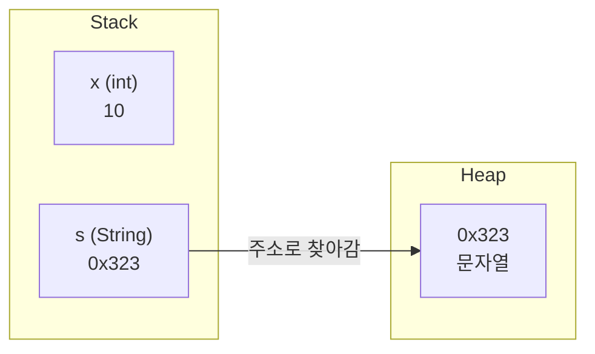
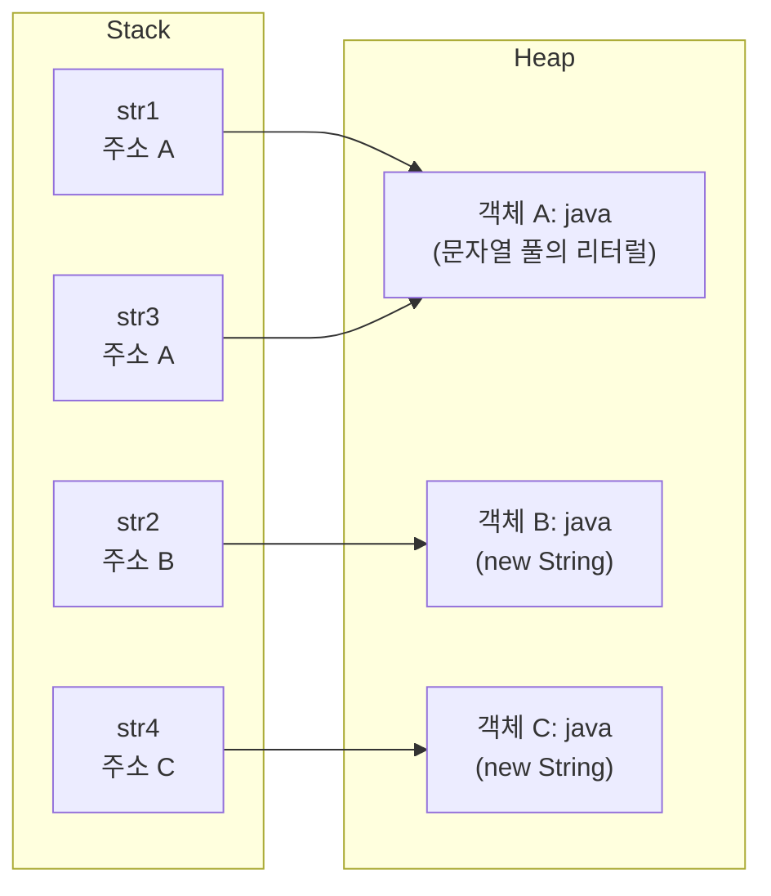
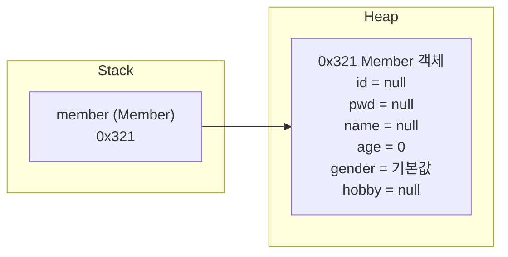

## 들어가며 (Situation)

어제([메소드 호출과 new 글]())는 `new`로 만든 객체는 Heap에 생기고, 참조변수는 Stack 프레임에 있다는 것까지 봤다. 오늘은 그 "참조변수가 들고 있는 것"의 정체를 파고드는 날이었다. `String`, 배열, 직접 만든 클래스가 모두 같은 규칙으로 움직인다는 것이 오늘의 줄거리다.

시작은 메모의 첫 줄이었다. 지금까지는 `int`, `double`처럼 소문자로 시작하는 자료형만 썼는데, `String`은 대문자로 시작한다. 강사님은 이것이 `String`이 **클래스**라는 신호라고 하셨다. 그런데 이 "대문자/소문자" 구분은 문법 규칙일까, 관례일까? 이 질문부터 확인하면서 시작했다.

## 문제 상황 (Task)

오늘 해결해야 했던 과제는 메모에 이렇게 적혀 있다.

> `String str1 = "java"; String str2 = new String("java");` 인데 `str1 == str2` 는 false로 나온다.

겉으로는 같은 `"java"`인데 같다고 나오지 않는다. 그래서 과제를 이렇게 정했다. **"참조 자료형 변수는 값이 아니라 주소를 담는다"는 설명을 코드와 실행 결과로 직접 확인하기.** 구체적인 확인 항목은 다음과 같다.

- 기본 자료형과 참조 자료형을 코드만 보고 구별할 수 있는가?
- `==`가 `false`/`true`로 갈리는 경우를 직접 실행해서 설명할 수 있는가?
- 값을 넣은 적 없는 배열과 객체 필드를 출력하면 왜 `0`, `null`이 나오는가? (메모의 마지막 줄 "초기값" 문장을 정확히 이해하기)

제약은 두 가지였다. 강사님의 그림은 수업용으로 단순화된 모델이라 공식 문서와 어긋나는 부분이 있을 수 있었고, 메모에도 부정확한 표현이 섞여 있었다. 그래서 공식 문서(JLS, JVMS, Javadoc)로 확인하며 바로잡는 것도 과제에 포함했다.

## 해결 과정 (Action)

### 1. 자료형 구별법 — 소문자/대문자는 "관례"다

메모에는 "참조자료형은 대문자로 시작, 기본자료형은 소문자로 시작"이라고 적었다. 구별에 쓰기에는 편하지만, 정확히는 이렇다.

| 구분 | 기본 자료형 | 참조 자료형 |
|---|---|---|
| 예 | `int`, `double`, `char`, `boolean` | `String`, `int[]`, `Member` |
| 변수가 담는 것 | 실제 값 | 객체(배열)가 있는 곳을 가리키는 참조(주소) |
| 보통 보이는 모양 | 소문자 키워드 | 클래스 이름(대문자로 시작) |

"대문자로 시작한다"는 문법이 아니라 **코딩 컨벤션**이다. Oracle의 명명 규칙은 클래스 이름은 대문자로 시작하고, 변수 이름은 소문자로 시작하라고 안내한다. ([Oracle Java Code Conventions - Naming Conventions](https://www.oracle.com/java/technologies/javase/codeconventions-namingconventions.html)) 이름을 어겨도 컴파일러가 막는 문법 규칙은 아니다. 다만 모든 자바 코드가 이 관례를 따르기 때문에 "대문자로 시작하면 클래스(참조 자료형)일 것"이라고 읽는 습관이 실제로 잘 맞는다. 그리고 기본 자료형 8개는 언어가 정해둔 **키워드**라서 소문자인 것이다.

### 2. 메모리 그림으로 보는 "값 vs 주소"

강사님의 그림은 `int x = 10;`과 `String s = "문자열";`을 나란히 그렸다.


그림 아래의 설명을 그대로 옮기면 "참조자료형은 heap 공간에 생성되며, 변수는 값을 가지고 있는 것이 아닌 실제 값이 존재하는 heap 메모리 상의 주소 값을 가지고 있게 된다."이다. 같은 내용을 텍스트로 다시 그려 봤다. (주소 `0x323`은 강사님 그림의 값이고, 실제 JVM 주소가 아니라 설명용 숫자다.)



기본 자료형 `x`는 Stack에 값 `10`이 **직접** 있고, 참조 자료형 `s`는 Stack에 주소만 있고 내용은 Heap에 있다. 메모의 "문자열은 stack에는 주소값만 존재(heap에 내용이 저장되고 그 주소를 stack에 저장)"가 이 그림이다.

**여기서 메모를 조금 바로잡았다.** 수업에서는 "JVM = stack + heap + static"이라고 정리했는데, 공식 명세(JVMS 2.5 Run-Time Data Areas)의 분류는 다르다.

| 수업용 단순화 | JVMS의 용어 | 참고 |
|---|---|---|
| stack | JVM Stack (스레드마다 하나, 메소드 호출 프레임) | 프레임 안에 지역변수와 매개변수가 있다 |
| heap | Heap (모든 스레드 공유) | "all class instances and arrays"가 할당되는 영역 |
| static | Method Area (클래스별 구조, 런타임 상수 풀, 메소드 코드 등) | JVMS는 "method area는 논리적으로 heap의 일부"라고 적고 있다 |

그림의 static 영역에는 `int`, `String[]`, `char`로 가는 화살표가 그려져 있다. 이 화살표가 정확히 무엇을 뜻하는지(클래스·타입 정보를 가리킨다는 의미인지 등)는 수업 자료만으로는 단정할 수 없어서, 이 글에서는 해석하지 않고 **"static 영역이라는 칸이 따로 있다"**는 것까지만 받아들이기로 했다. ([JVM 명세 2.5 Run-Time Data Areas](https://docs.oracle.com/javase/specs/jvms/se21/html/jvms-2.html#jvms-2.5))

### 3. String 메소드를 쓸 때의 규칙 — 반환 타입과 매개변수 확인

`String`은 클래스이므로 `.`을 찍으면 메소드가 나온다. 수업 코드(`a_string/Application01.java`)에서는 `length()`와 `charAt(index)`를 썼다.

```java
String str1 = "applemango";
System.out.println("str1의 길이! : " + str1.length()); // 반환 타입 int
for (int i = 0; i < str1.length(); i++){
    System.out.println(str1.charAt(i)); // index는 0부터 시작하는 번호 체계
}
```

메모의 "제공되는 메소드의 반환 타입을 봐야 함, 매개변수도 확인해야 함(전달인자를 제공해야 함)"은 어제 배운 내용이 `String` API에 그대로 적용된 것이다. [String Javadoc](https://docs.oracle.com/en/java/javase/21/docs/api/java.base/java/lang/String.html)에서 `length()`는 `int`를 반환하고 매개변수가 없으며, `charAt(int index)`는 `char`를 반환하고 `int` 전달인자를 하나 요구한다. 시그니처를 보지 않고 쓰면 `String s = str1.length();` 같은 타입 불일치가 난다. 강사님도 수업 코드 주석에서 "메소드를 다 외우지 말고, 사용해보고 출력해보고 이해하라"고 하셨다.

그리고 `charAt`의 **index는 0부터** 센다. `"abc"`는 `a:0, b:1, c:2`이고, 마지막 글자의 index는 `length() - 1`이다. 위 반복문이 `i < str1.length()`인 이유가 이것이다.

### 4. `str1 == str2`는 왜 false일까 — 직접 실행해서 확인

수업 코드(`a_string/Application02.java`)에는 문자열을 만드는 두 가지 방식이 있다.

```java
// 1. 리터럴 방식
String str1 = "java";
// 2. 객체 생성 방식
String str2 = new String("java");

String str3 = "java";
String str4 = new String("java");

System.out.println("동등비교 : " + (str1 == str2)); //false
System.out.println("동등비교 : " + (str1 == str3)); //true
System.out.println("동등비교 : " + (str2 == str4)); //false
System.out.println("equals() 활용 비교 : " + str1.equals(str2)); // true
```

강사님의 주석에 결과가 적혀 있었지만, 주석만 믿지 않고 같은 비교를 JDK 21(Temurin)로 직접 실행해 확인했다. 결과는 주석과 같았다.

| 비교 | 결과 | 의미 |
|---|---|---|
| `str1 == str2` | **false** | 리터럴 vs `new` → 서로 다른 객체 |
| `str1 == str3` | **true** | 리터럴 둘 → 같은 객체 |
| `str2 == str4` | **false** | `new`는 매번 새 객체 |
| `str1.equals(str2)` | **true** | 내용(문자들)이 같음 |



그림에서 `==`가 하는 일은 **Stack에 있는 값(주소)끼리 비교**하는 것이다. `str1`과 `str2`는 주소가 A와 B로 다르니 `false`다. 메모의 "그 주소끼리 비교하기 때문에 false가 나오는 것"이 이 뜻이다. `equals()`는 주소를 따라가 **내용(문자들)**을 비교하므로 `true`가 나온다. 문자열 내용 비교는 `equals()`를 쓴다고 정리했다.

**메모와 공식 문서를 맞춘 부분.** 메모에는 "String은 객체로 stack에 heap 주소를 저장한다"고만 적었는데, 리터럴과 `new`의 차이를 설명하려면 한 가지가 더 필요했다.

- [JLS 3.10.5](https://docs.oracle.com/javase/specs/jls/se21/html/jls-3.html#jls-3.10.5)는 "문자열 리터럴은 `String.intern` 메소드를 쓴 것처럼 **interned**되어 같은 내용이면 같은 인스턴스를 공유한다"고 정의한다. 메모의 "리터럴 방식으로 `str3 = "java"`를 만들면 `str1`과 같은 주소를 본다"가 이것이고, 이 공유되는 저장소를 보통 **String pool**이라고 부른다.
- `new String("java")`는 풀의 객체와 별개로 **새 인스턴스**를 만든다. 메모의 "new는 항상 새로운 공간을 만든다"가 맞다. (`new` 표현식은 항상 새 객체를 만든다고 [JLS 15.9.4](https://docs.oracle.com/javase/specs/jls/se21/html/jls-15.html#jls-15.9.4)에 있다.)
- 풀의 위치: JVMS 2.5.3은 힙이 "all class instances and arrays"가 할당되는 곳이라고 하고, 문자열 리터럴도 `String` 인스턴스다. 그래서 풀의 문자열도 **객체**이고, 이 글에서는 "문자열 내용이 Heap 쪽에 있다"는 그림을 유지한다. 다만 풀의 구체적인 구현 위치는 JVM마다 다를 수 있어서, 공식 문서로 확인한 범위(문자열이 `String` 객체라는 것)까지만 적는다.

메모의 마지막 주석 "이전에 기본확인을 위해 면접에 종종 출제"는 확인할 수 없는 정보라 근거 없이 단정하지 않기로 했다. 이 비교가 `==`와 `equals()`의 차이를 확인하는 좋은 기본 질문이라는 정도로만 받아들인다.

### 5. 배열도 참조 자료형 — `new int[5]`가 만드는 것

두 번째 스크린샷은 `int[] iarr = new int[5];`와 `Member member = new Member();`를 한 장에 그렸다.

![int[] iarr = new int[5]; 와 Member member = new Member(); 의 메모리 그림. stack의 iarr 는 주소 0x123으로 heap의 5칸 배열을 가리키고, member 는 주소 0x321로 heap의 필드 6칸 객체를 가리킨다. 오른쪽은 IntelliJ의 Member.java와 실행 결과(이름 null, 나이 0)]({{ site.baseurl }}/assets/images/2026-10-01-array-and-member-heap-allocation.png)

수업 코드(`b_array/Application01.java`)에서 같은 코드를 실행하면 다음과 같다.

```java
int[] iarr = new int[5]; //자료형 int[], heap에 5칸 공간 생성
System.out.println("iarr = " + iarr);            // 주소값 : [I@5b6f7412
System.out.println("iarr.length = " + iarr.length); //5
System.out.println(iarr[0]);                     // 0이 출력
```

배열 변수를 그대로 출력하면 값 5개가 아니라 `[I@5b6f7412` 같은 문자열이 나온다. `[I`는 "int의 배열"을 뜻하는 타입 이름이고, 뒤는 해시값이다. `iarr`가 **값이 아니라 배열 객체를 가리키는 참조**라는 것이 출력으로 드러난 순간이었다.

같은 이유로 참조 자료형 변수끼리 대입하면 값이 아니라 **주소가 복사된다.** `int[] copy = iarr;`를 하면 배열이 하나 더 생기는 것이 아니라, 두 변수가 **같은 Heap의 배열**을 가리키게 된다. 기본형이라면 `int b = a;` 뒤에 `b`를 바꿔도 `a`는 그대로지만, 참조형은 한쪽을 통해 바꾸면 다른 쪽에서도 바뀐 값이 보인다.

### 6. 클래스도 같은 규칙 — 필드와 기본값

`Member`는 강사님이 만든 **사용자 정의 자료형**이다. 수업 코드(`b_oop/a_user_type/Member.java`)의 필드는 이렇다.

```java
public class Member {
    /* 지금까지 우리는 Application이 아닌 클래스를 만들면 method만 작성했었다.
       하지만 클래스 내부에는 메소드를 작성하지 않고 바로 선언할 수 있다.
       이것을 전역변수( 필드 == 인스턴스 변수 == 속성) 라고 부른다 */
    String id;
    String pwd;
    String name;
    int age;
    char gender;
    String[] hobby;
}
```

그리고 `Application01.java`에서 `new Member()`로 만들고 값을 넣지 않은 필드를 출력했다.

```java
Member member = new Member();  // 자료형이 Member인 공간을 stack에 만들고 heap에도 공간을 생성
System.out.println("member 의 이름 : " + member.name); //null
System.out.println("member 의 나이 : " + member.age); //0
```

스크린샷의 실행 결과도 `member 의 이름 : null`, `member 의 나이 : 0`이다. 값을 한 번도 넣지 않았는데 오류가 아니라 `null`과 `0`이 나온다.

Member 객체 안의 `String` 필드들은 그림처럼 다시 **다른 Heap 객체를 가리키는 참조**다. 그래서 `new Member()` 직후에는 `id`, `pwd`, `name`, `hobby`가 아직 아무것도 가리키지 않는 `null`이고, `age`와 `gender`는 값을 직접 담는 기본형이라 `0`과 `'\u0000'`이다. 코드에서 `member.hobby = new String[]{...}`로 새 배열을 할당하면 그제야 `hobby` 필드가 그 배열을 가리킨다.



### 7. 메모의 마지막 문장 바로잡기 — "참조 자료형에만 초기값이 있다?"

메모에는 "참조 자료형에만 초기값이 있고 기본자료형은 없으므로 초기화를 시켜줘야 함"이라고 적었다. 수업 코드의 주석에도 "heap 공간은 비어있는 값이 존재할 수 없다. JVM이 지정한 기본값으로 세팅된다. 정수 0 / 실수 0.0 / 논리 false / 참조 null"이라고 되어 있다. 이 두 문장은 서로 어긋나서 JLS로 확인했다.

- [JLS 4.12.5 Initial Values of Variables](https://docs.oracle.com/javase/specs/jls/se21/html/jls-4.html#jls-4.12.5)는 **필드와 배열 요소**에 기본값을 준다. 기본형도 포함한다(`int`는 `0`, `boolean`은 `false`, 참조형은 `null`). 그래서 `age`가 `0`으로 나온 것이다.
- 반면 **지역변수**는 기본값이 없다. 읽기 전에 반드시 값을 대입해야 한다([JLS 16 Definite Assignment](https://docs.oracle.com/javase/specs/jls/se21/html/jls-16.html)). 이것은 기본형인지 참조형인지와 무관하다.

기본형(`int x;`)이라도 지역변수는 값을 넣기 전에 읽으면 컴파일 에러가 난다. 수업 코드의 `Member.test()` 메소드에도 `String test;`가 있는데, 지역변수라 값을 넣기 전에는 읽을 수 없다. 정리하면 메모의 문장은 이렇게 고쳐야 한다.

| 변수 종류 | 기본값 | 기본형 | 참조형 |
|---|---|---|---|
| 필드, 배열 요소 | 자동으로 있음 | `0`, `0.0`, `false` 등 | `null` |
| 지역변수, 매개변수 | **없음** (대입해야 읽을 수 있음) | 초기화 필요 | 초기화 필요 |

이 구분 덕분에 "초기화시켜줘야 한다"는 메모의 결론은 **지역변수**에서는 옳고, "기본형에는 초기값이 없다"는 부분은 필드와 배열에서는 틀리다는 것을 알게 됐다. 표를 만들어 놓고 보니 스크린샷의 `age 0`, `name null`과도 정확히 일치한다.

### 8. 메모의 궁금증 두 가지

메모 속에 `?? 증감식 뒤에는 왜 ; 가 안 붙지, array도 대문자로 쓰나`라는 질문이 있었다. 공식 문서로 답을 찾았다.

**(1) for문의 증감식 뒤에는 왜 `;`가 없을까?**

[JLS 14.14.1](https://docs.oracle.com/javase/specs/jls/se21/html/jls-14.html#jls-14.14.1)의 문법은 다음과 같다.

```text
BasicForStatement:
    for ( [ForInit] ; [Expression] ; [ForUpdate] ) Statement
```

`;`는 `for ( ... )` 안에서 **세 부분(초기식, 조건식, 증감식)을 구분하는 구분자**이고, 증감식(`ForUpdate`) 자리에는 문장이 아니라 식 목록(`StatementExpressionList`)이 들어간다. 구분자는 "사이"에만 필요하므로 마지막 증감식 뒤에는 필요가 없다. 닫는 `)`가 이미 끝을 알려준다. 그래서 `for (int i = 0; i < n; i++)`에는 `;`가 2개만 있다. 식 목록이라서 `i++, j--`처럼 쉼표로 여러 개를 쓸 수도 있다.

**(2) 배열도 대문자로 쓰나?**

아니다. 배열 타입은 **요소 타입 뒤에 `[]`를 붙여** 쓴다. `int[]`는 `int`가 소문자이므로 소문자이고, `String[]`은 `String`이 대문자로 시작하므로 대문자다. [JLS 10](https://docs.oracle.com/javase/specs/jls/se21/html/jls-10.html)은 배열이 **객체**이고 `Object`의 메소드를 쓸 수 있다고 한다. 그러니 `int[]`처럼 소문자로 시작해도 참조 자료형이다. 앞에서 정리한 "소문자면 기본 자료형"이 **배열에서는 예외**가 되는 셈이다. 정확한 구별법은 "`[]`가 붙었는가, 클래스인가"를 함께 보는 것이다. 이 글에서는 이 부분을 가장 중요한 보정으로 꼽는다.

### 9. 오늘 겪은 시행착오

- 메모에는 "대문자로 시작하면 참조 자료형"이라는 구별법과 함께 "array도 대문자로 쓰나"라는 의문이 적혀 있었다. `int[]`는 소문자로 시작하는데도 참조 자료형이라서 이 구별법만으로는 부족했고, 위 8번에서 JLS로 정리했다.
- 메모의 마지막 문장("참조 자료형에만 초기값이 있다")과 수업 코드 주석("0이 출력된다")이 서로 맞지 않아, 위 7번의 표로 정리했다.

## 결과 (Result)

정량 지표(성능 수치 등)는 측정하지 않았다. 직접 셀 수 있고 실행해서 확인한 것만 적는다.

| 확인 항목 | 실제 결과 |
|---|---|
| `str1 == str2` (리터럴 vs `new`) | false |
| `str1 == str3` (리터럴 vs 리터럴) | true |
| `str2 == str4` (`new` vs `new`) | false |
| `str1.equals(str2)` | true |
| `new int[5]`의 `iarr[0]`, `length` | `0`, `5` |
| `new Member()`의 `name`, `age` | `null`, `0` (스크린샷 결과와 일치) |

과제였던 "참조 자료형은 값이 아니라 주소를 담는다"는 것을 `false/true` 비교, `[I@...` 출력, `null`/`0` 기본값의 세 가지로 확인했다. 배운 점은 다음과 같다.

1. **변수는 상자일 뿐이고, 상자에 든 것이 값이냐 주소냐가 기본형과 참조형의 차이**다. `==`는 상자 안의 것을 비교하므로 참조형에서는 주소를 비교한다.
2. **내용 비교는 `equals()`**, 같은 객체인지 비교는 `==`다. 리터럴이 같은 주소를 가리키는 이유는 String pool(JLS의 interning) 때문이고, `new`는 항상 새 객체를 만든다.
3. **소문자/대문자는 관례일 뿐 문법이 아니다.** 게다가 `int[]`는 소문자로 시작해도 참조 자료형이다.
4. **기본값 규칙은 "필드와 배열 요소는 기본값 있음, 지역변수는 없음"**이다. "참조형에만 초기값이 있다"는 표현은 틀렸다.
5. **수업용 그림(stack/heap/static)은 단순화**다. 공식 용어(JVM Stack, Heap, Method Area)와 연결해 기억하면 이후 개념(GC, static)을 읽을 때 덜 헷갈릴 것 같다.
6. `for`의 `;`와 같은 사소한 문법도 JLS의 문법표를 보면 이유가 보인다.

## 더 학습하면 좋은 개념

- **String pool과 `String.intern()`** — 오늘은 "리터럴은 같은 객체를 공유한다"까지만 봤다. `intern()`의 정확한 동작(Javadoc)을 알아야 `==`로 문자열을 비교하는 코드가 왜 어쩌다 맞고 어쩌다 틀리는지 판단할 수 있다.
- **`equals()`와 `hashCode()`의 관계** — `String.equals()`는 내용 비교로 재정의되어 있다. 직접 만든 `Member`는 그렇지 않다. 이 차이를 알면 컬렉션(`HashMap`, `HashSet`)에서 객체를 키로 쓸 때 생기는 문제를 예방한다.
- **값에 의한 전달과 참조 복사 (배열을 메소드에 넘길 때)** — 참조형 변수를 대입하면 "주소가 복사된다"는 성질은 메소드의 매개변수에도 그대로 적용된다. 메소드 안에서 배열을 바꾸면 호출한 쪽도 바뀌는 이유가 여기서 나온다.
- **가비지 컬렉션(GC)과 `null`** — Stack의 참조가 사라지거나 `null`이 되면 Heap의 객체는 어떻게 되는지 알아야 "메모리를 직접 해제하지 않는 이유"를 이해한다.
- **생성자(constructor)** — `new Member()`는 기본 생성자를 호출한 것이고, 오늘 본 `null`/`0` 같은 기본값을 원하는 값으로 처음부터 채우는 방법이 생성자다.

## 참고 자료

- [JLS 21, 3.10.5 String Literals](https://docs.oracle.com/javase/specs/jls/se21/html/jls-3.html#jls-3.10.5)
- [JLS 21, 4.12.5 Initial Values of Variables](https://docs.oracle.com/javase/specs/jls/se21/html/jls-4.html#jls-4.12.5)
- [JLS 21, 10 Arrays](https://docs.oracle.com/javase/specs/jls/se21/html/jls-10.html)
- [JLS 21, 14.14.1 The basic for Statement](https://docs.oracle.com/javase/specs/jls/se21/html/jls-14.html#jls-14.14.1)
- [JLS 21, 15.9.4 Run-Time Evaluation of Class Instance Creation Expressions](https://docs.oracle.com/javase/specs/jls/se21/html/jls-15.html#jls-15.9.4)
- [JLS 21, 16 Definite Assignment](https://docs.oracle.com/javase/specs/jls/se21/html/jls-16.html)
- [JVM Specification 21, 2.5 Run-Time Data Areas](https://docs.oracle.com/javase/specs/jvms/se21/html/jvms-2.html#jvms-2.5)
- [Java SE 21 API - String](https://docs.oracle.com/en/java/javase/21/docs/api/java.base/java/lang/String.html)
- [Oracle - Java Code Conventions, Naming Conventions](https://www.oracle.com/java/technologies/javase/codeconventions-namingconventions.html)
