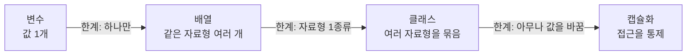
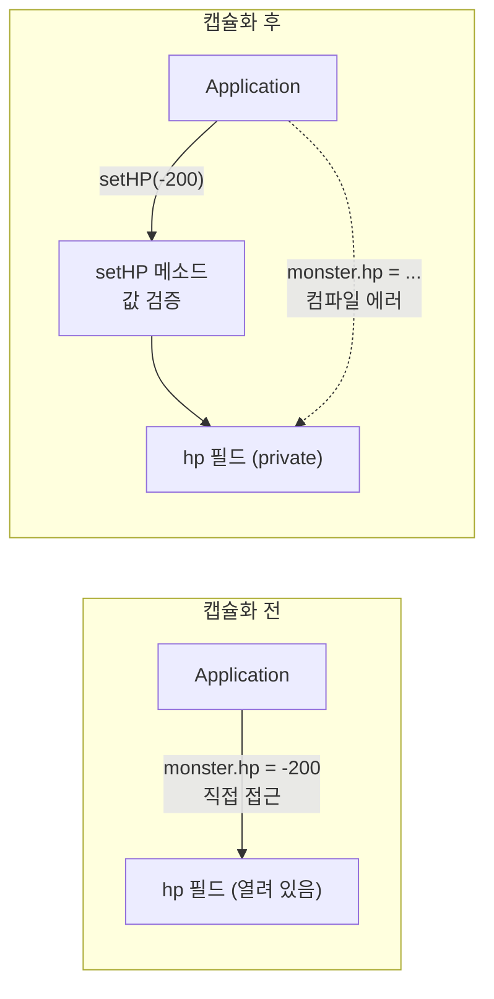
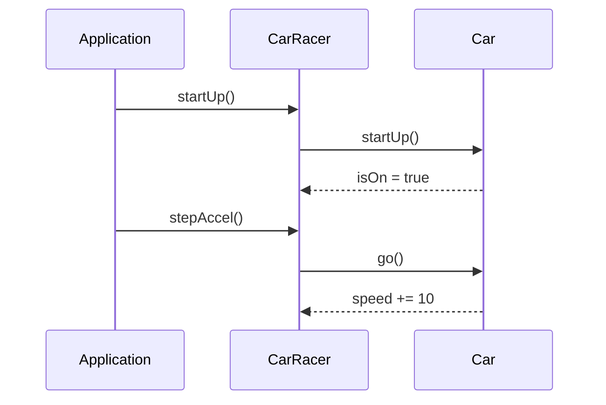

## 들어가며 (Situation)

어제([참조 자료형 글]())는 변수가 "값"이 아니라 "주소"를 담을 수 있다는 것, 그래서 `new Member()`로 만든 객체의 필드에는 `null`과 `0` 같은 기본값이 들어 있다는 것까지 확인했다. 오늘은 그 `Member` 같은 **사용자 정의 자료형을 어떻게 잘 설계하는가**를 배웠다. 오늘의 키워드는 **캡슐화**와 **추상화**다. 상속/다형성은 "다음 주일 수도 있다"는 메모만 있어서 마지막에 예고만 해두겠다.

수업은 1~3일차 복습으로 시작했다. 복습하면서 느낀 점은, 배운 것들이 따로 노는 지식이 아니라 **앞의 한계를 보완하는 순서**로 이어진다는 것이었다. 이 흐름을 먼저 정리하고, 캡슐화와 추상화로 넘어간다. 글의 뒷부분에서는 주말 동안 만들고 있는 콘솔 게임(`console2`)에 오늘 개념이 어디에 쓰였는지 코드를 읽으며 연결해 본다.

## 문제 상황 (Task)

오늘의 과제는 두 가지였다.

1. 클래스를 그냥 만들면 **어떤 문제가 생기는지**를 수업 코드(`Monster` 예제)로 확인하고, 캡슐화로 그 문제를 막는 방법을 이해하기.
2. "추상화"라는 말이 **프로그램 설계에서 무엇을 하라는 뜻인지** 수업 코드(`카레이서와 자동차` 예제)로 확인하기.

제약도 있었다. 내 메모에는 "반복되는 건 전역 변수로 만들어 메모리 사용량을 줄이자"처럼 **그대로 믿기 어려운 문장**이 있었고, "추상화"는 메모에 정의가 비어 있었다. 그래서 수업 코드와 공식 문서(Oracle Java Tutorials, JLS, JVMS)로 확인하며 바로잡는 것도 과제에 포함했다.

## 해결 과정 (Action)

### 1. 복습의 연쇄 — "한계"를 떠올리면 다음 개념이 따라온다

메모의 복습 부분을 표로 옮기면 이렇다.

| 개념 | 할 수 있는 것 | 한계 | 그 한계를 보완한 것 |
|---|---|---|---|
| 변수 | `int x = 10;` 값 하나를 담는다 | 값을 **하나씩밖에** 못 담는다 | 배열 |
| 배열 | `int[] y = new int[] {1, 2, 3};` 같은 값 여러 개 | **정해둔 자료형 하나만** 담을 수 있다 | 클래스 |
| 클래스 | 여러 자료형을 한 번에 묶는 **사용자 정의 자료형** | (오늘의 주제) 필드를 아무나 바꿀 수 있다 | 캡슐화 |



메모의 `int[] y = new int[] {1, 2, 3};`는 문법상 맞다. 배열 생성 표현식에 초기화 목록을 붙인 형태이고, 선언과 동시에 쓸 때는 `int[] y = {1, 2, 3};`로 줄여 쓸 수도 있다. ([JLS 10.6 Array Initializers](https://docs.oracle.com/javase/specs/jls/se21/html/jls-10.html#jls-10.6)) 그리고 어제 글에서 봤듯이 `y`는 값이 아니라 Heap의 배열을 가리키는 참조다.

메모의 `전역변수 == 필드 == 인스턴스변수`는 수업 코드(`Member.java`)의 주석에도 같은 표현이 있다. 다만 정확히는 이렇게 구분하면 덜 헷갈린다. 클래스 안, 메소드 밖에 선언한 변수가 **필드**이고, 그중 `static`이 없는 것이 **인스턴스 변수**다. ([JLS 4.12.3 Kinds of Variables](https://docs.oracle.com/javase/specs/jls/se21/html/jls-4.html#jls-4.12.3)) "전역변수"는 자바 명세에 나오는 용어가 아니라 수업에서 쓰는 별명에 가깝다.

그리고 이 연쇄 자체가 메모의 학습법이다. "한계를 생각하고 그걸 보완하는 걸 떠올리며 연쇄적으로 기억하기." 위 표처럼 **"~의 한계 → 그래서 ~가 나왔다"** 한 줄씩만 붙여 외우면, 새 개념이 나왔을 때 "이건 앞의 무슨 한계를 푸는 거지?"라고 먼저 묻게 된다. 오늘의 캡슐화도 그렇게 이어진다.

### 2. 캡슐화가 왜 필요한가 — 수업 코드 `problem1`~`problem_solved`의 계단

수업은 캡슐화를 **문제를 하나씩 일부러 겪어 보는 순서**로 가르쳤다. 같은 `Monster` 클래스를 네 번 고쳐 가며 보여 줬는데, 폴더 이름이 그대로 그 계단이다.

**문제 1. 검증되지 않은 값이 그대로 들어간다** (`problem1`)

```java
Monster monster2 = new Monster();
monster2.name = "피카츄";
// 문제 상황 발생 (1)
// 검증되지 않은 값을 넣었을 때 문제가 발생할 수 있다.
monster2.hp = -200;
```

필드가 접근 제한 없이 열려 있으니 체력이 `-200`이어도 막을 방법이 없다. `Monster`에는 이미 `setHP()`가 있지만, 사용하는 쪽이 `monster2.hp = -200;`으로 **우회할 수 있다.**

**문제 2. 필드 이름을 바꾸면 사용하는 곳이 한꺼번에 깨진다** (`problem2`)

수업 코드의 `Monster`는 요구사항이 바뀌어 `name`을 `kinds`로 바꿨고, `Application`의 주석에는 이렇게 적혀 있다.

> 변수명을 변경하자마자 변수를 사용하고 있는 곳에서 동시 다발적으로 컴파일 에러가 발생하고 있다.

그래서 `problem2/Application.java`의 코드는 전부 주석 처리되어 있다. 필드를 직접 쓰던 곳이 100곳이면 100곳이 깨진다.

**문제 3. 메소드로 막아도 필드가 열려 있으면 소용없다** (`problem3`)

```java
monster3.setName("갸라도스");
monster3.setHP(-300);
// ...
monster3.hp = -5500;   // 여전히 필드에 직접 접근할 수 있다
System.out.println(monster3.getInfo());
```

`setName()`과 `getInfo()`를 만들어 메소드로 쓰게 했더니 문제 2는 사라졌다. 이제 `Application`은 `kinds`라는 이름을 모른다. 그런데 `hp`는 여전히 열려 있어서 `-5500`이 들어간다. 수업 코드 주석도 "여전히 필드 접근이 가능한 상황"이라고 적어 뒀다.

**해결. 필드를 `private`으로 감춘다** (`problem_solved`)

```java
public class Monster {
    private String kinds;
    private int hp;

    public void setHP(int hp) { ... }
    public void setName(String name) { this.kinds = name; }
    public String getInfo() { ... }
}
```

`problem_solved/Application.java`에서는 `monster3.hp = -5500;` 줄이 주석 처리되어 있다. 필드가 `private`이면 이 줄은 컴파일 단계에서 막히기 때문이다. Oracle 튜토리얼은 이 개념을 이렇게 정의한다.

> Hiding internal state and requiring all interaction to be performed through an object's methods is known as *data encapsulation* — a fundamental principle of object-oriented programming. — [Oracle Java Tutorials, What Is an Object?](https://docs.oracle.com/javase/tutorial/java/concepts/object.html)



정리하면 캡슐화가 주는 이득은 세 가지다.

| 이득 | 수업 코드에서 확인한 장면 |
|---|---|
| 값의 **유효성 검증** | `setHP()`가 음수를 걸러낸다 (`hp = -5500` 우회를 `private`이 차단) |
| **내부 변경에 강함** | `name` → `kinds`로 바꿔도 `Application`은 `setName()`만 쓰므로 영향 없음 |
| 사용법이 **메소드로 단순화** | `getInfo()` 한 줄이면 이름과 체력을 문장으로 받는다 |

여기서 수업 코드를 읽다가 하나 발견한 것이 있다. `setHP()`의 `else` 분기 메시지는 "잘못된 값이 탐지되어 hp를 0으로 강제합니다"라고 출력하는데, 바로 아래 코드는 `this.hp = hp;`다. 주석(음수인 경우 0으로 강제 변경)대로라면 `this.hp = 0;`이어야 한다. 코드만 읽고 확인한 것이라 실제로 실행해 보지는 않았다. **검증 메소드를 만들어도, 검증 결과를 필드에 반영하는 코드가 틀리면 소용이 없다**는 점은 캡슐화의 한계를 보여 준다. 캡슐화는 "검증할 자리를 만들어 주는 것"이지 검증이 맞는지를 보장하지는 않는다.

### 3. 접근제한자 4가지의 범위

`private`만 쓴 것은 아니고, 자바에는 접근제한자가 4단계(제한자를 안 쓴 default 포함)가 있다. 공식 튜토리얼의 표 그대로다. ([Controlling Access to Members of a Class](https://docs.oracle.com/javase/tutorial/java/javaOO/accesscontrol.html))

| 제한자 | 같은 클래스 | 같은 패키지 | 하위 클래스 | 그 외 전체(World) |
|---|:---:|:---:|:---:|:---:|
| `public` | O | O | O | O |
| `protected` | O | O | O | X |
| (없음, default) | O | O | X | X |
| `private` | O | X | X | X |

`protected`의 "하위 클래스"는 상속을 배워야 의미가 보여서, 오늘은 표만 기억해 두었다. 같은 문서의 선택 기준은 한 문장으로 정리된다.

> Use the most restrictive access level that makes sense for a particular member. Use `private` unless you have a good reason not to.

같은 문서는 상수가 아닌 `public` 필드를 피하라고도 안내한다. (구현에 묶여 코드를 바꿀 유연성이 줄어든다는 이유다.) 이것이 위 "문제 2"의 공식 문서 버전이다.

JLS 쪽의 정의도 확인했다. `private` 멤버는 "선언을 감싸는 **최상위 클래스 본문 안**에서만" 접근할 수 있다. ([JLS 6.6.1 Determining Accessibility](https://docs.oracle.com/javase/specs/jls/se21/html/jls-6.html#jls-6.6.1)) 접근 제어는 **클래스 단위**이지 객체 단위가 아니다. 그리고 JLS는 접근과 스코프가 다른 개념이라고 명시한다. 스코프는 "단순 이름으로 참조할 수 있는 범위", 접근은 "한정된 이름(`객체.필드`)으로 참조할 수 있는 범위"다. (JLS 6 서두)

### 4. getter/setter와 `this`

필드를 `private`으로 닫았으니 외부에서 읽고 쓸 길은 메소드로 열어 줘야 한다. 이 역할의 메소드를 흔히 **setter(값 설정)**와 **getter(값 조회)**라고 부른다. 수업 코드의 `setName()`, `setHP()`가 setter, `getInfo()`가 조회 메소드다. 다만 `getInfo()`는 필드 하나를 그대로 돌려주는 전형적인 getter라기보다 이름과 체력을 합친 문장을 반환한다. 이름이 `get...`/`set...`으로 시작하는 것은 자바 코드의 **관례**이고 문법 규칙은 아니라고 이해했다.

수업 코드 `setHP(int hp)`에서 눈여겨볼 곳이 `this.hp = hp;`다. 매개변수 이름과 필드 이름이 같으면 안쪽에서 이름이 가려진다. JLS는 이것을 "지역변수는 같은 이름의 필드를 **shadow**한다"고 규정한다. ([JLS 6.4.1 Shadowing](https://docs.oracle.com/javase/specs/jls/se21/html/jls-6.html#jls-6.4.1)) 그래서 필드를 가리키려면 `this.hp`라고 써야 한다.

이 설명은 자동차 예제 `Car.startUp()`의 주석 질문에도 답이 된다. 수업 코드에는 이런 주석이 있었다.

```java
if (isOn) {
    System.out.println("시동이 이미 걸려있습니다!!!!");
} else {
    this.isOn = true; //위에는 this.isOn이 아닌 이유?
```

`startUp()`에는 `isOn`이라는 매개변수나 지역변수가 없어서 가려지는 일이 없다. 그래서 `isOn`만 써도 필드를 가리키고, `this.isOn`은 **써도 되지만 꼭 필요하지는 않다**. 이름이 겹칠 때만 `this.`가 필수가 된다.

### 5. 추상화 — 수업 코드가 말한 의미

추상화는 내 메모에 정의가 없었다. 그래서 수업 코드(`d_abstraction/run/Application.java`)의 주석을 그대로 확인했다.

> 추상화란? 공통된 부분을 추출하고, 공통되지 않은 부분은 제거하는 의미를 가진다. 복잡한 현실세계를 프로그램으로 설계할 때 현실세계를 그대로 반영하기에는 너무 방대하고 복잡하다. 따라서 추상화란 현실세계를 프로그램의 목적에 맞게 단순화 하는 것을 의미한다.

즉 수업이 말하는 추상화는 **"프로그램의 목적에 필요한 것만 남기고 단순화한다"**이다. 일반적인 정의(불필요한 세부사항을 숨기고 필요한 동작만 드러낸다)와 방향이 같다. 참고로 Oracle 튜토리얼의 "Abstract Methods and Classes"는 `abstract` 키워드 문법을 다루는 별개의 주제라서, 오늘 수업의 의미와는 구분해서 받아들였다. (`abstract`는 상속과 함께 나올 내용이라 이 글에서는 다루지 않는다.)

수업은 이 단순화를 **카레이서가 자동차를 운전하는 프로그램**으로 보여 줬다. 현실의 자동차에는 엔진, 타이어, 연료 같은 수많은 속성이 있지만, 요구사항 7줄에 필요한 상태는 단 두 개다.

```java
public class Car {
    // 데이터 후보군
    // 변하는 상태 후보군
    // 속력, 시동여부
    private int speed;
    private boolean isOn;
```

요구사항 문장에서 객체를 찾는 방법도 같이 배웠다. 수업 코드의 주석 그대로 "**은/는, 이/가 앞의 단어가 대부분 클래스 후보**"이고, 그 객체가 **수신할 수 있는 메세지는 그 객체가 해야 할 일과 동일**하다. 카레이서는 "시동을 걸어라, 엑셀을 밟아라, 브레이크 밟아라, 시동 꺼라", 자동차는 "시동을 걸어라, 앞으로 가라, 멈춰라, 시동을 꺼라"다.



여기에 캡슐화가 같이 쓰인다. 수업 코드 `CarRacer`는 이렇게 적어 뒀다.

```java
// Car는 CarRacer만 접근해야한다.
// 즉 Application은 Car에 접근하면 안된다. -> 캡슐화 private 적용
private Car car = new Car();
```

그래서 `Application`은 `Car`의 존재를 모르고 `racer.startUp()`만 부른다. **추상화로 "무엇이 필요한지"를 정하고, 캡슐화로 "그것을 어디까지 보여 줄지"를 정하는 순서**로 이해했다. 둘은 따로가 아니라 한 세트로 쓰인다.

### 6. 메모 바로잡기 (1) — "반복되는 건 전역 변수로 만들어 메모리 사용량을 줄이자"

메모의 이 문장이 어떤 맥락에서 나왔는지 수업 코드에서 찾았다. `d_abstraction/run/Application.java`에 있었다.

```java
// CarRacer 객체 생성
CarRacer racer = new CarRacer();  // new를 반복문 밖에 두어 메모리에 공간이 계속 생기는 걸 방지

// 사용자가 입력할 수 있는 화면
while (true){
    ...
    racer.startUp();
```

그리고 `CarRacer`의 `private Car car = new Car();`는 `main` 안의 지역변수가 아니라 **필드**다. 즉 메모의 "전역 변수"는 두 가지를 섞어 적은 것으로 보인다. 정확히 풀면 이렇다.

| 메모의 표현 | 실제로 맞는 말 |
|---|---|
| "반복되는 건 전역 변수로" | **반복문 안에서 `new`를 매번 하지 말고, 반복문 밖에서 한 번만 만들어 재사용**한다. 이때 `Car`처럼 객체가 다른 객체의 **상태(필드)**로 오래 유지되어야 하면 필드로 둔다. |
| "메모리 사용량을 줄이자" | 부분적으로만 맞다. 반복마다 쓰고 버리는 객체가 쌓이는 것은 줄지만, **더 중요한 이유는 상태 유지**다. |

직접 확인해 봤다. 다음은 수업의 `Car`를 단순화한 **예시 코드**다.

```java
// 예시 코드: 반복문 안에서 new 하면 상태가 매번 초기화된다
for (int i = 0; i < 2; i++) {
    Car c = new Car();
    if (i == 0) c.startUp();
    c.go();
    System.out.println("round " + i + " speed=" + c.speed + " isOn=" + c.isOn);
}
```

실행 결과(JDK 21)는 `round 0 speed=10 isOn=true` 다음에 `round 1 speed=0 isOn=false`였다. 같은 변수 이름이어도 매 바퀴마다 새 `Car`가 만들어지므로 **이전 바퀴의 시동 상태가 사라진다.** 카레이서 프로그램에서 "시동을 걸고, 엑셀을 밟는" 흐름이 되려면 `Car`는 반복문 밖에서 한 번만 만들어야 한다.

필드와 지역변수의 차이는 JLS 4.12.3에 이렇게 있다.

| 변수 종류 | 만들어지는 시점 | 사라지는 시점 |
|---|---|---|
| 지역변수 | 실행이 그 스코프에 들어갈 때 | 실행이 스코프를 벗어날 때 |
| 인스턴스 변수(필드) | 객체가 만들어질 때 | 객체가 더 이상 참조되지 않아 GC될 때 |

이 표에서 두 가지를 정확히 알게 됐다. 첫째, **필드로 올려도 메모리가 항상 줄지는 않는다.** 인스턴스 필드는 **객체마다** 따로 생기기 때문이다. 필드가 3개인 객체를 100개 만들면 필드도 그만큼 있다. 둘째, **필드를 남발하면 오히려 위험하다.** 메소드 여러 개가 같은 필드를 읽고 쓰면 어디서 값이 바뀌었는지 추적하기 어려워지고(상태가 얽힌다), 지역변수라면 메소드 종료와 함께 끝났을 값이 계속 남는다. 그래서 메모를 이렇게 고쳐 적기로 했다.

> **고친 메모:** 반복문 안에서 객체를 매번 `new` 하지 말고, 반복문 밖(또는 필드)에서 한 번 만들어 재사용한다. 상태를 유지해야 하는 값만 필드로 두고, 한 메소드 안에서만 쓰는 값은 지역변수로 둔다.

### 7. 메모 바로잡기 (2) — 두 가지 상태는 `boolean`으로

메모의 "단순히 2가지는 boolean형 사용이 좋음"의 이유를 표로 정리했다.

| 방식 | 예 | 문제 |
|---|---|---|
| `int` 0/1 | `int isOn = 1;` | `2`, `-1`도 들어갈 수 있다. 1이 켜짐인지 꺼짐인지 약속을 외워야 한다. |
| 문자열 `"Y"`/`"N"` | `String isOn = "Y";` | `"y"`, `"YES"` 같은 오타가 컴파일 에러가 되지 않는다. 비교는 `==`가 아니라 `equals()`여야 한다(어제 글의 함정). |
| `boolean` | `boolean isOn = true;` | 값이 `true`/`false` **둘뿐**이라 범위 오류가 원천 차단된다. `if (isOn)`으로 바로 읽힌다. |

JLS도 `boolean`은 값이 정확히 `true`와 `false` 두 가지이고, `if`, `while` 같은 제어문의 조건에는 `boolean` 식만 쓸 수 있다고 정의한다. ([JLS 4.2.5 The boolean Type](https://docs.oracle.com/javase/specs/jls/se21/html/jls-4.html#jls-4.2.5)) 숫자와 `boolean` 사이에는 캐스팅도 허용되지 않아서, `int` 값을 조건에 그대로 쓰는 실수가 컴파일 단계에서 걸린다.

수업 코드에서는 `Car`의 `private boolean isOn;`이 정확히 이 경우다. 게다가 `Application`에는 이런 주석이 있었다.

```java
//시작할 때마다 false인건 boolean의 기본값이 false이기 때문이다.
```

필드의 기본값 규칙(JLS 4.12.5)이 `boolean`에서는 `false`이므로, 자동차는 처음에 **시동이 꺼진 상태**로 시작한다. 어제 정리한 "필드는 기본값이 있다"가 요구사항 1번("자동차는 처음에 멈춘 상태로 대기한다")과 맞아떨어지는 순간이었다.

### 8. IntelliJ 팁 — `Shift+F6`과 `Alt+Enter`

수업에서는 단축키 두 개를 알려 주셨다.

| 단축키 | 하는 일 | 쓰는 때 |
|---|---|---|
| `Shift+F6` | **이름 변경(Rename refactoring)** | 변수, 메소드, 클래스, 파일 이름을 바꿀 때 |
| `Alt+Enter` | **문제 상황 해결 제안** | 빨간 줄(에러)이나 경고 위에서 |

**왜 Rename이 "찾아서 바꾸기"보다 안전한가.** JetBrains 공식 문서는 Rename을 "심볼, 파일, 디렉토리, 패키지, 모듈과 **그것들에 대한 모든 참조**를 코드 전체에 걸쳐 바꾸는 기능"이라고 설명한다. ([IntelliJ IDEA - Rename refactorings](https://www.jetbrains.com/help/idea/rename-refactorings.html)) 단순 텍스트 바꾸기는 글자가 같은 모든 곳을 바꾸지만, Rename은 **그 이름이 가리키는 대상**을 따라 참조만 바꾼다. 앞의 `problem2`에서 `name`을 `kinds`로 바꿀 때를 생각하면, 다른 클래스의 `name`이나 문자열 안의 `"name"`까지 건드리지 않는다는 점이 중요하다. (이 마지막 설명은 문서가 직접 한 말이 아니라 위 정의에서 이해한 내용이다.) 문서에는 **Preview**로 바뀔 곳을 먼저 볼 수 있다는 내용과, 주석/문자열/텍스트 일치까지 같이 바꾸는 옵션이 따로 있다는 내용도 있었다.

**`Alt+Enter`.** 문서는 코드 요소에 커서를 두고 전구 아이콘을 누르거나 `Alt+Enter`를 누르면 제안 목록이 열린다고 설명한다. 문제가 감지되면 빨간 전구와 함께 해결책(quick-fix)이 나온다. ([IntelliJ IDEA - Intention actions](https://www.jetbrains.com/help/idea/intention-actions.html)) 메모의 "빨간 불(에러) 상황에서 해야함"이 정확히 이것이다. 예를 들어 캡슐화로 `private`을 건 필드에 밖에서 접근해 빨간 줄이 생겼을 때, `Alt+Enter`로 getter를 만들어 주는 제안이 나올 수 있다. (이 예시는 내가 쓰는 환경에서 보게 될 것으로 생각한 것이며, 실제 제안 목록은 상황마다 다르다.) 확인된 범위는 여기까지이고, 문서가 Windows/Linux 기준으로 `Alt+Enter`만 적고 있어서 **macOS나 다른 키맵에서의 단축키는 확인하지 않았다.**

### 9. 오늘의 시행착오

- 메모의 "반복되는 건 전역 변수로 만들어 메모리 사용량을 줄이자"를 처음엔 그대로 믿고 적었다. 수업 코드를 다시 보니 맥락이 `new`의 위치였고, 위 6번의 실행 결과로 **상태 유지**가 더 큰 이유라는 것을 확인했다.
- 수업 코드 `setHP()`를 읽다가 "0으로 강제한다"는 주석과 `this.hp = hp;`가 다르다는 것을 발견했다. 문법적으로는 문제없이 컴파일되기 때문에 눈으로 읽지 않으면 놓치기 쉬운 오류였다.

## 콘솔 게임 만들기 실습

주말 동안 콘솔 추리 게임(`console2` 프로젝트의 `detective` 패키지)을 만들었다. 컨셉은 "팀장님 초코파이 증발 사건"이고, 용의자 3명을 조사해 범인을 지목하는 게임이다. 메인 기능은 만들었고, **보고서 항목 조회와 정책 관련 문제들은 앞으로 추가할 예정**이다. 오늘 배운 설계 방법이 그 코드 어디에 있는지 읽어 봤다.

### 요구사항에서 클래스를 찾는 방법을 그대로 썼다

`Application.java` 맨 위의 주석은 수업의 카레이서 예제와 같은 방식으로 쓰여 있다.

```java
/* comment. 은/는 , 이/가 <- 이 키워드 앞 단어가 대부분 클래스 후보이다.
 *   여기서 필요한 객체는 플레이어와 용의자, 보고서 객체이다.
 *   플레이어가 수신할 수 있는 메세지는 플레이어가 해야 할 일과 동일하다.
 *   1. 용의자를 인터뷰해라.
 *   2. 보고서를 조회해라.
 *   3. 범인을 지목해라.
```

추상화(요구사항을 목적에 맞게 단순화)를 한 결과가 **Player, Suspect, Report 3개의 클래스 후보**다. 현재 `detective` 패키지의 파일은 `Application`, `Player`, `Suspect`, `Report`로 4개다.

### 반복문 안의 `new`와 StackOverflow

작성자의 경험을 그대로 적으면, 반복문 안에서 인스턴스를 생성하거나 메소드를 호출하는 코드를 만들었다가 StackOverflow를 만났다. 현재 코드(`Application.java`)에서 반복문 주변은 이렇게 되어 있다.

```java
Scanner sc = new Scanner(System.in);
// 계임 시작, 플레이어 호출, 종료 담당
Player player = new Player();

while (true) {
    ...
        case 1:
            //  Player 메소드를 호출
            player.playerMenu();
```

`Player` 객체는 `while` 밖에서 한 번만 만들고, 반복 안에서는 메소드만 호출한다. 수업의 `racer`와 같은 구조다.

다만 StackOverflowError의 원인을 정확히 해두고 싶었다. 이 이름은 **Heap이 아니라 Stack(호출 스택)이 넘쳤다**는 뜻이다. JVMS 2.5.2는 스레드마다 있는 JVM Stack이 메소드 호출마다 프레임을 쌓는다고 설명하고, 요구하는 스택이 허용치보다 크면 `StackOverflowError`를 던진다고 한다. ([JVMS 2.5.2 Java Virtual Machine Stacks](https://docs.oracle.com/javase/specs/jvms/se21/html/jvms-2.html#jvms-2.5.2)) API 문서의 설명은 한 줄이다.

> Thrown when a stack overflow occurs because an application recurses too deeply. — [StackOverflowError (Java SE 21)](https://docs.oracle.com/en/java/javase/21/docs/api/java.base/java/lang/StackOverflowError.html)

반복문 안에서 객체를 `new` 하는 것만으로는 보통 이 오류가 나지 않는다. 반복은 한 바퀴가 끝나면 프레임이 사라지기 때문이다. 객체가 계속 쌓이면 Heap 쪽 문제(`OutOfMemoryError`)가 되는 것이 일반적이다. 반면 **호출이 끝나기 전에 같은 호출이 다시 중첩**되면 스택이 쌓인다. 자기 자신을 다시 호출하는 메소드가 대표적이고, 생성자 안에서 자기 클래스를 `new` 하는 경우도 같다. 아래는 이 원리를 확인한 **예시 코드**다.

```java
// 예시 코드: 서로를 필드 초기화에서 new 하면 생성자 호출이 끝없이 중첩된다
static class A { B b = new B(); }
static class B { A a = new A(); }

new A();   // StackOverflowError (JDK 21에서 직접 실행해 확인)
```

작성자의 기억과 코드로 확인할 수 있는 범위가 다르다. 현재 `console2`의 `detective` 패키지에는 **메소드가 자기 자신을 호출하거나, 클래스끼리 서로를 `new` 하는 코드가 없다.** `Application`은 `Player`를, `Player`는 `Suspect`를 필드로 만들 뿐 그 반대 방향은 없다. 호출 관계도 `playerMenu` → `selectSuspect` → `selectQuestion`으로 한 방향이다. 이 프로젝트는 Git 저장소가 아니어서 이전 버전을 확인할 수 없다. 그래서 **어느 코드에서 어떻게 났었는지는 이 글에서 단정하지 않고**, 나중에 기억나면 보충하기로 했다. 확실한 것은 StackOverflow는 "호출이 중첩될 때"의 문제라는 원리와, 그것을 고친 현재 구조가 위와 같다는 것이다.

### Application이 다 하던 것을 Player로 옮겼다 — 책임 분리

처음에는 사용자(플레이어) 관련 메뉴 처리를 `Application`에서 모두 하려고 했다. 그러다 사용자와 관련된 책임을 나누려고 관련 메소드들을 `Player` 클래스로 옮겼다. 지금의 `Application`은 시작 화면과 `player.playerMenu()` 호출만 맡는다.

`Player`를 보면 접근제한자가 일부 쓰인 것을 볼 수 있다.

```java
public class Player {

    Scanner sc = new Scanner(System.in);
    Suspect suspect = new Suspect();

    public void playerMenu() { ... }

    private void selectSuspect() { ... }
    private void selectQuestion(int ssmno) { ... }
    private void selectCriminal() { ... }
}
```

| 메소드 | 접근제한자 | 외부에서 필요한가 |
|---|---|---|
| `playerMenu()` | `public` | `Application`이 호출한다 |
| `selectSuspect()` | `private` | 아니오 (메뉴 안에서만 사용) |
| `selectQuestion(int)` | `private` | 아니오 |
| `selectCriminal()` | `private` | 아니오 |

바깥에 필요한 입구(`playerMenu`)만 `public`으로 열고, 그 안쪽 흐름은 `private`으로 닫았다. 오늘 배운 "필요한 것만 드러낸다"가 메소드 단위에서 쓰인 셈이다. 그리고 `Suspect`의 필드는 이렇게 `private`이다.

```java
public class Suspect {
    private String appearance;
    private String introduce;
    private String aliibuy;
    private String result;
```

오늘 배운 기준으로 읽어 보니 고쳐 볼 곳도 눈에 들어왔다. `Player`의 필드 `sc`와 `suspect`에는 접근제한자가 없어서 **default(같은 패키지에 공개)** 상태다. 튜토리얼의 "Use `private` unless you have a good reason not to"대로라면 `private`으로 바꾸는 것이 맞다. 다음에 코드를 고칠 때 반영할 목록에 넣었다.

### 앞으로 추가할 부분 — 현재 상태

현재 코드의 상태는 이렇다. 이 부분은 오늘 개념으로 풀지 않고 **지금 어떻게 되어 있는지만** 적는다.

| 항목 | 현재 상태 |
|---|---|
| 용의자 조사(메뉴 1) | `Player`의 `selectSuspect()` → `selectQuestion()`으로 조사 항목 출력까지 구현 |
| 범인 지목(메뉴 3) | `selectCriminal()` → `Suspect.Criminal()`로 성공/실패 문구 출력까지 구현 |
| 보고서 조회(메뉴 2) | 메뉴만 있고 `case 2:`는 비어 있음. `Report` 클래스도 아직 비어 있음 |
| 요구사항 중 정책 | 이미 확인한 항목 재질문 방지, 조사 완료 표시, 지목 전 최소 조건 검사 등은 `Application.java` 주석에 요구사항으로 적혀 있고 아직 코드에는 없음 |

이 표의 마지막 줄이 "앞으로 추가할 보고서 항목 조회와 정책 관련 문제들"에 해당한다.

## 결과 (Result)

정량 지표(성능 수치 등)는 측정하지 않았다. 직접 실행했거나 코드에서 셀 수 있는 것만 적는다.

| 확인 항목 | 결과 |
|---|---|
| 반복문 안 `new Car()` (예시 코드 실행) | 1바퀴째 `isOn=true`, 2바퀴째 `isOn=false, speed=0` (상태 초기화) |
| 서로를 `new` 하는 두 클래스 (예시 코드 실행) | `StackOverflowError` |
| `new Car()` 직후 필드 | `isOn=false`, `speed=0` (기본값) |
| 수업 `Monster` 계단 | `problem1`~`problem3`에서 필드 우회 접근 가능, `problem_solved`에서 `private`으로 차단 |
| `detective` 패키지 | 클래스 4개(Application, Player, Suspect, Report), `Player` 메소드 4개(`public` 1, `private` 3) |

배운 점은 다음과 같다.

1. **연쇄로 기억하기**: 변수 → 배열 → 클래스 → 캡슐화는 "한계 → 보완"의 순서로 이어진다. 새 개념이 나오면 "앞의 어떤 한계를 푸는가"를 먼저 묻는다.
2. **캡슐화는 필드 `private` + 메소드 접근**이다. 값 검증, 내부 변경에 대한 면역, 사용법 단순화를 얻는다. 단, 검증 메소드가 맞아야 의미가 있다.
3. **접근제한자는 "필요한 만큼만" 연다.** `private`이 기본이고, 열어야 할 입구만 `public`으로 한다.
4. **추상화는 "목적에 필요한 것만 남기는 단순화"**(수업의 정의)다. `Car`의 상태를 `speed`, `isOn` 두 개로 줄인 것이 그 예다.
5. **메모를 그대로 믿지 않기**: "전역 변수로 메모리 줄이기"는 `new`의 위치와 상태 유지의 이야기였고, 필드가 항상 메모리를 줄이는 것은 아니다.
6. **StackOverflowError는 호출 중첩**의 문제이고, 반복문 안의 `new`가 쌓이는 것과는 다른 종류다.
7. 책임이 큰 `Application`의 일을 `Player`로 나눈 것이 곧 **책임 분리**였고, 오늘 배운 캡슐화/추상화가 그 판단 기준이 됐다.

다음 주에 상속과 다형성을 배운다면, 지금의 `Suspect1()`, `Suspect2()`, `Suspect3()`처럼 비슷한 일을 하는 메소드가 3개로 나뉜 구조를 어떻게 바꿀 수 있는지 그때 다시 볼 생각이다. (오늘은 개념만 예고하고 다루지 않는다.)

## 더 학습하면 좋은 개념

- **생성자(Constructor)와 `this`** — 오늘은 `new Monster()` 뒤에 `setName()`, `setHP()`를 따로 호출했다. 객체가 만들어질 때 필드를 한 번에 안전하게 채우는 방법이 생성자이고, 캡슐화된 필드를 초기화하는 가장 자연스러운 방법이라서 다음에 이어서 배울 가치가 크다.
- **불변 객체(Immutable Object)와 `final`** — setter를 없애고 값을 한 번만 정하는 설계다. "필드를 아무나 바꾸지 못하게 한다"는 캡슐화의 목표를 더 강하게 밀고 간 형태라서, setter가 과연 항상 필요한지 생각해 보게 된다.
- **단일 책임 원칙(SRP)** — `Application`에서 `Player`로 메소드를 옮긴 판단 기준과 같은 이야기다. 클래스를 나누는 기준이 "바뀌는 이유가 하나"라는 것을 알면 `Suspect`나 `Report`를 어디까지 나눌지 근거가 생긴다.
- **스택 프레임과 재귀(Recursion)** — `StackOverflowError`를 읽는 법이다. 재귀가 왜 종료 조건 없이는 스택을 소진하는지 알면 이번에 겪은 오류 메시지를 읽고 원인을 찾는 속도가 빨라진다.
- **상속과 다형성** — 다음 주에 배울 수 있는 주제다. 비슷한 클래스(`Suspect` 3명)를 하나로 묶고 차이만 표현하는 방법이라서, 오늘 배운 추상화의 다음 단계로 이어질 것이다.

## 참고 자료

- [Oracle Java Tutorials - What Is an Object?](https://docs.oracle.com/javase/tutorial/java/concepts/object.html)
- [Oracle Java Tutorials - Controlling Access to Members of a Class](https://docs.oracle.com/javase/tutorial/java/javaOO/accesscontrol.html)
- [JLS 21, 4.2.5 The boolean Type and boolean Values](https://docs.oracle.com/javase/specs/jls/se21/html/jls-4.html#jls-4.2.5)
- [JLS 21, 4.12.3 Kinds of Variables](https://docs.oracle.com/javase/specs/jls/se21/html/jls-4.html#jls-4.12.3)
- [JLS 21, 4.12.5 Initial Values of Variables](https://docs.oracle.com/javase/specs/jls/se21/html/jls-4.html#jls-4.12.5)
- [JLS 21, 6.4.1 Shadowing](https://docs.oracle.com/javase/specs/jls/se21/html/jls-6.html#jls-6.4.1)
- [JLS 21, 6.6.1 Determining Accessibility](https://docs.oracle.com/javase/specs/jls/se21/html/jls-6.html#jls-6.6.1)
- [JLS 21, 10.6 Array Initializers](https://docs.oracle.com/javase/specs/jls/se21/html/jls-10.html#jls-10.6)
- [JVM Specification 21, 2.5.2 Java Virtual Machine Stacks](https://docs.oracle.com/javase/specs/jvms/se21/html/jvms-2.html#jvms-2.5.2)
- [Java SE 21 API - StackOverflowError](https://docs.oracle.com/en/java/javase/21/docs/api/java.base/java/lang/StackOverflowError.html)
- [IntelliJ IDEA - Rename refactorings](https://www.jetbrains.com/help/idea/rename-refactorings.html)
- [IntelliJ IDEA - Intention actions](https://www.jetbrains.com/help/idea/intention-actions.html)
