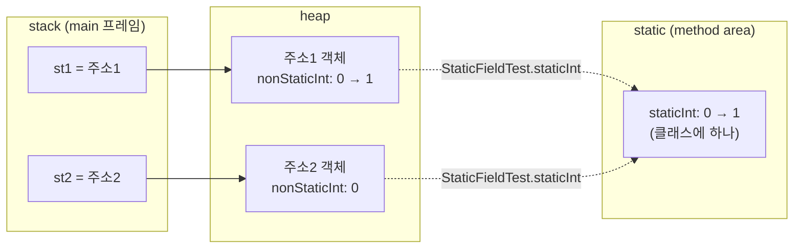
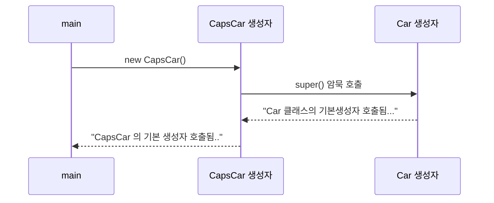
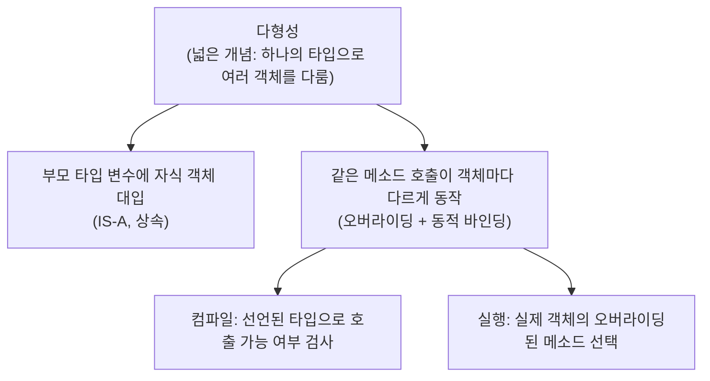
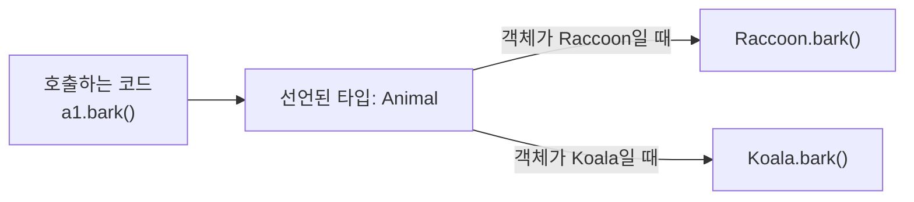

## 들어가며 (Situation)

지난 금요일([캡슐화와 추상화 글]())까지는 "클래스를 어떻게 안전하게 설계하는가"를 배웠다. 오늘(자바 6일차)은 그 클래스를 **어떻게 메모리에 올리고, 하나만 만들고, 물려주고, 바꿔 끼우는가**로 넘어갔다. 오늘의 키워드는 네 가지다.

1. `static` (정적 멤버)
2. 싱글톤 패턴 (eager / lazy)
3. 상속과 IS-A 관계
4. 다형성과 동적 바인딩

수업은 금요일 복습으로 시작했다. 복습 내용은 아래에서 짧게만 정리하고, 그 뒤로는 새 내용에 시간을 썼다.

## 문제 상황 (Task)

오늘 해결하려고 한 질문은 메모 곳곳에 흩어져 있었다.

- 같은 클래스로 객체를 두 개 만들었는데, 어떤 필드는 객체마다 따로이고 어떤 필드는 **왜 공유**되는가?
- 메모에는 "Application이 동작하는 순서: run 버튼 → 클래스 내부에 static 붙은 메소드/변수 초기화"라고 적혀 있다. 이 문장은 **정확히 맞는가?**
- 싱글톤의 eager와 lazy는 메모에 "빠르다/느리다"로 적혀 있는데, **무엇이 빠르고 무엇이 느린 것인가?**
- 자식 객체를 만들면 부모 생성자가 먼저 실행된다고 적었는데, **왜 그 순서인가?** 그리고 "동적 바인딩"은 IS-A와 같은 말인가?

제약은 이번에도 같았다. 수업 주석과 내 메모는 **수업용으로 단순화된 설명**이라 공식 문서와 어긋나는 문장이 섞여 있었다. 그래서 수업 코드를 직접 실행하고, JLS(자바 언어 명세)와 Oracle Java Tutorials로 확인하며 문장을 고치는 것까지 과제로 삼았다. 코드는 수업 코드만 인용하고, 따로 만든 예시 코드는 이 글에 넣지 않았다.

## 해결 과정 (Action)

### 0. 금요일 복습 — 한계에서 한계로

복습 내용은 "한계를 보완하며 이어진다"로 요약된다. 자세한 설명은 [지난 글]()에 있어서 여기서는 한 줄씩만 적는다.

| 개념 | 메모 한 줄 | 이어지는 한계 |
|---|---|---|
| 클래스 | **사용자 정의 자료형.** 기본형은 값 하나, 배열은 같은 자료형만 담는다는 한계를 넘어 여러 자료형을 묶는다 | 필드를 아무나 바꾼다 |
| 추상화 | 현실의 복잡한 객체를 **프로그램에 필요한 값만** 간추린다 | 필요한 값도 마음대로 접근된다 |
| 캡슐화 | 필드에 직접 접근하면 음수 HP 같은 이상한 값이 들어온다. 메소드로 1차 검증해도 필드가 열려 있으면 우회되므로, **필드를 `private`으로 막고 메소드로만 접근**하게 한다 | (오늘의 `static`, 상속으로 이어진다) |

### 1. `static` — "정적"이라는 말의 정확한 뜻

#### 1-1. 메모의 "정적 vs 동적"을 코드와 그림으로 확인

메모는 이렇게 적혀 있다.

> static: 정적 / new로 생성하는 인스턴스: 동적. 해당 코드가 작동해야 생성되니까.

"해당 코드가 작동해야 생성된다"는 `new`가 **실행되는 순간** 인스턴스가 만들어진다는 뜻이다. 이 부분은 JLS와 맞는다. JLS 12.5는 객체 생성을 "`new`로 클래스 인스턴스 생성 표현식을 **평가**할 때 새 객체를 위한 공간을 할당하고 생성자를 처리한다"는 순서로 설명한다. ([JLS 12.5 Creation of New Class Instances](https://docs.oracle.com/javase/specs/jls/se21/html/jls-12.html#jls-12.5)) 반면 `static` 필드는 객체와 무관하다. JLS 8.3.1.1은 이렇게 적는다.

> If a field is declared `static`, there exists exactly one incarnation of the field, no matter how many instances (possibly zero) of the class may eventually be created. — [JLS 8.3.1.1 static Fields](https://docs.oracle.com/javase/specs/jls/se21/html/jls-8.html#jls-8.3.1.1)

"인스턴스가 몇 개 만들어지든(0개여도) 필드는 정확히 하나"다. 수업 코드 `StaticFieldTest`는 이것을 필드 두 개로 보여 준다.

```java
public class StaticFieldTest {

    // static 키워드 확인을 위한 2개의 필드 선언
    private int nonStaticint;
    private static int staticInt;
    ...
    public void increaseNonStatic(){
        this.nonStaticint++;
    }
    public void increaseStatic(){
        // static 키워드가 붙은 변수는
        // 클래스명, 변수명으로 접근이 가능하다.
        // this 는 사용되지 않는다.
        StaticFieldTest.staticInt++;
    }
}
```

`Application`은 `st1`을 만들어 두 필드를 1씩 올린 뒤, `st2`를 새로 만들어 값을 출력한다. 이 코드를 직접 실행한 결과는 다음과 같았다.

| 출력 시점 | non-static 값 | static 값 |
|---|:---:|:---:|
| `st1` 생성 직후 | 0 | 0 |
| `st1`에서 각각 1씩 증가 후 | 1 | 1 |
| `st2` 생성 후 (`st2`의 non-static / 클래스의 static) | **0** | **1** |

`st2`는 새 객체라서 자기 몫의 `nonStaticint`가 0부터 시작하는데, `staticInt`는 `st1`이 올린 값 1을 그대로 본다. 수업의 그림이 정확히 이 장면이었다.


그림에서 확인되는 것만 옮기면 이렇다. (그림 오른쪽 일부는 잘려 있어서, 잘린 부분은 해석하지 않았다.)

- **stack**: `main()` 프레임 안에 `st1`(주소1)과 `st2`(주소2)가 있다.
- **heap**: `st1`이 가리키는 객체의 `nonStaticInt`는 `0 → 1`, `st2`가 가리키는 객체의 값은 `0`이다. 객체마다 별개의 칸이다.
- **static(method area)**: `+1`이 적힌 칸이 **하나**만 있고, `st1`과 `st2`에서 이 칸으로 향하는 빨간 선이 그려져 있다.

같은 내용을 Mermaid로 다시 그려 봤다. (주소1/주소2는 그림의 표기이고 실제 JVM 주소가 아니다.)



"static 영역"이라는 칸은 [10/1 글]()에서 정리한 대로 **수업용 단순화**다. 공식 용어로는 Method Area에 클래스별 구조가 놓인다고 연결해서 이해하고 있고, 이 글에서도 그 이상은 단정하지 않는다. Oracle 튜토리얼의 표현은 이렇다.

> Every instance of the class shares a class variable, which is in one fixed location in memory. — [Understanding Class Members](https://docs.oracle.com/javase/tutorial/java/javaOO/classvars.html)

#### 1-2. `static` 접근법과, `static` 메소드에서 인스턴스 멤버를 못 쓰는 이유

수업 코드는 호출 방식도 구분해서 보여 준다. 인스턴스 메소드는 `st1.getNonStaticint()`, `static` 메소드는 객체 없이 **`클래스명.메소드명()`** 이다.

```java
// static 이 붙은 메서드는 클래스명.메소드명() 이렇게 호출한다.
System.out.println("static  변수 값 확인 : " + StaticFieldTest.getStaticInt());
```

Oracle 튜토리얼도 static 메소드는 "인스턴스를 만들지 않고 클래스 이름으로 호출해야 한다"고 안내한다. 그럼 반대로 `static` 메소드 안에서 인스턴스 멤버를 바로 쓰면 왜 안 될까? 접근 규칙을 표로 정리했다. (같은 튜토리얼의 Access Rules)

| 호출하는 쪽 \ 대상 | 인스턴스 변수/메소드 | static 변수/메소드 |
|---|:---:|:---:|
| 인스턴스 메소드 | 바로 접근 O | 바로 접근 O |
| static 메소드 | **바로 접근 X** (객체 참조가 필요) | 바로 접근 O |

이유는 JLS 8.4.3.2에 있다. static 메소드는 "특정 객체를 참조하지 않고 호출"되므로, 특정 객체를 가리키는 `this`와 `super`를 쓰면 컴파일 에러다. ([JLS 8.4.3.2 static Methods](https://docs.oracle.com/javase/specs/jls/se21/html/jls-8.html#jls-8.4.3.2)) 인스턴스 필드는 **객체마다 하나씩** 있는데, static 메소드는 "어느 객체인지" 모르는 채 호출되니 어떤 객체의 필드를 읽어야 하는지 정할 수 없다. 앞의 출력표에서 `nonStaticint`가 `st1`은 1, `st2`는 0이었던 것을 떠올리면, "클래스에서 `nonStaticint`를 달라"는 요청은 답이 둘이라 성립하지 않는다.

그래서 인스턴스 필드를 객체 없이 static 메소드에서 쓰면 컴파일 에러가 난다. [9/30 글]()에서 "`main`이 `static`이라서 인스턴스 메소드를 호출하려면 `new`가 필요했다"고 정리한 것의 원리가 바로 이것이다.

수업 코드의 `increaseStatic()` 주석에도 같은 말이 있다. static 변수는 `this`를 쓰지 않고 `StaticFieldTest.staticInt`처럼 클래스명으로 접근한다.

### 2. "Application이 동작하는 순서" — 메모를 JLS로 바로잡기

메모는 이렇게 적혀 있다.

> Application이 동작하는 순서: run 버튼 → 클래스 내부에 static 붙은 메소드/변수 초기화

수업 코드 `a_static/Application.java`의 주석도 비슷하다. "static이 붙은 변수/메소드는 객체 생성 시점에 초기화되는 것이 아니라 **어플리케이션 시작 시점**에 초기화가 된다."

방향(객체 생성 시점과 다르다)은 맞다. 다만 "어플리케이션 시작 시점에 **전부** 초기화된다"는 단정은 JLS와 조금 다르다. JLS가 말하는 순서는 이렇다.

| 단계 | JLS 내용 | 출처 |
|---|---|---|
| 1. 로드 | `main`을 실행하려고 할 때 해당 클래스가 로드되지 않았다면 클래스 로더로 읽어 온다 | JLS 12.1.1 |
| 2. 링크 | 검증(verification) → **준비(preparation)** → (선택적) 해석. 준비 단계에서 static 저장 공간이 할당된다 | JLS 12.1.2 |
| 3. 초기화 | **`main`이 호출되기 전에** 해당 클래스는 초기화되어야 한다 | JLS 12.1.2 / 12.1.3 |
| 4. 이후 | 다른 클래스는 **처음 사용되는 시점**에 초기화된다 | JLS 12.4.1 |

JLS 12.4.1이 말하는 "처음 사용"은 구체적으로 네 가지다. T가 클래스일 때 다음 중 하나가 **처음 일어나기 직전**에 T가 초기화된다. ([JLS 12.4.1 When Initialization Occurs](https://docs.oracle.com/javase/specs/jls/se21/html/jls-12.html#jls-12.4.1))

- T의 인스턴스가 만들어질 때
- T에 선언된 `static` 메소드가 호출될 때
- T에 선언된 `static` 필드에 값이 대입될 때
- T에 선언된 `static` 필드가 사용될 때 (상수 변수가 아닌 경우)

그래서 메모를 이렇게 고쳤다.

> **고친 메모:** `main`이 있는 클래스는 `main`이 호출되기 전에 초기화된다. **다른 클래스의 static 멤버는 그 클래스가 처음 쓰일 때**(인스턴스 생성, static 메소드 호출, static 필드 사용) 초기화된다. static 필드의 초기화 코드는 초기화할 때 **적힌 순서대로** 한 번 실행된다. (JLS 12.4.2)

이 차이는 다음 싱글톤에서 실제로 결과를 가른다. "프로그램을 실행하자마자 전부 만들어진다"는 이미지로 eager를 이해하면 틀리게 된다.

그리고 메모의 "**static은 환경설정할 때 사용**"은, 수업 코드에서 이 표현이 나오는 곳을 찾지 못했다. 수업의 static 예제는 앞의 카운터 공유와 뒤의 싱글톤이었다. 내가 이해한 것은 이렇다. 환경설정처럼 프로그램 전체에서 **하나만 있고 모두가 같이 보는 값**이 static의 성질("클래스에 하나, 공유")과 맞아떨어진다는 뜻으로 받아들였다. 실제 "환경설정" 코드를 수업에서 본 것은 아니라서 이 부분은 단정하지 않는다.

### 3. 싱글톤 — 인스턴스를 하나만 두는 방법

#### 3-1. 정의와 필요성

수업 코드 `b_singleton/Application.java`의 주석은 싱글톤을 이렇게 설명한다.

> 싱글톤 -> 단일 인스턴스. 어플리케이션이 실행될 때 어떤 클래스가 최초 한 번만 메모리에 할당되고, 그 메모리에 인스턴스를 만들어서 하나의 인스턴스를 공유해 사용하여 메모리 낭비를 방지할 수 있게 하는 디자인 패턴을 의미한다. - 리모콘 -> 1개

집에 리모컨이 여러 개일 필요가 없는 것처럼, **하나의 객체를 모두가 같이 쓰는** 구조다. 앞에서 본 `static`의 성질("클래스에 하나")을 그대로 이용한다.

#### 3-2. 수업 코드의 구현: eager

```java
public class EagerSingleton {

    // 필드에 인스턴스 초기화
    private static EagerSingleton eager = new EagerSingleton();

    // 기본 생성자 private
    private EagerSingleton() {}

    //인스턴스를 반환하는 메서드
    public static EagerSingleton getInstance(){
        return eager;
    }
}
```

구성 요소는 세 가지다.

| 요소 | 역할 |
|---|---|
| `private` 생성자 | 바깥에서 `new`를 못 하게 막는다. (캡슐화가 여기서 다시 쓰인다. `Application`에 주석 처리된 `new EagerSingleton()` 줄이 그 예다.) |
| `private static` 필드 | 클래스에 **하나뿐인** 인스턴스를 담는다. |
| `public static getInstance()` | 객체가 없어도 `클래스명.getInstance()`로 부를 수 있어야 하므로 `static`이다. |

`getInstance()`가 `static`이어야 하는 이유는 "`new`를 막았으니 인스턴스가 없는데, 인스턴스 없이 인스턴스를 얻어야 하기 때문"이다. 1-2에서 배운 규칙이 바로 쓰였다.

#### 3-3. 수업 코드의 구현: lazy

```java
public class LazySingleton {

    private static LazySingleton lazy;

    private LazySingleton() {}

    // 외부에서 객체 필요시 호출하는 메소드
    public static LazySingleton getInstance() {

        if (lazy == null) {
            lazy = new LazySingleton();
        }
        return lazy;
    }
}
```

eager는 필드 선언부에서 `new`를 하고, lazy는 필드를 비워 두었다가 `getInstance()` 안에서 `null`이면 그때 `new`를 한다.

#### 3-4. 메모 바로잡기 — "lazy는 공간만 생성한 뒤 메서드가 호출되는 순간 값이 채워짐"

이 문장은 절반만 맞다. 위 코드로 풀면 이렇다.

- `private static LazySingleton lazy;`의 **필드(참조를 담는 칸)**는 클래스가 준비·초기화될 때 만들어지고, 기본값 `null`이 들어 있다. (메모의 "공간"이 이것을 뜻하는 것으로 이해한다. 참조형 필드의 기본값은 `null`이다.)
- 하지만 **`LazySingleton` 인스턴스(객체) 자체**는 그때 없다. `getInstance()`가 처음 호출되어 `lazy == null`이 `true`일 때 `new`로 **객체가 처음 만들어진다.**

즉 lazy는 "공간만 만들어 두고 나중에 값을 채우는" 것이 아니라 "**객체를 첫 요청이 올 때 만든다**"다. 필드 칸은 이미 있고, 거기 들어갈 객체가 늦게 생기는 것이다.

이번에도 수업 코드를 실행해서 확인했다. 두 번씩 `getInstance()`를 불러 해시코드를 출력한 결과는 다음과 같다.

| 변수 | 출력된 `hashCode()` (내 실행) |
|---|---|
| `eager1` | 1421795058 |
| `eager2` | 1421795058 |
| `lazy1` | 471910020 |
| `lazy2` | 471910020 |

각 쌍의 값이 같아서 **두 변수가 같은 객체를 가리킨다**는 것을 보여 준다. (수업 코드 주석에 적힌 숫자와 다른 것은 실행마다 값이 달라질 수 있어서이고, 중요한 것은 "같은 쌍끼리 같다"는 점이다. 해시코드가 같다고 같은 객체임이 수학적으로 증명되는 것은 아니지만, 이 수업 코드에서는 `new`가 한 번뿐이라는 구조와 함께 읽으면 충분한 증거라고 판단했다.)

#### 3-5. "eager는 앱 시작 시점에 만들어진다"도 확인해 봤다

앞의 2번에서 고친 규칙을 싱글톤에 적용해 보면 흥미로운 점이 생긴다. eager의 `new EagerSingleton()`은 **static 필드의 초기화 코드**이므로 `EagerSingleton` 클래스가 **초기화될 때** 실행된다. 그런데 클래스 초기화는 "앱 시작"이 아니라 "처음 사용될 때"(12.4.1)다. 수업 코드에서 `EagerSingleton`은 `getInstance()`라는 static 메소드가 **처음 호출될 때** 사용된다.

그래서 JVM 옵션 `-Xlog:class+init`를 켜고 같은 코드를 실행해 클래스 초기화 로그를 봤다. 로그의 순서는 `Application` → `EagerSingleton` → `LazySingleton` 순이었다. 즉 `main`이 시작된 뒤 `EagerSingleton`이 쓰이는 시점에 초기화됐다. (정확한 호출 직전 시각까지 보여 주는 로그는 아니라서, "JVM이 뜨자마자 모든 클래스가 초기화된 것은 아니다"까지만 확인했다고 적는다.)

이 결과를 정리하면 **이 수업 코드에서는 eager와 lazy의 인스턴스 생성 시점이 사실상 같다**. `EagerSingleton`에는 `getInstance()` 말고 다른 static 멤버가 없고, `private` 생성자 때문에 `new`도 못 쓰니 클래스 초기화를 일으키는 첫 사건이 `getInstance()` 첫 호출이기 때문이다. 둘의 차이가 뚜렷해지는 것은 이런 경우다. 클래스가 **다른 이유로 먼저 초기화**되면(예: 그 클래스의 다른 static 멤버를 먼저 쓰는 경우), eager는 `getInstance()`를 한 번도 부르지 않아도 인스턴스가 만들어지고, lazy는 `getInstance()`를 부르기 전까지 만들어지지 않는다. 이 점은 JLS 12.4.1의 규칙에서 논리적으로 따라 나오는 설명이고, 이 경우를 따로 실행해 본 것은 아니다.

#### 3-6. eager vs lazy 비교표와 트레이드오프

메모에는 이렇게 적혀 있다.

> eager: 최초 로딩시점이 길다는 단점이 있으나 이후에는 빠르다 (이미 만들어져 있으니) → 미리 만들어 놓고 나중에 요구하면 그때 배분 (자주 불릴 때 유용)
> lazy: 최초에는 공간을 만들어서 빠르지만 이후 코드를 진행하며 할당을 해서 느려짐 → 만들지 않고 있다가 나중에 요구하면 생성 (불릴 가능성이 낮을 때 생성)

방향(언제 비용을 내는가)은 맞다. 하지만 "빠르다/느리다"를 **측정한 적이 없어서**, 수치처럼 단정하지 않기로 했다. 정확하게는 "**비용이 지불되는 시점이 다르다**"로 쓰는 것이 맞다고 판단했다.

| 비교 항목 | eager (이른 초기화) | lazy (게으른 초기화) |
|---|---|---|
| 인스턴스를 만드는 시점 | 클래스 **초기화 때** (필드 초기화 코드) | `getInstance()`가 **처음 불릴 때** (`null` 검사 후) |
| 생성 비용을 내는 때 | 클래스 초기화 시점에 한 번 | 첫 `getInstance()` 호출에서 한 번 |
| 이후 `getInstance()` | 필드를 반환 | `null`이 아닌지 확인하고 반환 |
| 아무도 안 부르면 | 클래스가 초기화되었다면 인스턴스는 이미 있다 | 인스턴스를 만들지 않는다 |
| 수업의 선택 기준 | **자주 불릴 때** 미리 만들어 둔다 | **불릴 가능성이 낮을 때** 만들지 않고 둔다 |
| 동시 호출(멀티스레드) | 클래스 초기화는 JVM이 락으로 한 번만 실행되게 한다 (JLS 12.4.2) | 수업 코드의 `if (lazy == null)`에는 동기화가 없다 |

선택 기준이 왜 그렇게 되는지는 비용의 관점에서 풀 수 있다. 어차피 쓸 것이 거의 확실하면 미리 만들어도 낭비가 없고, 사용 시점의 대기가 줄어든다. 반대로 쓰일지 모르는 무거운 객체라면 필요할 때까지 미루는 편이 낭비를 막는다. 반대로 생각하면 둘 다 위험이 있다. eager는 안 쓰는데도 만들어 버릴 수 있고, lazy는 처음 요청한 사용자가 생성 비용을 대신 낸다. 이것이 메모의 **트레이드 오프**다. 그리고 메모의 마지막 줄, "요구사항에 따라 코드와 그 구성이 변경될 수 있다"가 결론이다. 정답이 하나가 아니라 **요구사항(얼마나 자주, 얼마나 무겁게 쓰는가)에 따라 고른다.**

표 마지막 줄의 멀티스레드 이야기는 이 글에서 깊게 다루지 않는다. 수업 코드의 `getInstance()`는 `lazy == null` 검사와 `new`가 별개의 단계라서, 여러 스레드가 동시에 들어오면 둘 이상이 `null`을 보고 각자 `new`를 할 수 있는 구조로 읽힌다. 다만 이것은 코드를 읽고 한 추론이고 직접 실행해 확인하지 않았다. "더 학습하면 좋은 개념"에 남겨 둔다.

메모의 "싱글톤은 옛날 면접 단골 질문"은 근거를 찾지 못해 단정하지 않는다. 메모 뒤의 "어느 시점에 할 것인지에 대한 디테일 때문에 단골 질문이었다"는 **수업에서 그렇게 소개했다**는 정도로만 적어 둔다. 질문의 핵심이 "생성 시점(실행 시점 vs 부를 때)"이라는 점은 위 비교표와 일치한다.

### 4. 네이밍 — camelCase vs snake_case

메모에 따르면 Java는 camel case(`total price` → `totalPrice`), Python은 snake case(`total_price`)다. 둘 다 **언어 문법이 아니라 관례**다. 자바의 관례는 [10/1 글]()에서 이미 연결한 [Oracle 명명 규칙](https://www.oracle.com/java/technologies/javase/codeconventions-namingconventions.html)이다. 파이썬은 PEP 8이 "함수와 변수 이름은 소문자로 쓰고, 가독성을 위해 필요하면 밑줄로 단어를 구분한다"고 권장한다. ([PEP 8 - Function and Variable Names](https://peps.python.org/pep-0008/#function-and-variable-names)) 같은 이름을 쓰더라도 언어마다 어울리는 표기가 다르다는 점만 기억해 두려고 한다.

### 5. 객체지향의 특징 — 3대인가 4대인가

메모는 두 가지로 적혀 있다.

| 분류 | 구성 |
|---|---|
| 3대 특징 | 캡슐화, 상속, 다형성 |
| 4대 특징 | 캡슐화, 상속, 다형성 + 추상화 |

**수업에서는 이렇게 분류했다**고 적는다. 공식 문서(JLS나 Oracle 튜토리얼)가 "객체지향은 몇 대 특징"이라고 숫자로 정의한 것은 확인하지 못했고, 교재마다 달리 분류하는 일반적인 설명으로 이해한다. 다만 Oracle 튜토리얼의 "What Is Inheritance?"는 상속을 "클래스가 다른 클래스의 상태와 행동을 물려받는 것"으로 소개하므로 상속이 핵심 개념이라는 데에는 이견이 없다. 중요한 것은 개수보다 **각각이 무슨 문제를 푸는가**다. 캡슐화·추상화는 금요일에 다뤘고, 오늘은 나머지 둘이다.

### 6. 상속과 IS-A — "경찰차는 차다"

#### 6-1. IS-A로 방향 잡기

메모의 질문 두 개다.

| 질문 | 답 |
|---|---|
| Q1) 경찰차는 차인가요? | Yes |
| Q2) 차는 경찰차인가요? | No |

상속은 `자식 extends 부모`로 쓰고 읽는 방향은 "**자식은 부모다**"(IS-A)다. 수업 코드의 `CapsCar` 위 주석이 그대로 이것이다.

```java
// 경찰차는 차다. IS-A 성립된다.
public class CapsCar extends Car{
```

Q2가 No인 이유는 모든 차가 경찰차가 아니기 때문이다. `CapsCar`는 `Car`가 가진 달리기, 경적 기능을 모두 가지지만(경찰차도 차이므로), `Car`는 `CapsCar`의 `무전하기()`를 갖지 않는다. 수업 코드 주석은 상속의 목적을 이렇게 요약한다. 반복되는 메소드는 부모에 정의하고, 자식은 상속만 받고, **다르게 동작해야 하는 메소드만 Override**한다. Oracle 튜토리얼도 `extends` 뒤에 상속받을 클래스를 쓰면 그 클래스의 필드와 메소드를 모두 가지면서 자식은 **고유한 기능에만 집중**할 수 있다고 설명한다. ([What Is Inheritance?](https://docs.oracle.com/javase/tutorial/java/concepts/inheritance.html))

#### 6-2. 부모 생성자가 먼저 실행되는 이유

메모에는 "상속이라는 객체를 사용하면 부모 생성자가 생성된 뒤 자식 생성자가 생김"이라고 적었다. 수업 코드로 순서를 확인했다. `CapsCar`의 생성자에는 `super()`가 적혀 있지 않다.

```java
public CapsCar() {
    System.out.println("CapsCar 의 기본 생성자 호출됨..");
}
```

`new Car()`와 `new CapsCar()`를 차례로 실행한 출력은 이랬다.

| 실행한 코드 | 출력된 생성자 메시지 (순서대로) |
|---|---|
| `new Car()` | `Car 클래스의 기본생성자 호출됨...` |
| `new CapsCar()` | `Car 클래스의 기본생성자 호출됨...` → `CapsCar 의 기본 생성자 호출됨..` |

`CapsCar`만 만들었는데 `Car`의 메시지가 먼저 나온다. 이것이 JLS의 규칙이다.

- **JLS 8.8.7**: 생성자 본문이 명시적 생성자 호출로 시작하지 않으면 `super()` 호출이 **첫 문장으로 암묵적으로 있는 것**으로 본다.
- **JLS 12.5**: 생성자를 처리할 때 `Object`가 아닌 클래스는 **명시적이든 암묵적이든 슈퍼클래스 생성자 호출**로 시작한다. 그다음에 이 클래스의 인스턴스 초기화·필드 초기화를 실행하고, 마지막으로 **생성자 본문의 나머지**를 실행한다.

([JLS 8.8.7 Constructor Body](https://docs.oracle.com/javase/specs/jls/se21/html/jls-8.html#jls-8.8.7), [JLS 12.5](https://docs.oracle.com/javase/specs/jls/se21/html/jls-12.html#jls-12.5))



왜 이 순서여야 할까. 자식은 부모가 물려준 필드(예: `Car`의 `runningStatus`)를 가지고 있는데, 그 필드가 부모의 생성자에서 먼저 초기화되어야 자식 생성자 본문이 안전하게 부모의 상태를 쓸 수 있다. (이 이유는 JLS가 직접 설명한 문장이 아니라, 12.5의 순서에서 이해한 것이다.)

여기서 메모의 표현 하나를 바로잡는다. "부모 생성자가 **생성된** 뒤 자식 생성자가 생긴다"고 쓰면 부모 객체와 자식 객체가 따로 두 개 생기는 것처럼 읽힌다. 수업 코드에서 `new CapsCar()`로 만들어지는 객체는 **하나**이고, 그 객체를 초기화하는 과정에서 부모 클래스의 생성자 본문이 먼저, 자식 생성자 본문이 나중에 실행된다. 이것을 "생성자 체이닝"이라고 부른다고 이해했다.

### 7. 다형성과 동적 바인딩

#### 7-1. 수업의 정의와 코드

`d_polymorphism/Application01.java` 주석이 다형성을 이렇게 정의한다.

> 다형성이란? 하나의 인스턴스가 여러가지 타입을 가질 수 있는 것을 의미한다. 그렇기 때문에 하나의 타입으로 여러 타입의 인스턴스를 처리할 수 있고, 하나의 메소드 호출로 객체 별 다른 방법으로 동작하게 할 수 있다.

수업은 `Animal`을 부모로, `Raccoon`과 `Koala`를 자식으로 둔다. 둘 다 `eat()`, `run()`, `bark()`를 `@Override`하고, 자기만의 메소드(`Raccoon.bite()`, `Koala.sleep()`)를 하나씩 더 가진다. 핵심 장면은 이 한 줄이다.

```java
Animal a1 = new Raccoon(); // type은 Animal, 그리고 그 값은 Raccon.
...
a1.bark();
// 컴파일 시점에 a1은 Animal 타입이기 때문에
// Raccoon의 고유 기능은 사용 불가능하다.
//        a1.bite();는 안됨
```

실행 결과는 `a1.bark()`가 **`너굴너굴 너굴맨..`**, 즉 `Animal`이 아니라 `Raccoon`의 `bark()`였다. 그리고 `((Raccoon) a1).bite()`로 형변환을 하면 `bite()`도 호출됐다.

#### 7-2. IS-A와 "타입은 Animal, 값은 Raccoon"

메모는 "동적 바인딩이란 너구리는 동물이다 IS-A를 이다"라고 적었다. 하지만 두 개념을 나눠야 정확해진다.

| 개념 | 하는 일 | 수업 코드의 장면 |
|---|---|---|
| **IS-A** | 자식 객체를 부모 타입 변수에 **대입할 수 있게** 해 주는 관계 | `Animal a1 = new Raccoon();` (너구리는 동물이다) |
| **동적 바인딩** | 그렇게 대입된 변수로 메소드를 부를 때, **실제 객체의 오버라이딩된 메소드가 실행**되게 하는 동작 | `a1.bark()`가 `Raccoon`의 `bark()`로 실행됨 |

수업 코드의 주석도 이 방향을 적고 있다. `animal = raccoon`은 올바른 표현식이고 `raccoon = animal`은 잘못된 표현이다. 메모리 공간의 관점에서는 `Animal`이 `Raccoon`의 자리에 들어가기엔 부족하다고 적혀 있다. 자바 언어에서 이 방향의 대입은 JLS 5.1.5(Widening Reference Conversion)가 허용하는 형태다.
#### 7-3. 동적 바인딩의 정확한 정의 — 컴파일 때 vs 실행 때

수업의 동적 바인딩 정의는 이렇다.

> 컴파일 시점에는 Animal 타입의 메소드와 연결이 되어있다가 런타임 시점에 실제 인스턴스(Raccoon)가 가진 오버라이딩 된 메서드로 변경되어 동작하는 것.

공식 문서와 합치면 두 단계다. 컴파일 때는 변수의 **선언된 타입**(`Animal`)을 기준으로 "이 메소드를 부를 수 있는가"를 검사한다. 그래서 `a1.bite()`는 컴파일되지 않는다. ([JLS 15.12.3](https://docs.oracle.com/javase/specs/jls/se21/html/jls-15.html#jls-15.12.3)) 실행 때는 **실제 객체의 클래스**를 기준으로 어떤 구현을 실행할지 찾는다. JLS 15.12.4는 "인스턴스 메소드의 경우 `o`가 참조하는 **객체의 클래스**가 참여한다. 서브클래스가 부모에 선언된 메소드를 오버라이드할 수 있기 때문"이라고 설명한다. ([JLS 15.12.4 Run-Time Evaluation of Method Invocation](https://docs.oracle.com/javase/specs/jls/se21/html/jls-15.html#jls-15.12.4)) Oracle 튜토리얼은 이것을 이렇게 풀어 쓴다.

> The Java virtual machine (JVM) calls the appropriate method for the object that is referred to in each variable. It does not call the method that is defined by the variable's type. This behavior is referred to as *virtual method invocation* and demonstrates an aspect of the important polymorphism features in the Java language. — [Polymorphism](https://docs.oracle.com/javase/tutorial/java/IandI/polymorphism.html)

용어 정리가 필요했다. 메모의 "다형성 동적 바인딩"처럼 둘을 붙여 쓰면 같은 말처럼 읽힌다. 내가 이해한 관계는 이렇다.



> **고친 메모:** 다형성은 넓은 개념이고, 동적 바인딩(Oracle 튜토리얼 표현으로 virtual method invocation)은 "같은 호출이 객체마다 다르게 동작한다"는 쪽의 **실행 방식**이다. IS-A는 부모 타입 변수에 자식 객체를 넣을 수 있게 해 주는 전제다. (이 정리는 수업과 공식 문서에서 이해한 것이고, 공식 문서가 "다형성 = 동적 바인딩 + 업캐스팅"처럼 하나의 공식으로 정의한 것은 확인하지 못했다.)

#### 7-4. `@Override`와 오버라이딩 규칙

수업 코드의 `Raccoon`과 `Koala`는 모든 오버라이딩 메소드에 `@Override`를 붙인다. 오버라이딩의 조건은 JLS 8.4.8.1이 이렇게 정한다. 자식 클래스 C의 인스턴스 메소드 m1이 부모 A의 인스턴스 메소드 m2를 오버라이드하려면, A가 C의 슈퍼클래스이고, C가 m2를 상속하지 않았으며, **m1의 시그니처가 m2 시그니처의 부분 시그니처**여야 한다. 쉽게 읽으면 "이름과 매개변수 목록이 같아야 한다"는 뜻이다. 반환 타입도 호환되어야 한다.

수업 코드 주석의 표현도 같다. 부모의 메소드 선언부를 그대로 쓰고, 구현 몸체만 새로 쓰는 것이 Override다. `@Override`는 실수를 막는 장치다. 이름이나 매개변수를 잘못 써서 "오버라이딩이라고 생각했는데 사실은 새 메소드"가 되는 실수를, 이 어노테이션이 있으면 **컴파일러가 에러로 알려 준다**고 이해했다. (JLS 9.6.4.4 `@Override`)

또 한 가지, **static 메소드는 오버라이딩이 아니라 hiding**이다. JLS 8.4.8.2는 자식이 같은 시그니처의 class method를 선언하면 부모의 것을 "숨긴다(hide)"고 한다. 오늘 배운 동적 바인딩은 **인스턴스 메소드**의 이야기다. static은 객체가 아니라 클래스에 붙기 때문이다.

#### 7-5. 작성자의 비유: 나, 딸, 알바생, 학생

메모의 비유를 그대로 옮긴다.

> 다형성 동적 바인딩: 나라는 사람이 있고 딸, 알바생, 학생이 있고 각 역할 아래에는 메소드가 있다. 학생의 메소드: 공부하기, 과제하기, 수업듣기 / 알바생의 메소드: 계산하기, 출근하기 / 딸의 메소드: 집안일하기, 등등. 동적 바인딩은 나를 부르고 상황에 따라 알바생, 딸, 학생을 불러와 그 아래 행동을 할 수 있도록 하는 것.

이 비유에서 맞는 부분은 **"같은 대상을 부르지만 상황에 따라 실행되는 행동이 달라진다"**는 감각이다. 수업 코드로 옮기면 `a1.bark()`라고 똑같이 부르지만 `a1`이 `Raccoon`이면 너굴너굴, `Koala`면 코알코알이 나온다.

다만 정확히 하려고 두 가지 차이를 적어 둔다.

| 비유 | 수업 코드 | 차이 |
|---|---|---|
| 한 사람이 **여러 역할**을 동시에 가진다 | 객체 하나는 **하나의 실제 타입**이다 (`Raccoon`이면 `Raccoon`) | 비유는 "한 사람이 여러 역할"에 가깝고, 상속은 "너구리는 동물이다"처럼 **부모-자식 관계**다 |
| 역할마다 메소드 이름이 다르다 (공부하기, 계산하기, 집안일하기) | 오버라이딩은 부모와 **같은 시그니처**의 메소드를 자식이 다시 구현한다 (`bark()`가 모두 `bark()`) | 다형성이 일어나려면 호출하는 쪽이 **같은 이름의 메소드**를 불러야 한다 |

그래서 "나라는 하나의 객체가 여러 역할을 가진다"보다는, 수업 코드의 `Animal`이 "나", `Raccoon`/`Koala`가 "그때그때 실제로 서 있는 사람"이라고 읽으면 상속의 다형성에 더 가깝다고 이해했다. 이 비유는 직관을 잡는 데 쓰고, 정의는 위의 JLS/Oracle 설명을 기준으로 삼는다.

#### 7-6. 중요! — 동적 바인딩은 왜 유지보수에 유리한가

메모에서 "중요!!"라고 표시한 부분이다.

> 동적 바인딩은 기존 메소드는 유지하되 값만 바꿀 때 유리하다. 유지보수에 유리해서 사용하는 것. 예: 결제를 A페이에서 B페이로 바꿀 때, 기능은 같으나 그 객체만 달라지는 것이니 다시 맞출 필요 없이 값만 불러들이면 되서 사용하는 것.

이 말을 수업 코드의 구조로 풀어 보면 이렇다. 호출하는 쪽은 **부모 타입**(`Animal a1`)만 알고 `a1.bark()`를 부른다. 어떤 자식 객체가 들어 있는지는 호출하는 쪽의 관심사가 아니다. 그래서 이 변수에 `new Raccoon()` 대신 `new Koala()`를 넣어도 `a1.bark()`라는 호출 코드는 **그대로** 컴파일되고, 실행 결과만 코알라의 `bark()`로 바뀐다. (수업 코드에서 `Koala`도 `Animal`을 상속하기 때문에 이렇게 바꿔 넣을 수 있다.)

결제 비유와 연결하면 이렇게 대응한다.

| 결제 비유 | 수업 코드 구조 |
|---|---|
| 결제라는 공통 기능 (A페이/B페이 모두 "결제하기") | 부모 `Animal`의 `bark()` 같은 공통 메소드 선언 |
| A페이, B페이 (구현이 각자 다름) | `Raccoon`, `Koala` (각자 오버라이딩한 구현) |
| 결제를 호출하는 코드 | `a1.bark()` |
| A페이 → B페이 교체 | `new Raccoon()` → `new Koala()` 로 **객체만 교체** |



한계도 같이 적어 둔다. 교체할 때 **객체를 만드는 줄(`new`가 있는 곳)은 여전히 바뀐다.** 바뀌지 않는 것은 객체를 사용하는 수많은 호출 코드다. 호출 코드가 100곳이어도 그 100곳을 고치지 않아도 된다는 것이 메모의 "다시 맞출 필요 없이"의 정확한 뜻이라고 이해했다. 그리고 결제 예시는 작성자(강사님)의 비유이고, 수업 코드에서 직접 결제 클래스를 본 것은 아니다. 수업 코드 안에서 뒷받침되는 것은 `Animal`-`Raccoon`-`Koala` 구조까지다.

이것은 금요일 캡슐화에서 본 "내부가 바뀌어도 사용하는 쪽은 영향이 없다"(`name`을 `kinds`로 바꾸어도 `Application`이 안 깨짐)와 같은 방향의 이득이다. 캡슐화는 **필드 이름이 바뀌어도**, 다형성은 **구현 객체가 바뀌어도** 호출하는 쪽을 지켜 준다.

### 8. 오늘의 시행착오

- 메모의 "run → static 초기화"를 처음엔 "프로그램이 시작되면 static이 전부 만들어진다"로 읽고 있었다. JLS 12.4.1을 읽고 나서야 **처음 쓰일 때** 초기화된다는 것을 알았고, 그래서 eager가 "프로그램 시작 시 생성"이라는 이미지도 같이 고쳐야 했다.
- "lazy = 공간만 만든다"는 메모를 코드와 비교하다가, 필드 칸과 객체가 별개라는 것을 정리하게 됐다.
- "동적 바인딩 = IS-A"로 적어 둔 것이 두 개념을 섞은 것이라는 점을 7-2의 표를 만들며 알았다.

## 결과 (Result)

성능 수치는 측정하지 않았다. 직접 실행했거나 코드에서 셀 수 있는 것만 적는다.

| 확인 항목 | 결과 |
|---|---|
| `st1`에서 non-static/static 각각 1 증가 | `st1`: 둘 다 1 |
| 이후 새로 만든 `st2` | non-static `0`, static `1` (static만 공유됨) |
| `EagerSingleton.getInstance()` 2회 | 해시코드가 서로 같음 (같은 객체) |
| `LazySingleton.getInstance()` 2회 | 해시코드가 서로 같음 (같은 객체) |
| `-Xlog:class+init` 로그의 초기화 순서 | `Application` → `EagerSingleton` → `LazySingleton` (`main` 시작 뒤 사용 시점에 초기화) |
| `new CapsCar()` 시 생성자 메시지 | `Car` → `CapsCar` 순으로 2줄, 객체는 1개 |
| `Animal a1 = new Raccoon(); a1.bark();` | `Raccoon`의 `bark()`가 실행됨 (`너굴너굴 너굴맨..`) |
| 이번에 인용한 수업 코드 | 12개 파일 (a_static 2, b_singleton 3, extend 3, d_polymorphism 4) |

배운 점은 다음과 같다.

1. **`static`은 "클래스에 하나"다.** 인스턴스 필드는 객체마다 따로, static 필드는 인스턴스가 0개여도 하나다. 그래서 static 메소드는 "어느 객체인지 모르는 채로" 호출되고, 인스턴스 멤버를 바로 못 쓴다.
2. **클래스는 "처음 쓰일 때" 초기화된다.** "앱 시작 시 static 전부 초기화"라는 문장은 `main`의 클래스에만 정확하고, 나머지는 처음 사용 시점이다.
3. **싱글톤은 `private` 생성자 + `private static` 필드 + `public static getInstance()`의 조합**이고, eager와 lazy는 "비용이 지불되는 시점"과 "정말 필요할 때 만들 것인가"에서 갈린다. 정답이 아니라 요구사항에 따른 선택(트레이드오프)이다.
4. **상속은 IS-A(자식은 부모다)** 방향으로 읽고, 부모의 생성자 본문이 먼저 실행된다(`super()` 암묵 호출). 객체는 하나다.
5. **다형성의 이득은 "호출하는 쪽을 안 고쳐도 된다"**는 것이다. 동적 바인딩은 그것을 가능하게 하는 실행 시점의 메소드 선택이다.
6. **메모를 그대로 믿지 않기**를 이번에도 반복했다. "run → static 초기화", "lazy는 공간만 생성", "동적 바인딩 = IS-A"를 각각 공식 문서와 실행 결과로 고쳤다.

## 더 학습하면 좋은 개념

- **스레드 안전한 싱글톤 (동기화, 클래스 초기화 보장)** — 수업의 lazy 구현은 `if (lazy == null)`와 `new` 사이에 동기화가 없어 여러 스레드가 동시에 호출하면 인스턴스가 둘 이상 만들어질 수 있는 구조로 읽혔다. JLS 12.4.2의 초기화 락과 JLS 17(스레드와 락)을 함께 보면, 같은 싱글톤이 왜 어떤 구현은 안전하고 어떤 구현은 위험한지 판단할 기준이 생긴다.
- **클래스 로딩과 초기화 (JLS 12, JVMS 5)** — 오늘 JLS 12.4.1로 "처음 쓰일 때 초기화"를 확인했는데, 로드·링크·초기화가 각각 언제 일어나는지는 JVM 명세 5장에서 더 자세히 나온다. static 초기화 블록과 초기화 순서 문제를 디버깅할 때 바로 필요하다.
- **오버라이딩 vs 오버로딩** — 오늘은 같은 시그니처를 다시 구현하는 오버라이딩만 다뤘다. 이름은 같지만 매개변수가 다른 오버로딩(수업 폴더에 `e_overloading`이 있다)은 컴파일 시점에 정해진다는 점이 달라서, 동적 바인딩과 헷갈리지 않으려면 같이 비교해 봐야 한다.
- **추상 클래스와 인터페이스** — 부모 타입으로 자식을 다루는 다형성을 더 강하게 쓰는 방법이다. 수업 폴더에는 `Animal`을 `interface`로 바꾼 예제도 있다. "결제처럼 기능은 같고 구현만 다른" 구조를 설계할 때 `Animal` 같은 부모 클래스와 어떤 차이로 선택하는지 알아 두면 좋다.
- **상속 대신 구성(Composition) / 단일 책임 원칙** — 비유의 "나, 딸, 알바생, 학생"처럼 한 대상이 여러 역할을 가지는 모델은 상속(IS-A)보다 구성(HAS-A)에 가깝다. 언제 상속이 맞고 언제 맞지 않은지 기준이 생기면 오늘 배운 IS-A 판단이 더 단단해진다.

## 참고 자료

- [Oracle Java Tutorials - Understanding Class Members](https://docs.oracle.com/javase/tutorial/java/javaOO/classvars.html)
- [Oracle Java Tutorials - What Is Inheritance?](https://docs.oracle.com/javase/tutorial/java/concepts/inheritance.html)
- [Oracle Java Tutorials - Polymorphism](https://docs.oracle.com/javase/tutorial/java/IandI/polymorphism.html)
- [Oracle - Java Code Conventions, Naming Conventions](https://www.oracle.com/java/technologies/javase/codeconventions-namingconventions.html)
- [JLS 21, 8.3.1.1 static Fields](https://docs.oracle.com/javase/specs/jls/se21/html/jls-8.html#jls-8.3.1.1)
- [JLS 21, 8.4.3.2 static Methods](https://docs.oracle.com/javase/specs/jls/se21/html/jls-8.html#jls-8.4.3.2)
- [JLS 21, 8.4.8 Inheritance, Overriding, and Hiding](https://docs.oracle.com/javase/specs/jls/se21/html/jls-8.html#jls-8.4.8)
- [JLS 21, 8.8.7 Constructor Body](https://docs.oracle.com/javase/specs/jls/se21/html/jls-8.html#jls-8.8.7)
- [JLS 21, 12.1 Java Virtual Machine Startup](https://docs.oracle.com/javase/specs/jls/se21/html/jls-12.html#jls-12.1)
- [JLS 21, 12.4 Initialization of Classes and Interfaces](https://docs.oracle.com/javase/specs/jls/se21/html/jls-12.html#jls-12.4)
- [JLS 21, 12.5 Creation of New Class Instances](https://docs.oracle.com/javase/specs/jls/se21/html/jls-12.html#jls-12.5)
- [JLS 21, 15.12 Method Invocation Expressions](https://docs.oracle.com/javase/specs/jls/se21/html/jls-15.html#jls-15.12)
- [JLS 21, 9.6.4.4 @Override](https://docs.oracle.com/javase/specs/jls/se21/html/jls-9.html#jls-9.6.4.4)
- [PEP 8 - Function and Variable Names](https://peps.python.org/pep-0008/#function-and-variable-names)
