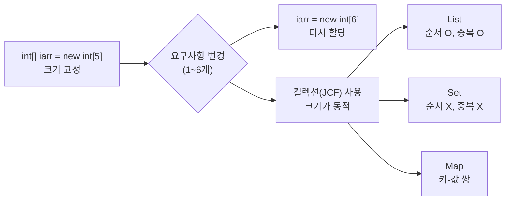
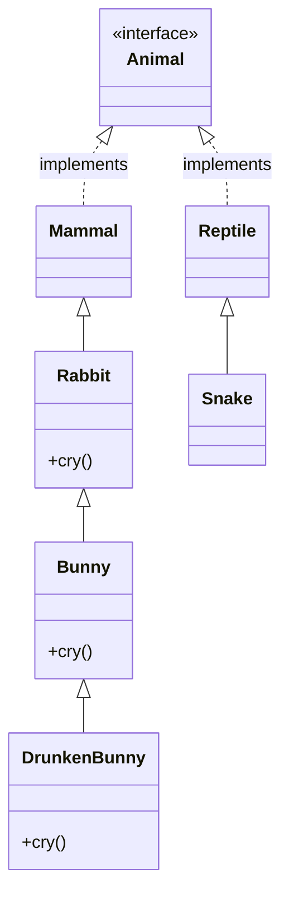
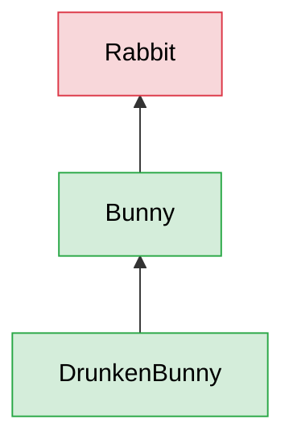
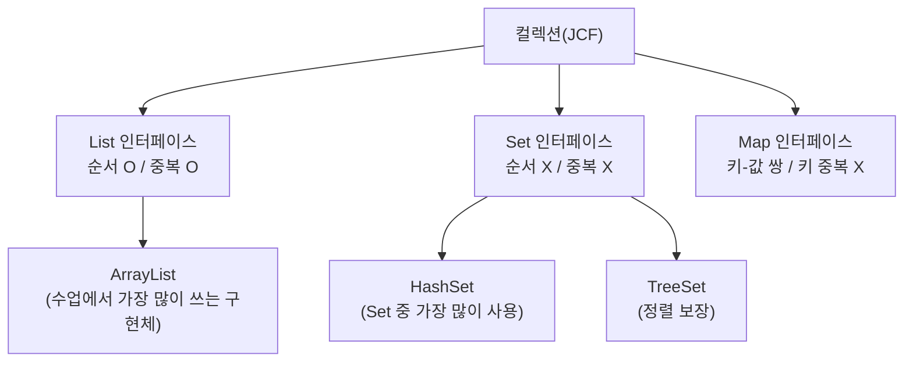

## 들어가며 (Situation)

어제([static, 싱글톤, 상속, 다형성 글]())까지는 클래스를 설계하고 물려주고 바꿔 끼우는 방법을 배웠다. 오늘(자바 7일차, 메모 제목은 "1007 컬렉션 / 제네릭")은 그렇게 만든 객체를 **여러 개 담는 방법**으로 넘어갔다. 오늘의 중심 개념은 세 가지다.

1. **제네릭(Generic)**: 데이터 타입을 일반화해서 타입 안전성을 높인다. 와일드카드(`?`, `? extends`, `? super`)도 여기에 포함된다.
2. **DTO**: 값만 운반하는 클래스를 만드는 암묵적인 규칙.
3. **List와 Set**: 배열의 한계를 넘기 위한 컬렉션(JCF).

수업 코드는 `chap04-generic-and-collection` 프로젝트이고, 이 글의 코드는 전부 그 안의 파일에서 가져왔다. 다만 수업 코드에 없는 코드는 "예시 코드"라고 따로 적었다.

## 문제 상황 (Task)

메모에는 문제의 출발점이 이렇게 적혀 있다.

> int[] iarr = new int[5]; 로 정수 5개를 저장한다. 요구사항이 1~6으로 바뀌면 iarr = new int[6]; 으로 다시 할당해야 한다. 배열의 한계: 시작할 때 크기가 고정되어 있어서 요구사항이 바뀌면 다시 할당한다. 이 공간적 제약을 해결하려고 컬렉션을 쓴다.

(이 배열 코드는 수업 프로젝트 `chap04`에 들어 있지 않고 메모에만 있는 예시다.) 이 메모에서 오늘 풀어야 할 질문이 나온다.

- 배열의 크기 제약을 컬렉션(JCF)은 **어떻게** 해결하는가?
- 컬렉션에 값을 넣을 때 `"apple"`도 `1`도 들어간다. 이래도 되는가? 타입을 고정하는 **제네릭**은 무엇이 다른가?
- 책 한 권(번호, 제목, 저자, 가격)을 변수 하나에 담는 **DTO**는 어떻게 만드는가?
- 순서·중복에 따라 List와 Set은 **언제 무엇을** 쓰는가?

제약은 이번에도 같았다. 수업 주석은 단순화된 설명이라서 직접 실행해 보고 Oracle 공식 문서와 대조하며 정리했다. 코드는 JDK 21로 직접 컴파일하고 실행했다.

## 해결 과정 (Action)

### 1. 배열의 한계에서 컬렉션(JCF)으로

메모의 "JCF(Java Collection Framework)는 누군가 만들어둔 프레임워크를 사용하는 것"이라는 문장은, 직접 자료구조를 만들지 않고 자바가 제공하는 것을 가져다 쓴다는 뜻으로 이해했다. Oracle 튜토리얼은 컬렉션을 "여러 요소를 하나의 단위로 묶는 객체"라고 소개하고, 컬렉션 프레임워크를 "컬렉션을 표현하고 조작하기 위한 통합된 아키텍처"라고 설명한다. ([Oracle Java Tutorials - Collections](https://docs.oracle.com/javase/tutorial/collections/index.html))



| 항목 | 배열 | 컬렉션(`ArrayList`) |
|---|---|---|
| 크기 | 만들 때 고정, 바꾸려면 새로 할당 (`new int[6]`) | 요소를 추가하면 늘어남 (메모: 동적 크기) |
| 요소 추가/삽입 | 칸을 직접 옮겨야 함 | `add(index, value)`로 삽입, 뒤 요소는 자동으로 밀림 |
| 담을 수 있는 타입 | 선언한 타입 하나 | 제네릭을 쓰지 않으면 아무 타입, 쓰면 지정한 타입 |
| 내부 구조 | 연속된 칸 | `ArrayList`는 내부적으로 배열의 특징을 가진다 (수업 주석) |

`ArrayList`의 Javadoc도 "크기를 조절할 수 있는 배열 구현(Resizable-array implementation)"이라고 적고 있다. ([ArrayList Javadoc](https://docs.oracle.com/en/java/javase/21/docs/api/java.base/java/util/ArrayList.html)) 즉 "컬렉션은 배열을 버린 것"이 아니라, **배열의 크기 고정 문제를 감싸서 대신 관리해 주는 것**으로 이해했다. (이 문장은 Javadoc 한 줄과 수업 주석에서 나온 내 해석이고, 내부 증설 방식까지는 확인하지 않았다.)

### 2. 제네릭 — 타입을 "나중에" 정하기

#### 2-1. 제네릭 없이 쓰면 생기는 일

`a_basic/Application`의 주석은 제네릭을 이렇게 정의한다.

```java
/* comment. Generic
*   제네릭은 데이터 타입을 일반화 한다는 의미이다.
*   클래스나 메소드에서 사용할 내부 데이터 타입을
*   컴파일 시점에 지정하는 방법을 의미한다.
*   컴파일 시점에 미리 타입에 대한 검사를 진행하여,
*   클래스나 메소드 내부에서 사용되는 객체의
*   타입 안정성을 높일 수 있다.
* */
```

`GenericTest<T>` 클래스는 `T` 하나로 필드 `value`의 타입을 표현한다.

```java
public class GenericTest<T> {

    /* comment.
    *   제네릭을 설정하는 방법은 클래스 선언부 끝에
    *   <> 다이아몬드 연산자를 사용하면 된다.
    *   <T> T는 타입 변수로 불리우며 관례상 T라고
    *   작성을 하게 된다.
    *  */

    private T value;
    ...
}
```

처음에는 `<>` 없이 생성한 객체에 `1`과 `"안녕하세요"`를 차례로 넣었다. 실행하면 둘 다 들어간다.

```java
GenericTest gt = new GenericTest();
gt.setValue(1);
System.out.println("gt = " + gt.getValue());      // gt = 1
gt.setValue("안녕하세요");
System.out.println("gt = " + gt.getValue());      // gt = 안녕하세요
```

컴파일은 통과했지만 javac가 `Some input files use unchecked or unsafe operations.`라는 경고를 냈다. 타입을 지정하지 않은 이 형태를 Oracle 튜토리얼은 **raw type**이라고 부른다. ([Raw Types](https://docs.oracle.com/javase/tutorial/java/generics/rawTypes.html)) 이 경고가 "타입 검사를 못 받는 코드가 있다"는 신호라고 이해했다. 이어서 타입을 지정한 쪽을 실행해 봤다.

```java
GenericTest<String> gt2 = new GenericTest<>();
gt2.setValue("문자열");
System.out.println("gt2 =  " + gt2.getValue());   // gt2 =  문자열
//        gt2.setValue(1);
```

주석 처리된 `gt2.setValue(1)`을 풀어서 컴파일해 봤더니 에러가 났다. (예시 코드: 수업 코드의 주석을 풀어 확인했다. 아래 컬렉션 쪽 에러도 마찬가지로 `List<String>`에 `add(1)`을 넣어 봤다.)

```text
error: incompatible types: int cannot be converted to String
```

"컴파일 시점에 타입 검사를 한다"는 수업의 말이 이 에러로 확인됐다. 잘못된 값이 **실행 도중이 아니라 코드를 쓰는 시점에** 걸러진다.

#### 2-2. 다이아몬드 안에는 기본형이 안 들어간다

수업 주석은 `GenericTest<int>`가 안 되는 이유로 Wrapper 클래스를 설명한다.

```java
/* comment.
*   <> 제네릭의 다이아몬드 연산자 내부에는 기본자료형이
*   들어갈 수 없다.
*   - Wrapper 클래스
*   - 기본지료형(int, char, boolean) 을
*   - 인스턴스화 (== 참조자료형 화) 한 객체라고 본다.
*   int -> Integer
*   ...
```

```java
//        GenericTest<int> gt3= new GenericTest<int>();
GenericTest<Integer> gt3= new GenericTest<>();
gt3.setValue(1);
```

직접 `List<int>`를 써 보니 `error: unexpected type`이 났다. 그래도 `gt3.setValue(1)`처럼 `int` 값 `1`은 그대로 넣을 수 있다. 이 부분은 Oracle 튜토리얼의 오토박싱으로 이해했다. ([Autoboxing and Unboxing](https://docs.oracle.com/javase/tutorial/java/data/autoboxing.html)) 자세한 변환 규칙은 이 글에서 다루지 않았다.

#### 2-3. 클래스 계층과 `T extends Rabbit`

여기서부터가 `b_use` 코드다. 메모에는 계층이 `Animal(interface) > Mammal > Rabbit > Bunny > DrunkenBunny`로 적혀 있다. 코드를 읽어 보니 `Mammal`은 `Animal`을 **구현**(`implements`)하고, 나머지는 `extends`다. 인터페이스는 구현부(메소드 몸체)가 없고 선언만 있어서, 상속(`extends`)이라 하지 않고 "구현한다"고 표현한다. 같은 패키지에 `Reptile`, `Snake`도 있다.



`Rabbit`, `Bunny`, `DrunkenBunny`는 모두 `cry()`를 갖고 있고, 자식은 `@Override`로 다시 구현한다.

| 클래스 | `cry()` 출력 (수업 코드) |
|---|---|
| `Rabbit` | 토끼가 울부짖습니다. 끾끾! |
| `Bunny` | 바니바니 당근당근 |
| `DrunkenBunny` | 바앙라ㅓㅇㄹㄹ...당,,ㄴ근,,,당..?근 |

`RabbitFarm`은 이 토끼들의 농장이다. 어떤 토끼가 올지 몰라서 제네릭으로 만들었다.

```java
/* comment.
*   해당 클래스는 토끼들의 농장이며
*   Rabbit, Bunny, DrunkenBunny 어떤 토끼가
*   들어올지 몰라 제네릭으로 생성
*   T ->  타입변수에는 어떤 값이 들어올 지 모르는 상태이다.
*   그래서 포유류, 파충류, 뱀 등이 전부 들어올 수 있다.
*   T extends Rabbit 을 지정하면
*   Rabbit 또는 Rabbit을 상속 받는 클래스만 T에
*   들어올 수 있게 된다.
* */
public class RabbitFarm<T extends Rabbit>{

    private T animal;
    ...
    public RabbitFarm(T animal) {
        this.animal = animal;
    }
}
```

메모의 "`<T>`는 코드의 유연성을 돕는다"는 말은 이 주석과 같다. `T`만 쓰면 아무 타입이나 들어와서 유연한 대신 위험하다. 그래서 `extends Rabbit`으로 **상한**을 건다. Oracle 튜토리얼은 이것을 bounded type parameter라고 부른다. ([Bounded Type Parameters](https://docs.oracle.com/javase/tutorial/java/generics/bounded.html)) 정리하면 이렇다.

| 선언 | 들어올 수 있는 타입 |
|---|---|
| `GenericTest<T>` | 제한 없음 (Wrapper 포함 모든 참조형) |
| `RabbitFarm<T extends Rabbit>` | `Rabbit`, `Bunny`, `DrunkenBunny` |

`Application01`에는 이 제한을 확인하는 줄이 주석 처리되어 있다. 풀어서 컴파일해 봤더니 다음 에러가 났다. (예시 코드: 수업 코드 주석을 푼 것)

```java
// Mammal 은 Rabbit 을 상속 받지 않았기 때문에 T 에
// 들어갈 수 없어서 컴파일 에러가 발생한다.
//        RabbitFarm<Mammal> farm1 = new RabbitFarm();
```

```text
error: type argument Mammal is not within bounds of type-variable T
```

#### 2-4. 제네릭과 다형성이 만나는 지점

```java
RabbitFarm<Bunny> farm2 = new RabbitFarm<>();
...
// farm2는 Bunny 를 위한 농장인데
// Rabbit 은  Bunny 의 부모이기 때문에
// 들어갈 수 없다.
//        Rabbit rabbit = new Rabbit();
//        farm2.setAnimal(rabbit);

DrunkenBunny drunkenBunny = new DrunkenBunny();
farm2.setAnimal(drunkenBunny);
farm2.getAnimal().cry();
```

`RabbitFarm<Bunny>`에는 `Rabbit`을 넣을 수 없지만(부모는 `Bunny`로 볼 수 없다) `DrunkenBunny`는 `Bunny`의 자식이라 넣을 수 있다. 실행하면 `farm2.getAnimal().cry()`가 `DrunkenBunny`의 울음소리(`바앙라ㅓㅇㄹㄹ...당,,ㄴ근,,,당..?근`)를 출력한다. 변수 타입은 `Bunny`인데 실행되는 것은 실제 객체의 메소드다. 어제 배운 [동적 바인딩]()이 제네릭 클래스 안에서도 그대로 일어난다.

#### 2-5. 와일드카드 — Application02 분석

메모의 확인 과제는 `wildcardFarm.anyType(new RabbitFarm<Rabbit>(new Rabbit()));` 같은 코드였다. 먼저 `WildcardFarm`부터 본다.

```java
public class WildcardFarm {

    public void anyType(RabbitFarm<?> farm){
        farm.getAnimal().cry();
    }

    public void extendsType(RabbitFarm<? extends Bunny> farm){
        farm.getAnimal().cry();
    }

    public void superType(RabbitFarm<? super Bunny> farm){
        farm.getAnimal().cry();
    }

}
```

세 메소드의 매개변수 타입은 모두 `RabbitFarm`이고, 타입 인자 자리만 다르다. 수업 주석은 규칙을 이렇게 정리한다.

```java
/* comment.
*   와일드카드: ?
*   제네릭 클래스 타입의 객체를 매소드의
*   매개변수로 전달 받을 때, 그 객체의 타입 변수를
*   제한할 수 있다.
*   <?> : 제한 없다. 아무거나 들어와도 된다.
*   <? extends Type> : 와일드카드 상한 제한  // 자신과 자신의 자식 클래스
*   <? super Type> : 와일드카드 하한 제한 //자신과 자신의 부모 클래스
* */
```

이 방향이 실제로 맞는지는 아래 실행 결과 표로 확인했다.

`Application02`를 그대로 실행한 결과를 한 표로 정리했다.

| 호출 | 결과 | 출력 |
|---|---|---|
| `anyType(new RabbitFarm<Rabbit>(new Rabbit()))` | 통과 | 토끼가 울부짖습니다. 끾끾! |
| `anyType(new RabbitFarm<Bunny>(new Bunny()))` | 통과 | 바니바니 당근당근 |
| `anyType(new RabbitFarm<DrunkenBunny>(...))` | 통과 | 바앙라ㅓㅇㄹㄹ... |
| `extendsType(new RabbitFarm<Rabbit>(...))` (주석 처리됨) | **컴파일 에러** | - |
| `extendsType(new RabbitFarm<Bunny>(...))` | 통과 | 바니바니 당근당근 |
| `extendsType(new RabbitFarm<DrunkenBunny>(...))` | 통과 | 바앙라ㅓㅇㄹㄹ... |
| `superType(new RabbitFarm<Rabbit>(...))` | 통과 | 토끼가 울부짖습니다. 끾끾! |
| `superType(new RabbitFarm<Bunny>(...))` | 통과 | 바니바니 당근당근 |
| `superType(new RabbitFarm<DrunkenBunny>(...))` (주석 처리됨) | **컴파일 에러** | - |

주석 처리된 두 줄을 풀어서 컴파일했더니 에러 메시지는 이랬다. (예시 코드: 수업 코드 주석을 푼 것)

```text
incompatible types: RabbitFarm<Rabbit> cannot be converted to RabbitFarm<? extends Bunny>
incompatible types: RabbitFarm<DrunkenBunny> cannot be converted to RabbitFarm<? super Bunny>
```



위 그림은 `? extends Bunny`에서 허용되는 타입(초록: `Bunny`, `DrunkenBunny`)과 막히는 타입(빨강: `Rabbit`)이다. `? super Bunny`는 반대로 `Rabbit`, `Bunny`가 허용되고 `DrunkenBunny`가 막힌다. Oracle 튜토리얼도 상한 와일드카드는 "알 수 없는 타입이 그 타입이거나 하위 타입", 하한 와일드카드는 "그 타입이거나 상위 타입"이라고 설명한다. ([Upper Bounded Wildcards](https://docs.oracle.com/javase/tutorial/java/generics/upperBounded.html), [Lower Bounded Wildcards](https://docs.oracle.com/javase/tutorial/java/generics/lowerBounded.html))

| 와일드카드 | 읽는 법 | 이 코드에서 허용되는 `RabbitFarm<?>` |
|---|---|---|
| `<?>` | 제한 없음 | `Rabbit`, `Bunny`, `DrunkenBunny` (단, `RabbitFarm`의 `T extends Rabbit` 범위 안에서) |
| `<? extends Bunny>` | 상한: `Bunny`와 그 자식 | `Bunny`, `DrunkenBunny` |
| `<? super Bunny>` | 하한: `Bunny`와 그 부모 | `Rabbit`, `Bunny` |

그리고 이 코드에서 이해하는 데 시간이 걸린 부분이 있었다. `superType`의 `farm.getAnimal().cry()`는 `Object`일 수도 있는 타입에서 `cry()`를 부르는 것처럼 보이는데도 컴파일된다. 내가 이해한 이유는 `RabbitFarm<T extends Rabbit>`가 이미 `T`의 상한을 `Rabbit`으로 묶고 있어서 `? super Bunny`로 들어온 타입이라도 `Rabbit`의 메소드(`cry()`)는 쓸 수 있다는 것이다. (이 부분은 컴파일 결과로 확인했을 뿐, JLS의 캡처 변환 규칙까지 읽고 정리하지는 못했다. "더 학습할 개념"에 남긴다.)

하나 더 직접 확인했다. 수업 코드에는 없지만 `RabbitFarm<? extends Bunny> g`에 `g.setAnimal(new Bunny())`를 호출하면 컴파일이 되지 않는다. (예시 코드)

```text
error: incompatible types: Bunny cannot be converted to CAP#1
```

`? extends Bunny`로 받은 농장은 안에서 **꺼내서 읽는 것**은 되지만 **넣는 것**은 막힌다. 실제 타입이 `Bunny`인지 `DrunkenBunny`인지 모르기 때문이다. 이 규칙(읽기는 `extends`, 쓰기는 `super`)의 공식 이름과 사용 지침은 Oracle 튜토리얼의 Wildcard Guidelines에 있다는 것까지만 확인했고, 이 글에서는 더 풀지 않았다.

### 3. DTO — "값만 담는 클래스"의 암묵적인 룰

#### 3-1. 정의와 6가지 구성 요소

메모의 "DTO: 보통은 값, 기능(메서드)으로 나눔. 암묵적인 룰을 꼭 작성하기"에서 **암묵적인 룰**이 무엇인지는 `BookDTO`의 주석에 번호를 붙여 적혀 있었다. 이 번호 목록이 DTO 파트에서 가장 중요한 내용이다.

> **DTO에 포함되어야 하는 것**
> 1. 필드
> 2. 기본 생성자
> 3. 모든 필드를 초기화하는 생성자
> 4. getter
> 5. setter
> 6. `toString`

DTO를 만들 때마다 이 1~6번을 순서대로 빠짐없이 채운다. 주석은 DTO를 "행위(메서드)에 집중하는 클래스가 아니라 **단순 데이터 운반을 위한 클래스**"라고 정의한다. 그래서 필드와, 필드를 다루는 최소한의 통로(생성자, getter, setter, `toString`)만 갖는다. 실제 `BookDTO` 주석은 다음과 같다.

```java
public class BookDTO {

    // DTO (Data Transfer Object) // VO라 하기도O
    // 행위(==메서드) 에 집중하는 클래스가 아닌
    // 단순 데이터 운반을 위한 클래스이다.
    // 메서드가 아닌 필드들로만 이루어져 있으며
    // DTO 에 포함되어 있는 값.
    // 1. 필드 , 2. 기본생성자 , 3. 모든 필드를 초기화 하는 생성자
    // 4. getter , 5. setter , 6. toString

    private int no; // 책 번호
    private String title; // 첵 제목
    private String author; // 책 저자
    private int price; // 책 가격

    public BookDTO() {}

    public BookDTO(int no, String title, String author, int price) {
        this.no = no;
        this.title = title;
        this.author = author;
        this.price = price;
    }
    ...
}
```

주석의 번호 순서대로 `BookDTO`에 대응시키면 다음과 같다.

| 번호 | 구성 요소 | `BookDTO`에서 | 왜 필요한가 (내가 이해한 이유) |
|---|---|---|---|
| 1 | 필드 | `no`, `title`, `author`, `price` (모두 `private`) | 운반할 데이터. 필드는 `private`으로 닫는다 |
| 2 | 기본 생성자 | `BookDTO() {}` | 값 없이 만든 뒤 나중에 setter로 채울 때 |
| 3 | 모든 필드를 초기화하는 생성자 | `BookDTO(int, String, String, int)` | `new BookDTO(1,"홍길동전","허균",50000)`처럼 한 줄로 만들 때 |
| 4 | getter | `getNo()` 등 | `private` 필드를 읽는 통로 |
| 5 | setter | `setNo()` 등 | `private` 필드를 바꾸는 통로 |
| 6 | `toString()` | `BookDTO{no=1, ...}` | 출력 시 주소값이 아니라 실제 값을 보기 위해 |

이 규칙은 금요일에 배운 [캡슐화]()의 연장이다. 필드를 `private`으로 닫고 getter/setter로만 접근한다. 다만 **DTO에는 로직(행위)이 없다**는 점이 다르다. 메모의 "값, 기능으로 나눔"은 값을 가진 클래스(DTO)와 기능을 가진 클래스(예: 게임의 `GameManager` 같은 클래스)를 나눈다는 뜻으로 이해했다. 수업 코드에서 기능 클래스가 따로 있는 것은 이번 `chap04`에서는 확인하지 못했다.

수업 주석의 "VO라 하기도 한다"는 말은 그대로 적어 둔다. VO(Value Object)와 DTO를 같다고 보는 설명도 있고 구분하는 설명도 있다고 알고 있는데, 공식 문서에서 정의를 확인하지 못했다. 이 글에서는 **수업에서 그렇게 소개했다**는 정도로만 쓰고 단정하지 않는다.

#### 3-2. 왜 DTO를 쓰는가 — 변수 5개에서 리스트 하나로

`Application02`의 주석 처리된 코드가 DTO를 쓰기 전의 모습이다.

```java
//    BookDTO book1 = new BookDTO(1,"홍길동전", "허균", 50000);
//    BookDTO book2 = new BookDTO(2,"목민심서", "정약용", 45000);
//    BookDTO book3 = new BookDTO(3,"삼국지", "나관중", 30000);
//    BookDTO book4 = new BookDTO(4,"마법천자문", "손오공", 20000);
//    BookDTO book5 = new BookDTO(5,"삼국유사", "일연", 58000);

// 각각의 변수에 책들이 들어있다.
```

DTO 덕분에 책 한 권의 4개 값(번호, 제목, 저자, 가격)이 **객체 하나**가 된다. 그래도 책이 5권이면 변수가 5개다. 6권이면 `book6`을 새로 선언해야 하고, 반복문으로 처리할 수도 없다. 여기서 배열이나 컬렉션의 필요가 다시 나온다. 문제 상황의 "요구사항이 바뀌면 크기를 다시 정해야 한다"와 같은 문제다. 수업은 `List<BookDTO>`로 이것을 풀었다.

### 4. List — 순서가 있고 중복을 허용한다

#### 4-1. 컬렉션 3가지와 `ArrayList`

`a_list/run/Application01`의 주석이 컬렉션의 큰 그림을 보여 준다.

```java
/* comment. 컬렉션
*   1. List
*   - 순서가 있는 데이터의 집합, 중복을 허용한다.
*   2. Set
*   - 순서가 없는 데이터의 집합, 중복을 허용하지 않는다.
*   3. Map
*   - 키와 값 하나의 쌍으로 이루어지는 데이터 집합
*   - key 같은 Set으로 구현되어 있어 중복을 허용하지 않는다.
*  */
```



수업 코드의 이 주석 두 줄도 중요했다.

```java
// 인터페이스는 생성자를 생성할 수 없다.
// == 즉 인터페이스는 객체를 생성할 수 없다.
// List를 상속받은 클래스를 통해 객체를 생성한다.
// ArrayList 는 List 를 상속받아 구현을 한 구현체이다.
// 가장 많이 사용이 되며, 내부적으로 배열의 특징을 갖는다.
List list = new ArrayList();
```

변수 타입은 인터페이스(`List`), `new`는 구현체(`ArrayList`)로 쓴다. 이 구조는 어제 [다형성]()에서 배운 "부모 타입 변수에 자식 객체를 넣는다"와 같다. 나중에 구현체만 바꿔도 `List`를 쓰는 코드는 그대로 둘 수 있다. (이 이점은 수업 코드에 `ArrayList` 외의 구현체가 없어서 직접 바꿔 보지는 못했고, 어제 배운 원리를 적용한 이해다.)

#### 4-2. 제네릭 없는 List 실행해 보기

```java
List list = new ArrayList();

list.add("apple");
list.add(1);
list.add(123.123);
list.add(true);
list.add(new Date());

System.out.println("list = "+list);
System.out.println("list.size() = "+ list.size());
System.out.println("1번 공간에 있는 값 = " + list.get(1));
```

실행하면 `list = [apple, 1, 123.123, true, Wed Oct 07 ... KST 2026]`, `list.size() = 5`, `1번 공간에 있는 값 = 1`이 나온다. 문자열, 정수, 실수, 불리언, 날짜가 한 리스트에 다 들어간다. 배열은 같은 타입만 담았는데 컬렉션은 "크기"뿐 아니라 "타입"도 풀려 있다. 하지만 이것은 2-1에서 본 raw type과 같다. 꺼낼 때 무엇이 나올지 모르는 상태다.

다음 코드는 삽입과 삭제를 보여 준다.

```java
// 배열의 단점 : 고정크기, 기존 값 수정
list.add(1, "banana"); // 1이 index가 2로 변경되고 banana 가 추가
System.out.println("list = " + list);

list.remove(2);
System.out.println("list = " + list);
```

| 시점 | `list`의 내용 |
|---|---|
| 처음 | `[apple, 1, 123.123, true, 날짜]` |
| `list.add(1, "banana")` 후 | `[apple, banana, 1, 123.123, true, 날짜]` |
| `list.remove(2)` 후 | `[apple, banana, 123.123, true, 날짜]` |

`add(1, "banana")`는 1번 칸에 값을 끼워 넣고 기존의 `1`을 한 칸 밀어서 2번이 되게 했다. 이어서 `remove(2)`로 2번 칸의 `1`이 지워졌다. 수업 주석의 "배열의 단점: 고정 크기, 기존 값 수정"은, 배열이라면 값을 끼워 넣기 위해 뒤의 값을 직접 한 칸씩 옮기고 크기를 늘려야 하는 번거로움을 뜻하는 것으로 이해했다. 컬렉션은 이것을 메소드 한 번으로 한다.

#### 4-3. 제네릭 + List + Collections.sort

```java
List<String> strings = new ArrayList<>(); //제네릭으로 타입 고정
strings.add("a");
strings.add("c");
strings.add("b");
strings.add("d");
System.out.println("strings = " + strings); // strings = [a, c, b, d]
// Collection 객체를 따로 생성하지 않아도 sort를 사용함
// sort는 static이라 .메소드명(); 으로 호출하여 사용이 가능하다
Collections.sort(strings); // 오름차순 정렬
System.out.println("strings = " + strings); // strings = [a, b, c, d]
```

`Collections.sort`를 객체 없이 `Collections.sort(...)`로 호출할 수 있는 이유는 `static` 메소드이기 때문이다. 어제 배운 [static 규칙]()이 JDK 클래스에서도 그대로 쓰인다.

#### 4-4. DTO를 List에 담기

수업의 마지막 List 실습은 DTO와 List, 제네릭을 한 번에 쓴 `Application02`다. 요구사항은 주석에 이렇게 적혀 있다.

```java
/* comment. ArrayList 활용!
 *   - 책은 책번호, 제목, 저자, 가격이 있다.
 *   - 5권의 책을 하나의 변수에 저장을 한다.
 *   - 가격 오름차순으로 정렬을 해본다.
 * */
```

```java
//BookDTO 타입의 객체를 저장할 수 있는 List
List<BookDTO> bookList = new ArrayList<>();
bookList.add(new BookDTO(1,"홍길동전", "허균", 50000));
bookList.add(new BookDTO(2, "목민심서", "정약용", 45000));
bookList.add(new BookDTO(3, "삼국지", "나관중", 30000));
bookList.add(new BookDTO(4, "마법천자문", "손오공", 20000));
bookList.add(new BookDTO(5, "삼국유사", "일연", 58000));
```

5개 변수가 `bookList` 하나로 줄었다. 반복은 두 가지로 해 봤다.

```java
// 반복문을 활용해서 책 1개씩 출력
for(int i = 0; i < bookList.size(); i++){
    System.out.println((i+1) + "번째 책 : " + bookList.get(i));
}

// 향상된 for 문
// for(컬렉션 반복 시 1개의 값을 담을 변수 : 컬렉션객체 )
for (BookDTO book : bookList){
    System.out.println(book.getNo() + "번째 책 : " + book);
}
```

| 방식 | 특징 |
|---|---|
| `for (int i...; i < bookList.size(); ...)` | 인덱스 `i`가 필요할 때. `get(i)`로 꺼낸다 |
| `for (BookDTO book : bookList)` | 인덱스가 필요 없을 때. 요소를 하나씩 `book`에 담아 준다 |

`List<BookDTO>`이기 때문에 향상된 for에서 `BookDTO book`으로 바로 받고 `book.getNo()`를 호출할 수 있다. 제네릭 없이 `List`였다면 꺼낸 값을 `Object`로 받아 형변환이 필요했을 것이다. (이 형변환은 수업 코드에서 시도해 보지 않은 설명이다.) 책 한 권이 `toString()`으로 `BookDTO{no=1, title='홍길동전', author='허균', price=50000}`처럼 출력된 것은 DTO의 6번(`toString`) 덕분이다.

여기서 **일부러 생략한 부분**이 하나 있다. 요구사항 주석에는 "가격 오름차순으로 정렬"이 있지만, `Application02`에는 정렬 코드가 없고 실행 결과도 번호 순서(가격 50000, 45000, 30000, 20000, 58000) 그대로다. 이 정렬은 자바 코드로 하기보다 **나중에 DB에서 하는 편이 쉽다.** 자바에서 정렬하려면 비교 기준을 담은 새 클래스를 만들어 `Comparable` 인터페이스를 구현하고 `compareTo`를 오버라이드해야 하는데, 오늘의 핵심(제네릭, DTO, List/Set)에서 벗어나는 작업이다. 그래서 수업에서도, 이 글에서도 생략했다. `Comparable`은 아래 "더 학습하면 좋은 개념"으로 남겼다.

### 5. Set — 순서도 중복도 없다

#### 5-1. HashSet

```java
/* comment. Set 자료구조 특징
*   1. 요소의 저장 순서를 유지하지 않는다.
*   2. 같은 요소의 중복 저장을 허용하지 않는다.
* */

// Set 인터페이스를 구현한 HashSet 을 가장 많이 쓴다.
Set<String> hset = new HashSet<>();

hset.add("java");
hset.add("db");
hset.add("servlet");
hset.add("spring");
hset.add("jpa");
// Set 자료형은 중복된 요소는 허용하지 않는다.
hset.add("jpa");

System.out.println("hset = " + hset);
```

여섯 번 `add`했지만 `"jpa"`가 중복이라 5개만 남는다. 직접 실행한 출력은 `hset = [spring, java, servlet, jpa, db]`였다. 넣은 순서(java, db, servlet, spring, jpa)와 다르게 나왔다. 이것이 "순서를 유지하지 않는다"의 실제 모습이다. `HashSet` Javadoc도 반복 순서에 대해 보장하지 않는다(makes no guarantees)고 적고 있다. ([HashSet Javadoc](https://docs.oracle.com/en/java/javase/21/docs/api/java.base/java/util/HashSet.html)) 이 순서는 실행 환경에 따라 달라질 수 있는 값이라서 위 출력 순서 자체를 외우지는 않는다.

#### 5-2. TreeSet으로 만든 로또 추첨기

```java
Set<Integer> lotto = new TreeSet<>();

while (lotto.size() < 7) {
    // (int)(Math.random() * 45) + 1
    // Math.random() -> 0 ~ 1 사이의 난수
    // * 45 -> 난수의 최대값
    // +1 -> 난수의 최솟값
    lotto.add((int)(Math.random() * 45) + 1);
}

System.out.println("lotto = " + lotto);
```

이 코드에서 "중복 불가"가 어떻게 쓰이는지가 흥미로웠다. 반복문은 `for`가 아니라 **`size() < 7`인 동안** 돈다. 난수가 겹치면 `add`가 무시되어 `size()`가 늘지 않으니, 서로 다른 7개가 모일 때까지 저절로 반복된다. (이 해석은 코드를 읽은 것이다. 겹침이 실제로 일어난 실행을 따로 확인하지는 않았다.) 출력은 `lotto = [6, 8, 14, 16, 19, 21, 30]`처럼 **오름차순**이다. 난수는 실행마다 달라서 이 숫자는 한 번 실행한 예일 뿐이다.

수업 주석은 `HashSet`과의 차이를 이렇게 설명한다. "TreeSet은 이진 검색 트리 구조로 데이터의 정렬을 보장한다." Javadoc은 `TreeSet`을 `NavigableSet` 구현이며 `TreeMap` 기반이고, 요소를 **자연 순서(natural ordering)** 또는 지정한 `Comparator`로 정렬한다고 설명한다. ([TreeSet Javadoc](https://docs.oracle.com/en/java/javase/21/docs/api/java.base/java/util/TreeSet.html)) 수업 주석의 "조회가 매우 빠르다"는 부분은 이번에 측정하거나 문서에서 확인하지 않아서 이 글에서 주장하지 않는다.

### 6. List vs Set 정리

| 항목 | List (`ArrayList`) | Set (`HashSet` / `TreeSet`) |
|---|---|---|
| 순서 | 있음 (넣은 순서, 인덱스로 접근) | `HashSet`: 보장 안 함 / `TreeSet`: 정렬됨 |
| 중복 | 허용 | 허용 안 함 |
| 인덱스 접근 | `get(i)`, `add(i, v)`, `remove(i)` | 인덱스 없음 (수업 코드에서 `get`을 쓰지 않았다) |
| 수업 예제 | 책 목록 `List<BookDTO>` | 로또 번호 `Set<Integer>` |
| 이런 때 선택 | 순서가 의미 있고 같은 값이 여러 번 올 수 있을 때 | 같은 값이 한 번만 있어야 할 때 |

### 7. 오늘의 시행착오

- 메모의 계층(`Animal(interface) > Mammal > ...`)은 코드와 한 곳이 달랐다. `Mammal`은 `extends`가 아니라 `implements Animal`이다. 메모를 코드에 맞춰 고쳤다.
- `superType`의 `farm.getAnimal().cry()`는 `? super Bunny`만 보면 `Object`일 수도 있는 타입에서 `cry()`를 부르는 것처럼 보인다. 그런데도 컴파일되는 이유는 `RabbitFarm`의 `T extends Rabbit`와 함께 봐야 설명된다. 와일드카드만이 아니라 클래스 선언의 상한도 같이 읽어야 한다.
- `Application02`(List)의 요구사항 주석에는 "가격 오름차순 정렬"이 있지만 코드에는 없었다. 자바에서 정렬하려면 `Comparable`을 구현하고 `compareTo`를 오버라이드해야 하고, 정렬은 나중에 DB에서 하는 편이 쉬워서 일부러 생략한 것이었다.

## 결과 (Result)

성능 수치는 측정하지 않았다. 직접 실행하거나 컴파일한 것만 적는다.

| 확인 항목 | 결과 |
|---|---|
| 제네릭 없이 `setValue(1)`, `setValue("안녕하세요")` | 둘 다 통과, javac `unchecked` 경고 발생 |
| `GenericTest<String>`에 `setValue(1)` (예시 코드) | 컴파일 에러 `int cannot be converted to String` |
| `RabbitFarm<Mammal>` (예시 코드) | 컴파일 에러 `not within bounds of type-variable T` |
| `extendsType(RabbitFarm<Rabbit>)` (예시 코드) | 컴파일 에러 (`? extends Bunny`는 `Rabbit` 불가) |
| `superType(RabbitFarm<DrunkenBunny>)` (예시 코드) | 컴파일 에러 (`? super Bunny`는 `DrunkenBunny` 불가) |
| `List` 삽입/삭제 | `add(1,"banana")`로 6개, `remove(2)` 후 5개 |
| `Application02` 책 목록 | 5권, 번호 순서 그대로 출력 (정렬은 DB에서 하기로 하고 생략) |
| `HashSet`에 6번 `add` (중복 `jpa` 1개) | 5개만 저장, 넣은 순서와 다르게 출력 |
| `TreeSet` 로또 | 서로 다른 7개, 오름차순 출력 |
| 이번에 확인한 수업 코드 | 18개 파일 (`a_generic` 13, `b_collection` 5) |

배운 점은 다음과 같다.

1. **배열의 한계는 "크기가 고정"이라는 것이고, 컬렉션은 이것을 감싸서 동적으로 관리해 준다.** 다만 컬렉션도 제네릭 없이 쓰면 타입이 풀려 버린다.
2. **제네릭은 타입 검사를 컴파일 시점으로 당긴다.** `T`로 열어 두고(`<T>`), 필요하면 `extends`로 상한을 건다(`T extends Rabbit`).
3. **와일드카드의 `extends`는 자식 방향, `super`는 부모 방향이다.** `Bunny`를 기준으로 표를 그려 보면 방향이 헷갈리지 않는다.
4. **DTO는 필드, 기본 생성자, 전체 생성자, getter, setter, `toString`의 6가지 구성이 암묵적인 룰이다.** 값을 객체 하나로 묶고, 그 객체를 `List`에 담아야 비로소 "책 5권"이 변수 하나가 된다.
5. **List와 Set은 순서와 중복으로 가른다.** `HashSet`의 출력 순서는 보장되지 않고, `TreeSet`은 정렬된다.
6. **주석과 메모를 그대로 믿지 않고 실행으로 확인했다.** 계층의 `implements`와 와일드카드 방향을 코드로 바로잡았다.

## 더 학습하면 좋은 개념

- **Comparable과 Comparator** — `BookDTO`를 가격 오름차순으로 정렬하려면 `Comparable`을 구현하고 `compareTo`를 오버라이드해 비교 기준을 알려 줘야 한다. 이번에는 정렬을 DB에서 하기로 하고 생략했지만, `Collections.sort`와 `TreeSet`이 어떻게 순서를 정하는지도 같은 개념에서 출발하므로, DTO를 컬렉션에서 다루려면 반드시 필요하다.
- **`equals()`와 `hashCode()`** — `HashSet`이 "같은 요소"를 어떻게 판별하는지의 핵심이다. `String`은 이미 준비되어 있어 수업 코드에서 문제가 없었지만, `BookDTO`를 `Set`에 넣으면 같은 책이 중복으로 들어갈 수 있다. DTO를 `Set`이나 `Map`의 키로 쓰기 전에 알아야 한다. (이 동작은 이번에 직접 확인하지 않았다.)
- **Map (`HashMap`, `TreeMap`)** — 수업 주석에서 언급만 된 세 번째 컬렉션이다. 키-값 쌍으로 저장하는데 키가 Set처럼 중복을 허용하지 않는다는 점에서 오늘 배운 Set과 이어진다. 실제 프로그램에서 "번호로 책 찾기"처럼 값을 찾는 상황에 자주 쓰일 것 같아서 다음에 학습해 두려고 한다.
- **와일드카드 가이드라인 (PECS)과 캡처 변환** — `? extends`는 읽기, `? super`는 쓰기에 쓴다는 지침이다. 오늘 `g.setAnimal(new Bunny())`가 `CAP#1` 에러로 막힌 이유가 여기에 나온다. 와일드카드를 단순히 "자식/부모 허용"으로 외우지 않고, 어떤 상황에 선택하는지 판단하게 해 준다.
- **타입 소거(Type Erasure)와 raw type** — 제네릭이 컴파일 시점에만 존재하고 실행 시점에는 지워진다는 개념이다. 오늘 본 `unchecked` 경고와 raw type이 왜 위험한지를 설명하는 원리라서, 제네릭을 "문법"이 아니라 "동작 원리"로 이해하는 데 필요하다.

## 참고 자료

- [Oracle Java Tutorials - Generics](https://docs.oracle.com/javase/tutorial/java/generics/index.html)
- [Oracle Java Tutorials - Bounded Type Parameters](https://docs.oracle.com/javase/tutorial/java/generics/bounded.html)
- [Oracle Java Tutorials - Wildcards](https://docs.oracle.com/javase/tutorial/java/generics/wildcards.html)
- [Oracle Java Tutorials - Upper Bounded Wildcards](https://docs.oracle.com/javase/tutorial/java/generics/upperBounded.html)
- [Oracle Java Tutorials - Lower Bounded Wildcards](https://docs.oracle.com/javase/tutorial/java/generics/lowerBounded.html)
- [Oracle Java Tutorials - Raw Types](https://docs.oracle.com/javase/tutorial/java/generics/rawTypes.html)
- [Oracle Java Tutorials - Type Erasure](https://docs.oracle.com/javase/tutorial/java/generics/erasure.html)
- [Oracle Java Tutorials - Autoboxing and Unboxing](https://docs.oracle.com/javase/tutorial/java/data/autoboxing.html)
- [Oracle Java Tutorials - Collections](https://docs.oracle.com/javase/tutorial/collections/index.html)
- [Oracle Java Tutorials - The List Interface](https://docs.oracle.com/javase/tutorial/collections/interfaces/list.html)
- [Oracle Java Tutorials - The Set Interface](https://docs.oracle.com/javase/tutorial/collections/interfaces/set.html)
- [Java SE 21 API - ArrayList](https://docs.oracle.com/en/java/javase/21/docs/api/java.base/java/util/ArrayList.html)
- [Java SE 21 API - HashSet](https://docs.oracle.com/en/java/javase/21/docs/api/java.base/java/util/HashSet.html)
- [Java SE 21 API - TreeSet](https://docs.oracle.com/en/java/javase/21/docs/api/java.base/java/util/TreeSet.html)
