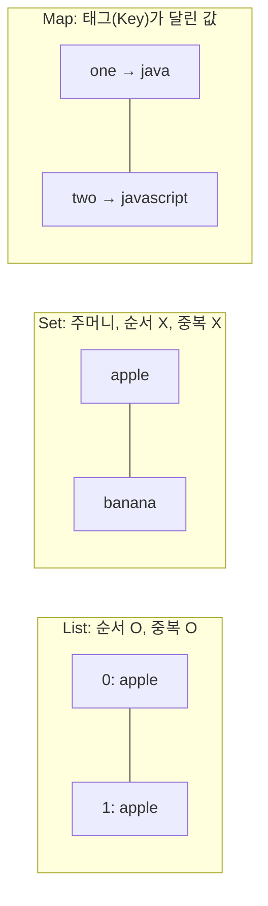
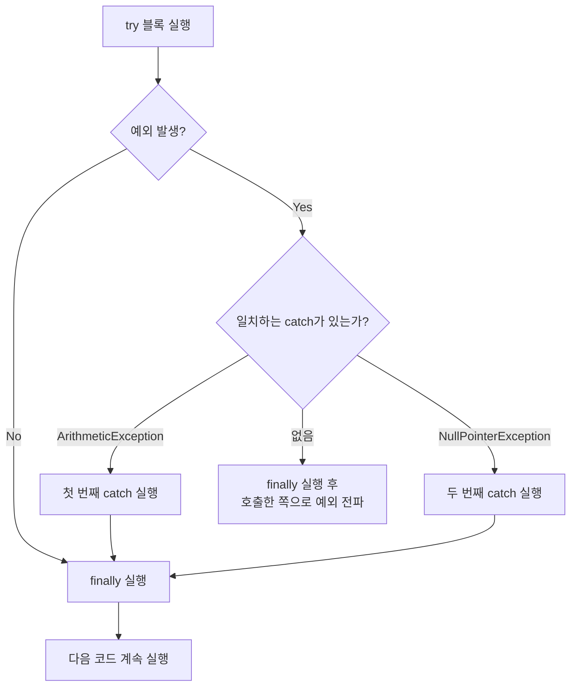
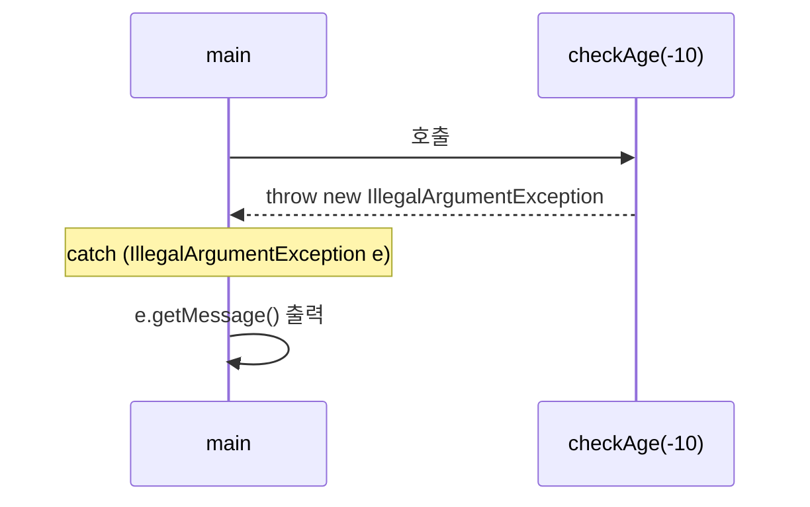
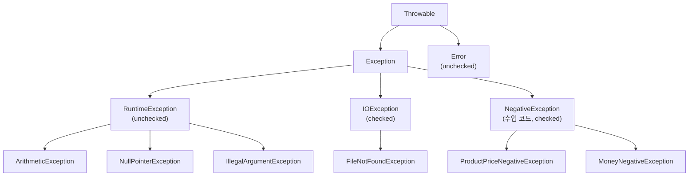
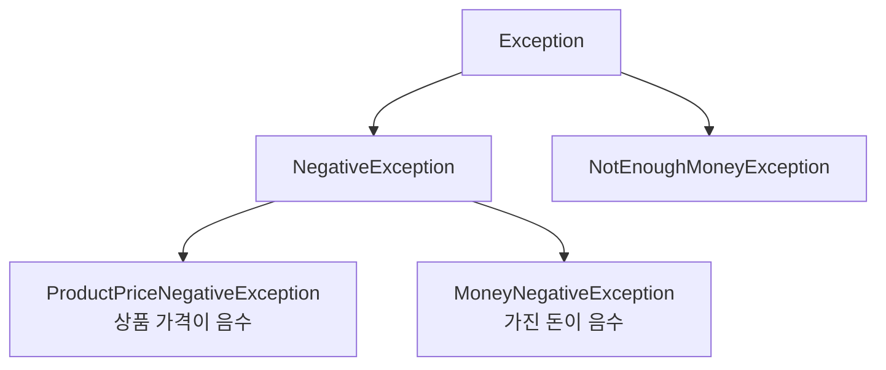

## 들어가며 (Situation)

어제([제네릭, DTO, List, Set 글]())는 List와 Set을 배웠고, 세 번째 컬렉션인 Map은 "다음에 학습"으로 남겨 뒀다. 오늘(자바 8일차)은 그 Map으로 시작해서 **예외 처리**로 넘어갔다. 오늘의 큰 줄기는 세 가지다.

1. **Map**: 키-값 쌍으로 저장하는 컬렉션 (`HashMap`, `Properties`).
2. **예외 처리**: `try - catch - finally`, `throw`/`throws`, 사용자 정의 예외.
3. **파일 입출력 맛보기**: 예외 처리를 **강제**당하는 대표적인 코드.

코드는 `chap04-generic-and-collection`의 `c_map`(2개 파일)과 `chap05-exception-file-io`(`a_exception`, `b_fileio`, 5개 폴더·9개 파일)에서 가져왔다. 수업 코드에 없는 코드는 "예시 코드"라고 적었고, 그 예시 코드는 JDK 21(`openjdk 21.0.12`)로 직접 컴파일하고 실행해서 출력을 확인했다.

내 필기에는 `//`로 시작하는 **의문**이 여러 개 있었다. 이 글은 그 의문에 하나씩 답을 다는 방식으로 썼다. 필기에서 틀렸던 부분은 본문에서 그때그때 바로잡았고, 마지막 "배운 점"에서 한 번 더 모았다.

## 문제 상황 (Task)

오늘 풀어야 했던 질문은 이렇다.

- List는 순서로 값을 찾는데, 번호가 아니라 **이름표(키)로 값을 찾고 싶을 때**는 어떻게 하는가?
- Map에 같은 키로 `put`하면 값이 덮어써진다. 덮어쓰기가 싫으면?
- 키는 모르고 값만 알 때는 어떻게 조회하는가?
- 프로그램 실행 중 `0으로 나누기`나 `null` 참조가 생기면 프로그램이 죽는다. 이걸 **죽지 않게** 하려면?
- JDK가 주는 예외로는 "가진 돈이 부족합니다" 같은 **현실의 상황**을 표현하기에 부족하다. 어떻게 하는가?
- 필기 속 질문들: `finally`는 실무에서 쓰는가? `finally` 안에 `try`가 가능한가? `switch`에 `return`이 안 되는 이유는?

제약은 어제와 같았다. 수업 주석은 단순화된 설명이어서, 직접 실행해 보고 Oracle 문서와 대조하며 정리했다.

## 해결 과정 (Action)

### 1. Map — 옷에 태그가 달린 Set

#### 1-1. 필기와 수업 주석의 정의

필기에는 이렇게 적었다. "List는 순서가 있고 중복 O, Set은 주머니처럼 중복·순서 X, **Map은 Set처럼 들어 있는데 옷 태그처럼 키가 달려 있다**." 수업 코드의 주석이 이 비유를 뒷받침한다.

```java
/* comment. Map
*   Map 특징
*   1. Key-Value : 키-값 한 쌍으로 데이터를 저장한다.
*   2. Key 는 내부적으로 Set 방식으로 구성이 되어있다.
*  */
```



| 항목 | List | Set | Map |
|---|---|---|---|
| 비유 | 번호표가 붙은 줄 | 주머니 | 태그가 달린 옷 |
| 순서 | 있음 | 없음 | 없음 (`HashMap` 기준) |
| 중복 | 값 중복 허용 | 중복 불허 | **Key는 중복 불허**, Value는 중복 가능 |
| 값을 찾는 기준 | 인덱스 `get(i)` | (찾는 게 아니라 "있는지" 확인) | 키 `get(key)` |

Map Javadoc은 Map을 "키를 값에 매핑하는 객체이며, 같은 키를 중복해서 가질 수 없고 각 키는 최대 하나의 값에 매핑된다"고 설명한다. ([Map Javadoc](https://docs.oracle.com/en/java/javase/21/docs/api/java.base/java/util/Map.html)) "Key는 내부적으로 Set 방식"이라는 수업 주석과 같은 말이다. 실제로 `Map`에는 키 전체를 `Set`으로 돌려주는 `keySet()` 메소드가 있다.

#### 1-2. 인터페이스는 `new`가 안 된다

```java
// Map은 인터페이스이다.
// 따라서 객체를 생성할 때 Map 인터페이스를
// 상속 받은 클래스로 생성해야 한다.
Map map = new HashMap();
```

필기의 "인터페이스는 기본 생성자를 생성할 수 없어 인스턴스 생성 불가"는 어제 List에서 본 것과 같은 규칙이다. 변수 타입은 인터페이스(`Map`), `new`는 구현체(`HashMap`)로 쓴다. 다만 표현을 하나 다듬었다. "기본 생성자를 못 만든다"보다는 **"생성자가 없는(구현이 없는) 타입이라 `new` 자체가 안 된다"**가 정확해 보인다. 인터페이스는 메소드 몸체가 없어서 객체로 만들 수 없다는 어제의 설명과 이어진다.

#### 1-3. 제네릭 없이 쓴 Map (`Application01` 앞부분)

```java
Map map = new HashMap();

map.put("one", new Date());
map.put(12, "apple");
// key는 중복되기 되면 나중에 작성된 값으로
// 덮어씌워지게 된다.
map.put(12, "banana"); //map = {one=Thu Oct 08 09:37:42 KST 2026, 12=banana}

System.out.println("map = " + map);

// banana 꺼내기
System.out.println("banana 값 출력하기 : " + map.get(12));
```

`"one"`이라는 `String` 키와 `12`라는 `Integer` 키가 한 Map에 같이 들어간다. 그리고 `12`를 두 번 `put`했는데 나중 값인 `banana`가 남는다.

##### 의문 1. 제네릭을 안 쓰면 무슨 문제인가? 그래서 제네릭을 배우는 건가?

필기에는 "제네릭으로 타입을 지정하지 않으면 다른 타입 값이 Key에 오는 걸 막지 못함 → 그래서 제네릭을 배움 (제네릭 컬렉션을 직접 만들 일은 거의 없음)"이라고 적었다. 위 코드가 정확히 그 모습이다. 키 타입이 `String`과 `Integer`로 섞여도 컴파일러는 막지 못한다. (어제 본 raw type 경고와 같은 종류다.) 반면 뒤쪽의 `Map<String, String>`은 타입이 고정된다.

```java
Map<String, String> map2 = new HashMap<>();
// Map의 Key 값은 암묵적으로 String 타입으로 하는 것이
// 일반적이다.
map2.put("one", "java");
map2.put("two", "javascript");
map2.put("three", "python");

System.out.println("map2 = " + map2);
map2.remove("three");
System.out.println("map2 = " + map2);
```

"제네릭 컬렉션을 직접 만들 일은 거의 없다"는 내 감상은 **절반만 맞는** 것 같다. 수업에서 `GenericTest<T>`나 `RabbitFarm<T>`를 만든 것은 원리를 이해하기 위해서였고, 실제 코드에서는 `Map<String, String>`처럼 만들어진 제네릭 컬렉션을 **쓰는 쪽**이 대부분이라는 뜻으로 이해했다.

그리고 "암묵적 룰: Key는 String"도 수업 주석(`암묵적으로 String 타입으로 하는 것이 일반적이다`)에 나온 말이다. 문법상의 제한이 아니라 관례다. 실제로 `Map<Integer, String>`도 쓸 수 있다. (예시 코드: `Map.of`와 `HashMap`에 정수 키를 넣어 보진 않았지만, 제네릭 타입 인자에 `Integer`를 쓰는 것은 어제 본 `GenericTest<Integer>`와 같은 규칙이다.)

##### 의문 2. Value와 리터럴의 차이는?

내 필기의 의문은 "Value와 리터럴의 차이는?"이었는데, 이 질문은 서로 **다른 차원의 용어**를 비교하고 있었다.

| 용어 | 무엇에 대한 말인가 | 예 |
|---|---|---|
| **리터럴(literal)** | 소스 코드에 **직접 적은 값의 표기** 방식 | `"java"`, `12`, `true` |
| **Value** | Map 안에서 **키에 짝지어진 저장 값** (Map의 용어) | `map2.put("one", "java")`에서 `"java"` |

즉 `"java"`는 코드에 쓴 표기로는 문자열 리터럴이고, Map 안에서의 역할로는 `"one"` 키의 Value다. 리터럴은 "어떻게 썼는가", Value는 "어디에 들어 있는가"의 이야기라서 비교 대상이 아니다. `map.put("one", new Date())`처럼 리터럴이 아닌 `new Date()` 결과도 Value가 될 수 있다. (이 정리는 Java 언어 명세의 리터럴 정의와 Map Javadoc의 용어를 대응시킨 내 해석이다. 질문의 의도가 이것이 맞는지는 확인이 필요하다.)

##### 의문 3. Key는 모르고 Value만 아는 경우는? (조회가 안 됨)

`get(key)`는 키로만 값을 찾는다. 값으로 키를 바로 찾는 메소드는 없고, 대신 **훑어서 찾는** 방법이 있다. 아래는 직접 실행한 예시 코드다. (예시 코드)

```java
Map<String, String> m = new HashMap<>();
m.put("one", "java"); m.put("two", "python"); m.put("three", "java");

m.containsValue("python");                 // true  (값이 있는지만 확인)
for (Map.Entry<String, String> e : m.entrySet()) {
    if (e.getValue().equals("python")) {
        System.out.println("key=" + e.getKey());  // key=two
    }
}
```

| 하고 싶은 일 | 방법 | 비고 |
|---|---|---|
| 값이 존재하는지만 | `containsValue(value)` | 값을 순회해서 찾는다 |
| 값에 해당하는 키 찾기 | `entrySet()`을 순회하며 `getValue()` 비교 | 값이 중복이면 키가 여러 개 |
| 이런 조회가 자주 필요하다면 | 키와 값을 뒤집은 Map을 따로 하나 더 두는 것을 고려 | 설계 선택 |

값은 중복될 수 있기 때문에 "값으로 키 하나를 정확히 찾는다"가 애초에 성립하지 않는다. 이것이 `get`이 키 방향으로만 있는 이유라고 이해했다.

##### 의문 4. 키가 중복되어 값이 덮어써지는 게 싫으면?

`put`은 같은 키가 있으면 기존 값을 바꾸고 **이전 값을 돌려준다**. 덮어쓰고 싶지 않다면 방법이 몇 가지 있다. (예시 코드, 직접 실행)

```java
m.put("one", "kotlin");               // 반환: "java"  → 덮어쓰기. 이전 값을 돌려줌
m.putIfAbsent("one", "x");            // 반환: "kotlin" → 이미 있으니 안 바뀜
m.putIfAbsent("four", "c");           // 반환: null    → 없었으니 넣음
m.containsKey("one");                 // true  → put 전에 키가 있는지 직접 확인
```

| 방법 | 동작 | 이럴 때 |
|---|---|---|
| `put(k, v)` | 키가 있으면 덮어쓰고 이전 값 반환 | 최신 값으로 갱신하고 싶을 때 |
| `putIfAbsent(k, v)` | 키가 **없을 때만** 넣는다. 이미 있으면 기존 값을 반환 | 덮어쓰기 방지 |
| `containsKey(k)` 후 `put` | 키 존재 여부를 직접 확인 | 없으면 넣고, 있으면 다른 처리를 하고 싶을 때 |
| 키를 다르게 설계 | 키에 번호·식별자를 붙이는 등 | 같은 이름의 값을 여러 개 보관하고 싶을 때 |

`putIfAbsent`는 Java 8부터 `Map`에 추가된 메소드다. ([Map.putIfAbsent Javadoc](https://docs.oracle.com/en/java/javase/21/docs/api/java.base/java/util/Map.html)) 한 가지 주의할 점이 있다. `putIfAbsent`는 키에 **null 값이 매핑되어 있는 경우도 "없다"로 취급**하는 것으로 Javadoc에 적혀 있다.

##### 의문 5. Map은 딕셔너리의 단점을 해결한 것인가?

필기에는 "Map은 딕셔너리의 단점을 해결한 것인가?"라고 물어 두었다. 이 질문은 **전제를 먼저 바로잡아야** 했다. (딕셔너리는 Python의 `dict` 같은 것을 말한다고 이해했다.) Map과 딕셔너리는 "키로 값을 찾는다"는 같은 개념을 서로 다른 언어가 구현한 것이지, 한쪽이 다른 쪽의 단점을 고친 후속이 아니다. 오히려 Java에도 `java.util.Dictionary`라는 **오래된 추상 클래스**가 있었다. `Dictionary` Javadoc은 이 클래스가 **obsolete**이고 새 코드는 `Map` 인터페이스를 쓰라고 안내한다. ([Dictionary Javadoc](https://docs.oracle.com/en/java/javase/21/docs/api/java.base/java/util/Dictionary.html)) 그러니 "딕셔너리의 단점을 Map이 해결했다"는 말은 **Java 안에서는 사실에 가깝지만**(`Dictionary` → `Map`), Python 딕셔너리와 비교해서 "Map이 낫다"고 말할 수는 없다. 이 글에서는 거기까지만 쓴다.

##### 의문 6. `null`은 무엇이고, `404 null point exception`은?

필기: "null은 존재하지 않음을 의미. '404 null point exception'은 존재하지 않는 것을 참조할 때의 대표 에러." 이 문장에서 **두 곳을 교정**한다.

- **`404`는 HTTP 상태 코드**(Not Found)이고 자바 예외와는 관련이 없다. 웹에서 "없는 페이지"를 뜻하는 숫자라서 내가 기억 속에서 "존재하지 않음"이라는 공통점으로 엮은 것으로 보인다.
- 예외 이름은 `null point`가 아니라 **`NullPointerException`**이다. 수업 코드 `b_solved`의 주석에도 `NullPointException`이라고 적혀 있는데, 이 역시 정확한 클래스 이름이 아니다.

Map에서 `null`은 이렇게 나타난다. (예시 코드, 직접 실행)

```java
map.get("zzz");      // 없는 키를 조회하면 null 을 반환한다
```

`HashMap`은 `null` 키 하나와 `null` 값도 허용한다. (`{null=nk}`가 출력되는 것을 확인했다.) 그래서 `get`이 `null`을 돌려줬을 때 "키가 없다"인지 "값이 null이다"인지는 `containsKey`로 구분해야 한다.

#### 1-4. Properties — 키와 값이 모두 String인 Map

```java
/* comment. Properties
*   .env
*   DATABASE_URL=~~~~~~~~~~
*   Key(String)=Value(String)
*   설정파일을 구성할 때 만드는 파일로서
*   Map 처럼 Key와 Value 로 환경설정 값을 저장한다.
*   단, 특징은 Key-Value 모두 String 문자열이다.
*  */

Properties prop = new Properties();
prop.setProperty("driver", "cj.jdbc.driver.mysql");
prop.setProperty("url","jdbc:mysql://localhost/menudb");
prop.setProperty("username","wanted");
prop.setProperty("password","wanted");

System.out.println("prop = " + prop);
```

`Properties`는 설정값을 `키=값` 문자열로 보관하는 Map 계열 클래스다. Javadoc에 따르면 `Properties`는 `Hashtable<Object,Object>`의 하위 클래스이고, 키와 값이 모두 String인 영속적인 속성 집합을 표현한다. ([Properties Javadoc](https://docs.oracle.com/en/java/javase/21/docs/api/java.base/java/util/Properties.html)) 수업 주석에 "Map 처럼"이라고 적힌 것이 이 관계를 말한다. 위 코드는 DB 접속 설정(`driver`, `url`, `username`, `password`)을 담는 예제다. 값은 수업용 더미 값이고, 실제 비밀번호를 소스에 적는 것은 위험하니 그래서 주석에서 `.env` 같은 **설정 파일을 따로 두는** 방식을 언급한 것으로 이해했다.

### 2. 예외 처리 — 프로그램이 죽지 않게 하는 방법

#### 3-1. 컴파일 오류와 런타임 오류

`a_basic/Application`의 주석이 두 오류를 나눈다.

```java
/* comment.
*   컴파일 오류
*   - 컴파일 오류란, 개발자가 코드를 작성 중에
*     발생하는 오류를 의미한다. ex) 없는 변수 참조, 타입 불일치
*   런타임 오류
*   - 어플리케이션 실행 시 코드를 실행하면서 발생하는 오류이다.
*     대표적인 에러는 NullPointerException (null 참조)
*  */
```

| 항목 | 컴파일 오류 | 런타임 오류 |
|---|---|---|
| 발견 시점 | 코드를 쓰고 컴파일할 때 | 프로그램을 실행하는 도중 |
| 예 | 없는 변수 참조, 타입 불일치 | `NullPointerException`, 배열 범위 초과 |
| 발견하기 쉬운가 | 쉽다. 위치를 컴파일러가 알려 준다 | 어렵다. 발생 후 원인을 **찾으러 가야** 한다 |
| 안전성 | 런칭 전에 확인 가능 | 사용자가 쓰다가 터질 수 있다 |

필기의 "이상적인 코드는 돌리기 전에 컴파일 단계에서 오류를 알 수 있는 코드"는 어제 제네릭에서 본 것과 이어진다. `GenericTest<String>`에 `1`을 넣으면 컴파일 에러가 난 것이 "컴파일 시점으로 오류를 당겨 온" 사례였다. 주석에 있는 런타임 오류 예시는 주석 처리되어 있는데, 메시지가 그대로 적혀 있다.

```java
//        int[] iarr = new int[5];
//        System.out.println("6번째 인덱스 출력 : " + iarr[6]); //Error 발생 (Index 6 out of bounds for length 5)

//        String str = null;
//        str.length(); //Cannot invoke "String.length()" because "str" is null
```

배열의 `iarr[6]`은 길이 5인 배열에서 6번 인덱스를 읽는 코드다. "6번째 인덱스 출력"이라고 적었지만 인덱스는 0부터 시작하므로 `iarr[6]`은 사실 **일곱 번째 칸**이고, 길이 5인 배열이라면 `iarr[5]`부터 이미 범위를 벗어난다. 수업 주석의 오류 메시지 `Index 6 out of bounds for length 5`가 이를 말해 준다. 또 주석은 "예외 처리를 하지 않으면 프로그램이 비정상적으로 종료될 수 있다"고 정리한다. 직접 확인한 예시 하나를 보면, 처리하지 않은 예외가 `main`까지 올라가면 프로그램이 스택 트레이스를 찍고 멈춘다. (예시 코드: `throw new IllegalStateException("rt")`를 호출한 쪽에서 잡지 않으면 `Exception in thread "main" java.lang.IllegalStateException: rt`가 출력되고 끝난다.)

그리고 `0으로 나누기`는 **정수 나눗셈**에서 `ArithmeticException`(`/ by zero`)이 난다. 필기의 "0으로는 나누기 불가"를 정확히 말하면 "**정수를 0으로** 나눌 수 없다"이고, 이것은 JLS에 정의된 동작이다.

#### 3-2. try - catch - finally

`b_solved/Application`의 주석이 구조를 정의한다.

```java
/* comment. 예외처리
*   1. try - catch - finally
*   - try : 예외가 발생할 가능성이 있는 코드 블럭
*   - catch : 특정 예외를 처리하는 코드 블럭
*   - finally : 예외 발생 여부와 관계없이 항상 실행되는 코드 블럭
*   2. throws 를 이용한 예외 전파
*  */

try {
    // 예외 발생 가능성 있는 코드
//    int result = 10 / 0; // new ArithmeticException(); 가 나오고 바로 catch로
    // NullPointException
    String str = null;
    str.length(); // new NullPointerException();

} catch (ArithmeticException e) {
    System.out.println("예외 메세지 = " + e.getMessage());  //  / by zero
    System.out.println("❌❌❌예외 발생!!!!!!❌❌❌");
} catch (NullPointerException e) {
    System.out.println("예외 메세지 = " + e.getMessage());  //  Cannot invoke "String.length()" because "str" is null
    System.out.println("❌❌❌예외 발생!!!!!!❌❌❌");
} finally {
    System.out.println("예외 발생 여부와 관계 없이 실행됨...");
}
```



필기의 "**catch는 예외 발생 시 어떻게 동작할지 작성하는 곳**"이 위 주석의 "특정 예외를 처리하는 코드 블럭"과 같은 말이다. 위 코드에서는 `str.length()`에서 `NullPointerException`이 나면 그 아래 줄은 실행되지 않고 **곧바로 맞는 `catch`로 이동**한다. 그리고 처리가 끝나면 `finally`를 거쳐 `System.out.println("프로그램 종료됨..")`까지 실행되어, 프로그램이 **정상 종료**된다.

##### 여러 예외를 처리하는 법: 여러 catch와 멀티캐치

필기에는 "여러 예외는 여러 catch 또는 멀티캐치"라고 적었다. 수업 코드는 `catch`를 여러 개 쓰는 방식이었고, 멀티캐치는 수업 코드에 없다. 아래는 직접 실행해 본 예시 코드다. (예시 코드)

```java
try {
    Object o = null; o.toString();
} catch (ArithmeticException | NullPointerException e) {   // 멀티캐치
    System.out.println("multi " + e.getClass().getSimpleName());   // multi NullPointerException
}
```

| 방식 | 쓸 때 |
|---|---|
| 여러 `catch` | 예외마다 **처리 방법이 다를 때** (위 수업 코드) |
| 멀티캐치 `A \| B` | 처리 방법이 **같을 때**. 코드 중복이 준다 |

여러 `catch`는 **위에서부터** 맞는지 검사하므로 자식 예외를 위에 두어야 한다는 점도 있다. (Oracle Tutorial의 설명을 읽은 내용이다.) ([Catching and Handling Exceptions](https://docs.oracle.com/javase/tutorial/essential/exceptions/handling.html))

##### 의문 7. `finally`는 실무에서 쓰는가? (try-with-resources)

필기에서 "최신 실무는 try-with-resources가 표준"이라고 적었는데, **"표준"이라는 단어는 조금 강하다**고 생각해서 다시 확인했다. Oracle Tutorial은 `finally`로 자원을 닫는 코드보다 `try-with-resources`를 쓰라고 권하는 편이다. 자원을 닫을 때의 흔한 실수를 줄여 주기 때문이다. ([The try-with-resources Statement](https://docs.oracle.com/javase/tutorial/essential/exceptions/tryResourceClose.html)) 그러니 "`finally`가 쓸모없어졌다"가 아니라 **"파일, 소켓 같은 `AutoCloseable` 자원을 닫는 용도는 try-with-resources로 옮겨 갔다"**가 정확하다. `finally`는 자원이 아닌 정리 작업(예: 상태 되돌리기)에는 여전히 쓸 수 있다.

수업 코드(`b_fileio/Application01`)에서 이 문제가 실제로 보인다.

```java
FileWriter writer = new FileWriter("output.txt");
writer.write("Hello, File IO!!");
writer.write("File Test");

// 버퍼(연결통로)에 있는 데이터를
// 밀어서 디스크에 저장한다.
writer.flush();
```

`flush()`는 했지만 **`close()`는 호출하지 않았다.** 읽기 쪽(`FileReader`)도 마찬가지다. 수업은 예외 처리 구문을 보여 주는 것이 목적이어서 생략한 것으로 보인다. 자원을 닫는 올바른 방법을 try-with-resources로 쓰면 이렇다. (예시 코드, 직접 실행. 수업 코드를 그대로 바꾼 것이 아니라 `BufferedWriter`/`BufferedReader`로 새로 쓴 코드다.)

```java
try (FileWriter w = new FileWriter("o.txt"); BufferedWriter b = new BufferedWriter(w)) {
    b.write("hi");
}   // 블록을 벗어나면 b, w가 자동으로 close() 된다. (실행 결과: hi 를 다시 읽어 확인)
```

| 방식 | 자원 닫기 |
|---|---|
| 수업 코드 (`flush`만 호출) | 닫지 않음. 파일 핸들이 열려 있을 수 있다 |
| `finally`에서 `close()` | 직접 닫는다. 그런데 `close()`도 예외를 던질 수 있어서 `try`가 중첩된다 |
| try-with-resources | `AutoCloseable`이면 **자동으로** `close()` |

##### 의문 8. `finally` 안에 `try`를 넣을 수 있는가?

가능하다. 직접 컴파일해서 확인했다. (예시 코드)

```java
try {
    int x = 1 / 0;
} finally {
    try {
        Integer.parseInt("x");
    } catch (NumberFormatException e) {
        System.out.println("inner " + e.getMessage());   // inner For input string: "x"
    }
}
// 바깥 catch 에서 outer / by zero 가 출력되었다.
```

`finally` 안의 `try`는 문법상 허용되고, 안쪽 예외를 안쪽에서 처리했기 때문에 바깥의 `ArithmeticException`이 그대로 전달됐다. 필기에는 "중첩이 깊으면 가독성이 떨어지니 분리하는 게 좋다고 생각"이라고 적었는데, 이 생각이 맞다고 본다. 위에서 본 것처럼 `finally`에서 자원을 닫느라 `try`를 중첩해야 하는 상황이 try-with-resources를 쓰는 이유이기도 하다. (이 이유는 공식 문서의 일반 권장 + 내 정리이며, 중첩의 가독성에 대한 기준은 공식 규칙이 아니라 취향의 영역이다.)

##### 의문 9. `switch`에 `return`이 안 되는 이유? (콘솔게임에서 생긴 문제)

필기에 "`switch`문이 **함수 안에 있어야** 가능"이라고 적어 두었는데, 방향은 맞지만 **정확하게 보완**이 필요하다. `switch`에 `return`을 못 쓰는 것이 아니다. `return`은 **메소드(함수)를 끝내는 문장**이므로, `switch`가 메소드 안에 있으면 쓸 수 있다. 문제가 생기는 곳은 `return`이 **어떤 값을 돌려주는지 / 어디서 빠져나오는지**이다.

| 상황 | 결과 |
|---|---|
| `switch`가 값을 반환하는 메소드 안, 모든 경우에 `return` | 컴파일 OK (직접 확인: `case 1: return 10; default: return 0;`) |
| `switch`에서 일부 `case`만 `return`하고 나머지 경로에 `return`이 없음 | 컴파일 에러 `missing return statement` (직접 확인) |
| `void` 메소드의 `switch`에서 `return;` | 메소드가 거기서 끝난다 |
| `main` 안에서 `return;` | `main`이 끝나 프로그램이 종료된다 (`void`라서 값은 못 돌려줌) |


#### 3-3. `throw`와 `throws` — 예외의 위임

```java
try {
    checkAge(-10); // new Ille("나이는 음수일 수 없습니다")
} catch (IllegalArgumentException e){
    System.out.println("e.getMessage() = " + e.getMessage());
}

public static void checkAge(int age){ //static인 이유는 객체 생성하지 않아도 되어서
    if (age < 0 ){
        /* comment.
        *   실제로 예외를 발생시키는 메서드는 checkAge()이다.
        *   throw 는 해당 메서드에서 예외처리를 담당하는 것이 아닌
        *   부른 쪽 (호출한 쪽)에 예외처리를 위임한다고 보면 된다.
        *  */
        throw new IllegalArgumentException(
                "나이는 음수일 수 없습니다!"
        );
    }
    System.out.println("전달 받은 " + age + "는 유효한 나이입니다!");
}
```

`checkAge`는 직접 예외를 **만들어서 던진다**(`throw new`). 처리는 호출한 쪽 `main`의 `catch`가 한다. 이것이 주석의 "호출한 쪽에 예외처리를 위임"이다. `static`인 이유도 주석에 적혀 있다. 객체를 만들지 않고 `main`(static)에서 바로 부르기 위해서다. (주석의 `new Ille(...)`은 `IllegalArgumentException`을 줄여 쓴 메모다.)



#### 3-4. checked와 unchecked — 필기 교정

수업 필기에는 "Runtime~은 Exception의 자식이며 **untracked**라 `throws` 불필요. **tracked**는 그 윗단계(FileNotFound 등)이며 전부 `throws` 필요"라고 적혀 있다. 이 부분은 용어와 위치를 교정한다.

| 필기 | 교정 |
|---|---|
| untracked | **unchecked** exception (컴파일러가 처리를 강제하지 않는다) |
| tracked | **checked** exception (`throws`나 `try-catch`로 처리하지 않으면 컴파일 에러) |
| tracked는 Runtime의 "윗단계" | `RuntimeException`과 `FileNotFoundException`은 **위아래가 아니라 서로 다른 가지**다. 둘 다 `Exception`의 자손이다. |
| ArithmeticException extends RuntimeException | 맞다 |



JLS는 `RuntimeException`과 `Error`, 그 하위 클래스를 unchecked, 나머지 예외 클래스를 checked라고 정의한다. ([JLS 11.1.1](https://docs.oracle.com/javase/specs/jls/se21/html/jls-11.html#jls-11.1.1)) 그러니 "`Exception`을 상속하면 다 `throws`가 필요"한 것은 정확히 말하면 **"`RuntimeException`을 거치지 않고 `Exception`을 상속하면"**이다. 이 규칙을 컴파일러가 실제로 강제하는지 직접 확인했다. (예시 코드)

```java
static class A extends Exception { A(String m){ super(m); } }
public static void main(String[] x){ throw new A("y"); }
```

```text
error: unreported exception A; must be caught or declared to be thrown
```

반면 `IllegalStateException`(unchecked)을 `throws` 없이 던지는 코드는 컴파일이 됐다(위 3-1의 실행 예).

필기의 "throws A / throw B면 B extends A (B를 throw하면 A를 throws하는 것과 같음)"는 **맞는 내용**이다. `throws`에는 던져지는 예외의 **부모 타입**을 써도 된다. 직접 컴파일해서 확인했다. (예시 코드: `static void f() throws A { throw new B("b"); }`에서 `B extends A`일 때 컴파일 성공.) 필기의 "throws에는 부모 클래스 정도를 쓰고 아래는 자식 구현"도 같은 말로 이해했다. 다만 부모로 뭉뚱그리면 **호출한 쪽은 어떤 자식이 올지 모르게** 되니, 구분해서 처리하고 싶을 때는 구체적으로 적는 편이 낫다는 것은 수업 코드에서 볼 수 있다.

#### 3-5. 사용자 정의 예외 — `ExceptionTest`와 3단 구조

```java
/* comment.
*   사용자 정의의 예외 클래스 정의하기
*   JDK를 설치하면 사전에 정의 된 예외 클래스를 사용할 수 있다.
*   하지만, 현실세계에서 발생할 수 있는 수 많은 예외를
*   처리하기에는 너무 추상적이고 제한적이다.
*  */
```

수업의 시나리오는 **상품 가격과 내가 가진 돈**을 입력받아 (1) 음수일 때, (2) 가진 돈이 부족할 때를 예외로 다루는 것이다. 예외 클래스를 만드는 방법은 `NegativeException`의 주석에 있다.

```java
/* comment. 예외 클래스로 만드는 방법
*   모든 예외의 부모 클래스인 Exception 클래스 상속
* */
public class NegativeException extends Exception {

    public NegativeException(String message) {
        super(message);
    }
}
```

그리고 상속 구조는 이렇게 짜여 있다. `NegativeException`을 부모로 하고, 음수의 종류에 따라 자식을 두었다.

```java
public class ProductPriceNegativeException extends NegativeException { ... }
public class MoneyNegativeException extends NegativeException { ... }
public class NotEnoughMoneyException extends Exception { ... }
```



참고로 소스를 읽어 보니 "모든 예외의 부모 클래스인 `Exception`"이라는 주석은 정확히는 **`Throwable`이 모든 예외·에러의 부모**이고 `Exception`은 그 아래다(`Error`가 따로 있다). 수업 설명을 단순화한 표현으로 이해했다.

던지는 쪽 `ExceptionTest.checkMoney`는 세 경우를 순서대로 검사한다.

```java
public void checkMoney(int productPrice,int money) throws ProductPriceNegativeException, MoneyNegativeException, NotEnoughMoneyException {

    // 상품 가격 음수일 때?
    if(productPrice < 0){
        throw new ProductPriceNegativeException("상품의 가격은 음수일 수 없습니다!!");
    }

    // 내가 가진 돈이 음수일 때?
    if(money < 0){
        throw new MoneyNegativeException("가진 돈이 음수일 수 없습니다!!!!");
    }

    // 싱품 가격이 내가 가진 돈 보다 클 때
    if(money < productPrice){
        throw new NotEnoughMoneyException("가진 돈 보다 상품의 가격이 더 비싸요..");
    }

    System.out.println("가진 돈이 출분합니다~~~ 즐거운 쇼핑 하세요~~");
}
```

`NegativeException`을 `Exception`으로 상속했으니 **모두 checked**다. 그래서 필기의 "사용자 정의 예외를 `Exception`으로 만들면 다 `throws` 필요"가 이 코드에서 그대로 나타난다. `throws`에 세 클래스를 나열한 것도 확인했다. 그리고 받는 쪽은 `catch`를 세 개 쓴다.

```java
try {
    et.checkMoney(50000,30000);
} catch (ProductPriceNegativeException e) {
    System.out.println(e.getMessage());
} catch (MoneyNegativeException e) {
    System.out.println(e.getMessage());
} catch (NotEnoughMoneyException e) {
    System.out.println(e.getMessage());
}
```

`50000`원짜리 상품에 `30000`원을 가지고 있으니 세 번째 조건에 걸려 `가진 돈 보다 상품의 가격이 더 비싸요..`가 출력될 것이다.

여기서 필기의 `throws A / throw B` 규칙을 이 코드에 적용하면, `ProductPriceNegativeException`과 `MoneyNegativeException`은 둘 다 `NegativeException`의 자식이므로 `throws NegativeException` 하나로 줄여 쓸 수도 있고, `catch (NegativeException e)` 하나로 둘을 같이 받을 수도 있다. 수업 코드는 구분해서 메시지를 다르게 보이려고 **일부러 풀어 쓴** 것으로 이해했다. (이 줄여 쓰는 방식은 수업 코드에는 없고 필기 규칙을 적용해 본 것이다.)

#### 3-6. 파일 입출력 — 예외 처리를 강제당하는 코드

```java
// File IO 같은 클래스들은 객체 생성 시 예외를 반드시 처리하게
// 설정이 되어 있다.
FileWriter writer = new FileWriter("output.txt");
```

`FileWriter`의 생성자는 `IOException`을 선언하고 있어서, 위의 checked 규칙에 따라 **반드시 처리해야 컴파일된다.** 수업 주석의 "반드시 처리하게 설정이 되어 있다"가 이 규칙을 말한다. 읽기 쪽은 이렇다.

```java
FileReader reader =new FileReader("output.txt");

int data;
// read() : 파일에서 한 문자씩 읽고, 파일 끝에 도달하면 -1 을 반환
while ((data = reader.read()) != -1){
    System.out.print((char)data);
}
```

`read()`는 문자 하나를 `int`로 돌려주고, 끝에 도달하면 `-1`을 돌려준다. 그래서 `(char)`로 변환해서 출력한다. 이 코드의 `catch`는 `FileNotFoundException`과 `IOException` 두 개를 나란히 적었는데, `FileNotFoundException`이 `IOException`의 자식이어서 **자식(`FileNotFoundException`)이 위에 있는 순서**다. 두 `catch` 모두 `throw new RuntimeException(e)`로 **checked 예외를 unchecked로 감싸서** 다시 던진다. 처리할 방법이 마땅치 않을 때 쓰는 흔한 패턴이다. ([FileWriter Javadoc](https://docs.oracle.com/en/java/javase/21/docs/api/java.base/java/io/FileWriter.html))

### 3. 오늘의 시행착오

- 필기의 **`404 null point exception`**은 HTTP 404와 자바 `NullPointerException`을 엮은 것이었다. 둘은 관련이 없다.
- **untracked/tracked**는 정확한 용어가 아니라 **unchecked/checked**였다. 그리고 두 계열은 위아래가 아니라 `Exception` 아래의 형제 가지였다.
- **`finally`**가 쓸모없어진 것이 아니라 "자원 닫기" 용도가 try-with-resources로 옮겨 간 것이었다.
- **`switch`와 `return`**은 "함수 안에 있어야 한다"로 적었는데, 정확히는 **메소드의 반환 타입과 모든 경로의 `return`**이 핵심이었다.
- 수업 코드의 파일 입출력은 `flush()`만 하고 `close()`를 하지 않는다. 수업은 예외 처리 문법이 목적이었다고 이해했다.

## 결과 (Result)

오늘은 **개념을 코드와 실행으로 확인**하는 날이었다.

| 확인 항목 | 결과 |
|---|---|
| `HashMap`에 같은 키로 `put` | 이전 값을 반환하고 덮어씀 |
| `putIfAbsent` | 키가 있으면 안 바뀌고 기존 값 반환, 없으면 넣고 `null` 반환 |
| 값으로 키 찾기 | `entrySet()` 순회로 가능 (`containsValue`는 존재 확인만) |
| `HashMap`의 `null` 키 | 허용 (`{null=nk}`) |
| `Map.of`에 중복 키 | `IllegalArgumentException: duplicate key` |
| `switch`와 `return` | 모든 경로에 `return`이 있으면 컴파일, 없으면 `missing return statement` |
| checked 예외 `throw`를 `throws` 없이 | 컴파일 에러 `unreported exception` |
| unchecked 예외를 `throws` 없이 | 컴파일 성공 |
| `throws A` + `throw new B(...)` (`B extends A`) | 컴파일 성공 |
| `finally` 안의 `try-catch` | 동작함 |
| 멀티캐치 | `NullPointerException`이 잡힘 |
| 이번에 읽은 수업 코드 | 11개 파일 (`chap04` Map 2개, `chap05` 9개) |

이번 글에는 **정량적 지표(응답 시간 등)가 없다.** 성능을 비교하는 실습이 아니었고, 없는 수치를 만들지 않으려고 이렇게 정성적인 결과로 정리했다.

배운 점은 다음과 같다.

1. **Map은 "태그가 달린 Set"처럼 생각하면 이해가 빠르다.** Key는 중복되지 않고 Value는 중복될 수 있다. 값으로 키를 찾으려면 순회해야 한다.
2. **덮어쓰기를 막으려면 `putIfAbsent`나 `containsKey`를 쓴다.** `put`은 이전 값을 돌려준다는 점도 함께 기억한다.
3. **Value와 리터럴은 다른 축의 용어다.** 리터럴은 코드에 쓴 표기, Value는 Map 안의 역할이다.
4. **오류는 컴파일 시점에 잡힐수록 안전하다.** 그래서 제네릭을 배우고, 런타임 예외는 `try-catch`로 처리한다.
5. **checked는 처리를 강제하고, unchecked는 강제하지 않는다.** `RuntimeException`을 거치면 unchecked, `Exception`에서 바로 상속하면 checked다. 필기의 tracked/untracked는 이 용어의 틀린 기억이었다.
6. **`finally`의 자원 정리는 try-with-resources가 대신한다.** `finally`는 여전히 유효하다.
7. **필기와 수업 주석도 실행으로 확인했다.** 계속 어긋난 부분을 찾아서 바로잡았다.

## 메모 (개인 할 일)

- 콘솔게임에 **예외 처리**를 넣어 보기.

## 더 학습하면 좋은 개념

- **`equals()`와 `hashCode()`** — `HashMap`이 "같은 키"를 판별하는 기준이다. `String` 키는 이미 준비되어 있어서 문제가 없었지만, `BookDTO` 같은 직접 만든 클래스를 키로 쓰면 `equals`/`hashCode` 재정의 없이는 같은 키로 인식되지 않을 수 있다. Map을 제대로 쓰기 위해 필요하다.
- **`HashMap`, `LinkedHashMap`, `TreeMap`의 차이** — 오늘은 `HashMap`만 썼다. 순서 보장 여부와 정렬 여부가 구현체마다 다르다. 출력 순서를 보장해야 하는 상황에서 어떤 것을 골라야 하는지 판단하는 데 필요하다.
- **try-with-resources와 `AutoCloseable`** — 수업 코드의 파일 입출력은 `close()`를 하지 않았다. 자원이 닫히는 원리와 `suppressed exception`까지 이해하면 자원 누수 없는 코드를 쓸 수 있다.
- **예외 연쇄(Exception Chaining)와 `RuntimeException`으로 감싸기** — 수업 코드의 `throw new RuntimeException(e)`가 어떤 정보를 남기고(원인 `cause`) 어떤 정보를 잃는지 이해하면, 로그를 보고 원인을 추적하는 데 도움이 된다.

## 참고 자료

- [Java SE 21 API - Map](https://docs.oracle.com/en/java/javase/21/docs/api/java.base/java/util/Map.html)
- [Java SE 21 API - HashMap](https://docs.oracle.com/en/java/javase/21/docs/api/java.base/java/util/HashMap.html)
- [Java SE 21 API - Properties](https://docs.oracle.com/en/java/javase/21/docs/api/java.base/java/util/Properties.html)
- [Java SE 21 API - Dictionary](https://docs.oracle.com/en/java/javase/21/docs/api/java.base/java/util/Dictionary.html)
- [Java SE 21 API - FileWriter](https://docs.oracle.com/en/java/javase/21/docs/api/java.base/java/io/FileWriter.html)
- [Oracle Java Tutorials - The Map Interface](https://docs.oracle.com/javase/tutorial/collections/interfaces/map.html)
- [Oracle Java Tutorials - Exceptions](https://docs.oracle.com/javase/tutorial/essential/exceptions/index.html)
- [Oracle Java Tutorials - Catching and Handling Exceptions](https://docs.oracle.com/javase/tutorial/essential/exceptions/handling.html)
- [Oracle Java Tutorials - The try-with-resources Statement](https://docs.oracle.com/javase/tutorial/essential/exceptions/tryResourceClose.html)
- [Oracle Java Tutorials - The switch Statement](https://docs.oracle.com/javase/tutorial/java/nutsandbolts/switch.html)
- [Java Language Specification SE 21 - Chapter 11 Exceptions](https://docs.oracle.com/javase/specs/jls/se21/html/jls-11.html)
